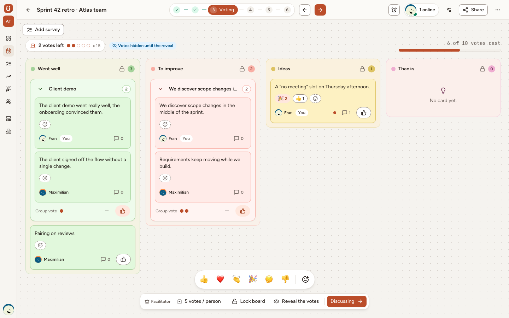
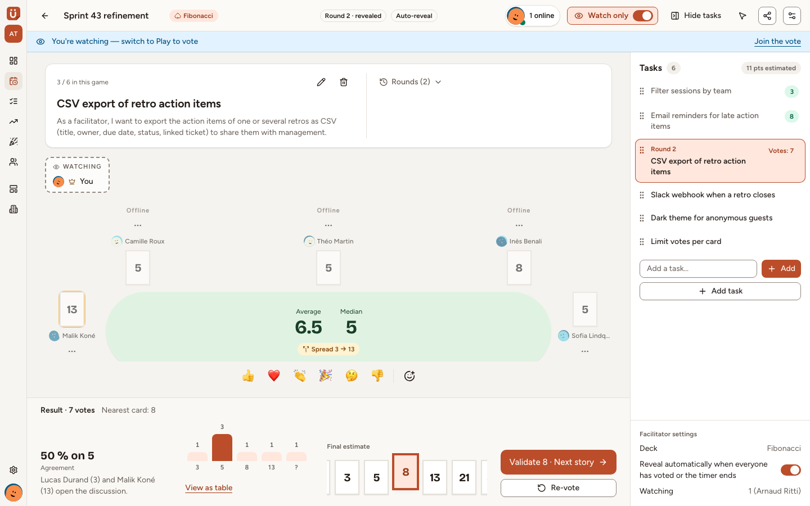
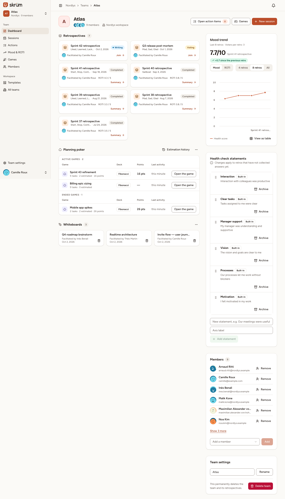

<p align="center">
    <picture>
        <source media="(prefers-color-scheme: dark)" srcset="public/brand/skrum-logo-horizontal-dark.svg">
        
    </picture>
</p>

<p align="center">
    Retrospectives, planning poker, whiteboards, surveys and games for agile teams.<br>
    Realtime, open source, and yours to host.
</p>

<p align="center">
    <a href="https://github.com/arnaud-ritti/skrum/actions/workflows/tests.yml"></a>
    <a href="https://github.com/arnaud-ritti/skrum/actions/workflows/docker-image.yml"></a>
    <a href="https://github.com/arnaud-ritti/skrum/releases/latest"></a>
    <a href="LICENSE"></a>
</p>

# Skrum

Skrum is an open-source, self-hostable place for a team's rituals. It is multi-tenant (workspaces contain teams, teams run sessions), lets guests join a session through a link, and is available in English, French, Spanish and German. It is released under the GNU Affero General Public License v3.0 or later (AGPL-3.0-or-later, see [`LICENSE`](LICENSE)).

[Run with Docker](#run-with-docker) · [Configuration](#configuration) · [Connect an AI assistant](#connect-an-ai-assistant) · [Local development](#local-development) · [Contributing](#contributing)

<p align="center">
    <picture>
        <source media="(prefers-color-scheme: dark)" srcset="tests/visual/__screenshots__/retro-board-voting-dark-1440-en.png">
        
    </picture>
</p>

## Features

- **Retrospectives**: realtime boards from templates, anonymous cards, votes, a return-on-time-invested poll, and action items with an owner, a due date and reminders.
- **Planning poker**: custom decks, anonymous rounds, tasks imported from an issue tracker.
- **Whiteboards**: a shared canvas for the whole team.
- **Surveys**: health check, team pulse, eNPS and quick questions.
- **Games**: Draw and guess, Sprint GIF, Hangman, Decoded, Two truths, Mood weather and Guess who, to open a session.
- **Integrations**: Slack, Telegram, Microsoft Teams, Mattermost, Jira (Cloud and Data Center), Linear, GitHub and outgoing webhooks.
- **Sign-in**: password, passkeys, two-factor authentication, and single sign-on with Google, GitHub, Microsoft Entra or any OpenID Connect provider.
- **AI assistants**: a Model Context Protocol server, so an assistant reads and updates what you allow.
- **Self-hosting**: one container for the web server, websockets, queue and scheduler, on PostgreSQL, MariaDB, MySQL or SQLite.

<table>
    <tr>
        <td width="50%">
            <picture>
                <source media="(prefers-color-scheme: dark)" srcset="tests/visual/__screenshots__/poker-room-revealed-dark-1440-en.png">
                
            </picture>
        </td>
        <td width="50%">
            <picture>
                <source media="(prefers-color-scheme: dark)" srcset="tests/visual/__screenshots__/team-page-dark-1440-en.png">
                
            </picture>
        </td>
    </tr>
    <tr>
        <td align="center">Planning poker, cards revealed</td>
        <td align="center">A team's home</td>
    </tr>
</table>

Documentation: <https://arnaud-ritti.github.io/skrum/docs/>

## Run with Docker

The image is published to GitHub Container Registry.

```bash
curl -O https://raw.githubusercontent.com/arnaud-ritti/skrum/main/compose.production.yaml
curl -o .env https://raw.githubusercontent.com/arnaud-ritti/skrum/main/.env.production.example
docker run --rm --entrypoint php ghcr.io/arnaud-ritti/skrum:latest artisan key:generate --show
```

The last command prints the value for `APP_KEY`. Fill the three values at the top of `.env`:

- `APP_URL`: the public address of the instance, as typed in the browser;
- `APP_KEY`: the value just printed;
- `DB_PASSWORD`: a strong password for the database.

Everything else has a working default. The same file lists, commented, what an install most often changes: the address Caddy serves, the host ports, the image version (`SKRUM_IMAGE`), the instance name and time zone, and outgoing mail, which goes to the log until the `MAIL_*` variables are set.

Compose reads `.env` from the project directory twice: to fill the `${...}` values in `compose.production.yaml` (image, ports, database name, user and password) and as the app container's environment. To use a file with another name, pass `--env-file <file>` to every `docker compose` command; it feeds the `${...}` values, so also point the `env_file:` entry of the `app` service at that file.

Start it:

```bash
docker compose -f compose.production.yaml up -d
```

Skrum answers on `http://<host>`: plain HTTP on port 80, meant for a TLS-terminating reverse proxy in front, whose forwarded headers are trusted by default (`TRUSTED_PROXIES`). To let the built-in Caddy obtain certificates itself, set `SERVER_NAME` to your domain: see [SERVER_NAME](#server_name).

> [!WARNING]
> The first account to sign up becomes the instance admin. Create it right after starting, and consider `SKRUM_SIGNUP_MODE` to control who can sign up afterwards.

If a container keeps restarting, `docker compose -f compose.production.yaml logs app` shows why (for example a missing variable, or `APP_DEBUG` left enabled).

### Upgrading

Back up the database first (the `pgsql-data` volume with the default Compose file) and the `app-storage` volume, then pull the new image and recreate the containers:

```bash
docker compose -f compose.production.yaml pull && docker compose -f compose.production.yaml up -d
```

Migrations run automatically when the container starts. Prefer pinning `SKRUM_IMAGE` to a version tag over `latest`, so upgrades happen when you choose.

To show a maintenance page while you work, run `php artisan down --retry=<seconds>` in the application container (`docker compose -f compose.production.yaml exec app php artisan down --retry=1800`) and `php artisan up` when done. The page shows the time of return taken from `--retry`; it reloads by itself every 30 seconds and links to the status page.

The admin footer shows the running version (`SKRUM_VERSION`, set by the published images). The check for a newer release is on by default (`SKRUM_UPDATE_CHECK_ENABLED=true`). Set it to `false` to disable the environment default; a saved Administration › General choice takes precedence. When enabled, the instance asks `SKRUM_UPDATE_FEED` once a day and sends nothing about itself.

<details>
<summary>Notes for instances installed from a build older than 0.0.1</summary>

Upgrading to the release that adds the `app-storage` volume: until then, profile photos and brand assets lived in the container itself, and the new volume starts empty. Once, copy them out of the running container before `up -d`, then back into the volume and give them to uid 82 (`www-data`). With `compose.production.mariadb.yaml` or `compose.production.sqlite.yaml`, use that file in each command:

```bash
docker compose -f compose.production.yaml cp app:/app/storage/app ./storage-app-backup
docker compose -f compose.production.yaml pull && docker compose -f compose.production.yaml up -d
docker compose -f compose.production.yaml cp ./storage-app-backup/. app:/app/storage/app
docker compose -f compose.production.yaml exec -u root app chown -R 82:82 /app/storage/app
```

Upgrading to the release with the production env template: `REVERB_APP_ID`, `REVERB_APP_KEY` and `REVERB_APP_SECRET` are now optional (left empty, they are derived from `APP_KEY`); values already set are kept. An existing `.env` and an existing copy of the Compose file need no change.

Upgrading to the release with account photos, active sessions and linked accounts:

- `SKRUM_PASSWORD_BREACH_CHECK` (default `true`) checks a new password against known data breaches, while it is typed and when it is saved, by k-anonymity (only the first five characters of its SHA-1 hash leave the server, to `api.pwnedpasswords.com`). Set it to `false` on an instance without outbound access. `SKRUM_PASSWORD_BREACH_CHECK_TIMEOUT` (seconds, default `5`) bounds the call; a check that fails or times out lets the password through.
- The single sign-on callback now also serves signed-in users, who link an identity from Settings › Security. The callback URL is the same: no change at the provider.
- Profile photos are **off** until an admin turns on "Profile photos" in Administration › Branding. Photos are stored on the `local` disk under `avatars/`: back them up with the rest of `storage/app`.
- Active sessions show each device's IP address as the framework stored it. Behind a reverse proxy, the proxy must be trusted (`TRUSTED_PROXIES`, `*` by default), or every row shows the proxy's address. With `SESSION_DRIVER` other than `database` the Active sessions card is not shown.
- An account created by single sign-on, without a password of its own, is asked no password confirmation in the account settings until it sets one (an accepted risk, rule S-1 of `docs/superpowers/specs/2026-10-21-plan-26-account-guests-design.md` §5.12). The administration area still asks.

Upgrading to the release with team roles and sprints: every existing team member becomes "Member" of their teams. Workspace admins keep managing every team and can now take control of any open retro. Give owners and facilitators their roles in Team settings › Members & rituals. A team has no sprint until someone presses "Start the next sprint" (or adds sprints) on that same tab. A workspace admin can rename the workspace; its address stays. The members table of the team settings shows who is online when Reverb runs (without it, the date of the last session joined only).

</details>

### SERVER_NAME

`SERVER_NAME` tells the built-in Caddy what to serve. Accepted forms:

- a bare domain such as `skrum.example.com`: Caddy obtains and renews a certificate automatically (a `https://` prefix is also accepted). Ports 80 and 443 must be reachable from the internet;
- `:PORT` for plain HTTP, such as `:80` behind a TLS-terminating reverse proxy (`http://:80` is also accepted). The proxy's forwarded headers are trusted by default (`TRUSTED_PROXIES`), so generated URLs and cookies use `https`.

Several addresses, or a domain with an explicit port, are not supported by the container healthcheck.

Forwarded headers (`X-Forwarded-For`, `X-Forwarded-Proto`) are trusted from any address by default, which is what an instance behind a reverse proxy needs. On an instance reached directly, with a domain as `SERVER_NAME` and no proxy in front, set `TRUSTED_PROXIES=none`, or to the addresses of your proxies: otherwise a visitor can pass off another IP address, and the sign-in throttle, the audit log and the active sessions all go by that address.

Certificates live in the `caddy-data` volume. Keep `/data` and `/config` on named volumes as in `compose.production.yaml`; if you switch to bind mounts, they must be writable by uid 82 (`www-data`) or Caddy cannot store certificates.

Uploaded files (profile photos, brand assets) live in the `app-storage` volume, mounted on `/app/storage/app`: keep it on a named volume, or a `pull && up` that recreates the container deletes them, and back it up with the database. A bind mount there must be writable by uid 82 (`www-data`).

Web traffic and websockets share one port: Caddy proxies Reverb's `/app/*` and `/apps/*` paths to Reverb inside the container, so nothing else needs to be exposed. Host ports are set with `SKRUM_HTTP_PORT` (default `80`) and `SKRUM_HTTPS_PORT` (default `443`). Changing them away from 443 and 80 breaks automatic HTTPS certificate issuance, so use them only with `SERVER_NAME=:80` behind a proxy or for local testing.

## Run on Coolify

A Compose template for [Coolify](https://coolify.io) is in [`docs/coolify`](docs/coolify/README.md): paste it into a "Docker Compose Empty" resource and deploy. Coolify generates the domain, the application key and the database credentials, and terminates TLS in front of the container.

## Configuration

All configuration is read from the environment. `.env.production.example` holds what an install needs; `.env.example`, the development template, comments most of the other variables.

PostgreSQL is the default database. MariaDB, MySQL and SQLite are supported too: [docs/database.md](docs/database.md) says which to choose, what each needs and what an upgrade does, and `compose.production.mariadb.yaml` and `compose.production.sqlite.yaml` replace `compose.production.yaml` for the first and the last.

| Variable                                                           | Purpose                                                                                                                                                                              |
| ------------------------------------------------------------------ | ------------------------------------------------------------------------------------------------------------------------------------------------------------------------------------ |
| `APP_URL`                                                          | Public URL of the instance.                                                                                                                                                          |
| `SERVER_NAME`                                                      | Address Caddy serves, see above.                                                                                                                                                     |
| `DB_CONNECTION`                                                    | `pgsql` (default), `mariadb`, `mysql` or `sqlite`. See `docs/database.md`.                                                                                                           |
| `DB_PASSWORD`                                                      | Database password. Required, except with SQLite.                                                                                                                                     |
| `TRUSTED_PROXIES`                                                  | Proxies whose forwarded headers are trusted: `*` (default), a comma-separated list of IPs, or `none`. An empty value counts as absent in the image. See [SERVER_NAME](#server_name). |
| `SKRUM_SIGNUP_MODE`                                                | Who may create an account (default `invite`).                                                                                                                                        |
| `SKRUM_LLM_PROVIDER`                                               | `anthropic` or `openai`; empty disables AI until configured.                                                                                                                         |
| `SKRUM_LLM_API_KEY`                                                | Provider API key; required for AI.                                                                                                                                                   |
| `SKRUM_LLM_MODEL`                                                  | Model identifier supplied by the provider; required for AI.                                                                                                                          |
| `SKRUM_LLM_BASE_URL`                                               | Optional API endpoint for a gateway or self-hosted server; OpenAI-compatible endpoints usually end in `/v1`.                                                                         |
| `SKRUM_REQUIRE_EMAIL_VERIFICATION`                                 | Require email verification (default `true`). Set to `false` to make it optional; Administration › General can override it.                                                           |
| `SKRUM_ALLOWED_EMAIL_DOMAINS`                                      | Optional list of email domains allowed to sign up.                                                                                                                                   |
| `SKRUM_AVATAR_STYLE`                                               | DiceBear avatar style (default `thumbs`).                                                                                                                                            |
| `SKRUM_MCP_ENABLED`                                                | Serve the MCP server at `/mcp` and show the "API tokens" settings page (default `true`).                                                                                             |
| `SKRUM_MCP_RATE_LIMIT`                                             | MCP requests per minute per API token (default `120`).                                                                                                                               |
| `SKRUM_MCP_WRITE_RATE_LIMIT`                                       | MCP write and delete tool calls per minute per API token (default `30`).                                                                                                             |
| `GOOGLE_*`, `GITHUB_*`, `ENTRA_*`, `OIDC_*`                        | Single sign-on providers; a provider is enabled when all its values are set. See `.env.example`.                                                                                     |
| `MAIL_*`                                                           | Outgoing mail settings (Laravel mailer configuration).                                                                                                                               |
| `SLACK_*`, `JIRA_*`, `LINEAR_*`… (see `.env.example`)              | Integration apps; a provider is available when its app credentials are set.                                                                                                          |
| `SKRUM_VERSION`                                                    | Version shown in the admin and on the error pages; the published images set it.                                                                                                      |
| `SKRUM_UPDATE_CHECK_ENABLED`                                       | Check for new releases daily (default `true`); Administration › General can override it.                                                                                             |
| `SKRUM_UPDATE_FEED`                                                | Release feed asked by the daily update check (default: the project's latest GitHub release).                                                                                         |
| `REVERB_APP_ID`, `REVERB_APP_KEY`, `REVERB_APP_SECRET`             | Reverb credentials. Optional: derived from `APP_KEY` when empty.                                                                                                                     |
| `REVERB_CLIENT_HOST`, `REVERB_CLIENT_PORT`, `REVERB_CLIENT_SCHEME` | Where browsers connect. Leave unset in production.                                                                                                                                   |
| `SKRUM_RUN_MIGRATIONS`                                             | Run migrations at container start (default `true`).                                                                                                                                  |
| `OCTANE_WORKERS`                                                   | Octane worker count. With the default `auto`, Octane sets no count and FrankenPHP starts 2 workers per CPU; set a number on large hosts.                                             |
| `OCTANE_MAX_REQUESTS`                                              | Requests per worker before it is recycled (default `500`).                                                                                                                           |

`APP_KEY` is also required; the container stops with an explanation if it is missing.

The SSO providers, the SMTP settings and the integration apps can also be set in Administration (SSO authentication, SMTP, Integrations). A value saved there wins over its environment variable, field by field; the environment stays the default, and "Use the environment value" returns to it. Saving needs a password confirmation of less than five minutes, every change is written to the audit log, and every SSO or SMTP change is mailed to every instance admin. Saved secrets are encrypted with `APP_KEY`: after rotating `APP_KEY` they can no longer be read, the instance falls back to the environment values and the admin shows a warning; enter them again. Some keys stay environment only and have no field in the admin: `APP_URL` and the redirect URIs derived from it, `OUTGOING_WEBHOOKS_ALLOW_PRIVATE_NETWORKS`, `OUTGOING_WEBHOOKS_ALLOW_HTTP`, `GITHUB_APP_PRIVATE_KEY_PATH`, `INTEGRATIONS_*`, mailers other than SMTP and `log`, and the Laravel Slack notification channel keys (`SLACK_BOT_USER_*`).

AI settings can also be changed in **Administration › AI**. Saved fields override the environment, API keys are encrypted and never returned to the browser, and clearing a field restores its environment value. See [AI configuration](website/src/content/docs/administration/ai.md) for setup examples.

## Processes

The image runs FrankenPHP with Laravel Octane. s6-overlay supervises four services: Octane, Reverb, the queue worker and the scheduler. Each is restarted after a crash. Migrations run once at start-up. The scheduler runs `skrum:heartbeat` every minute; the public page `/status` reads those heartbeats to tell whether the queue and the scheduler are alive, beside the database, cache, realtime and mail checks. It answers during maintenance too. The compose file sets `stop_grace_period: 20s` because s6 waits up to 10 seconds for services on shutdown, and Docker's default of 10 seconds would kill the container first.

## Connect an AI assistant

Skrum serves a [Model Context Protocol](https://modelcontextprotocol.io) server at `{APP_URL}/mcp`, so an AI assistant can read your team's retrospectives, action items and planning poker games, and make the changes you allow.

1. In skrum, open **Settings → API tokens** and create a token. Reading is always included; tick **Create and update** to let the assistant add or change action items, messages and poker games, and **Delete my messages** to let it delete messages you wrote. You can limit a token to one team and choose when it expires (90 days by default).
2. Copy the token when it is shown: skrum stores only its hash and cannot show it again.
3. Add the server to a client that can send an `Authorization` header. With Claude Code:

    ```bash
    claude mcp add --transport http skrum https://skrum.example.com/mcp --header "Authorization: Bearer <token>"
    ```

    Other clients (Cursor, VS Code, scripts) take the same URL and header, for example:

    ```json
    {
        "mcpServers": {
            "skrum": {
                "type": "http",
                "url": "https://skrum.example.com/mcp",
                "headers": { "Authorization": "Bearer <token>" }
            }
        }
    }
    ```

What the assistant can do matches what you can do in skrum, for the teams you can see (and only the bound team when the token has one). Everything the board hides stays hidden: other people's cards while they are still being written, the authors of anonymous messages, who voted for what, individual health check and ROTI answers, and poker cards before they are revealed (and, in anonymous rounds, who played which card). No tool returns email addresses, retro guest links or credentials; `poker.game.get` shows the poker guest link only while guest access is on, as the game does. No tool votes or sets a poker estimate for you.

Sign-in through OAuth is not supported yet, so web connectors that require it (claude.ai, ChatGPT) cannot connect. Revoking a token on the settings page takes effect on the next request; changing your password does not revoke tokens. Data you read through the server is sent to the AI application you use.

The tracker tools work once an issue tracker is connected to the team, and the insight tools appear only when an AI provider is configured.

Set `SKRUM_MCP_ENABLED=false` to turn the server and the settings page off; existing tokens are kept but refused. Restart the app or container after changing `SKRUM_MCP_ENABLED`.

## Local development

Development uses Laravel Sail:

```bash
vendor/bin/sail up -d
vendor/bin/sail composer run dev
npm run dev
```

Optional demo data (local environment only; the seeder refuses to run elsewhere):

```bash
vendor/bin/sail artisan db:seed --class=DemoSeeder
```

Demo accounts (local development only): `facilitator@skrum.test` and `member@skrum.test`, password `password`.

## Contributing

Contributions are welcome. Start with [`CONTRIBUTING.md`](CONTRIBUTING.md): how to set up, what to run before a pull request, and how changes are agreed on before they are written.

- [Code of conduct](CODE_OF_CONDUCT.md)
- [Security policy](SECURITY.md): report a vulnerability privately, never in a public issue
- [Report a bug](https://github.com/arnaud-ritti/skrum/issues/new?template=bug_report.yml) · [Request a feature](https://github.com/arnaud-ritti/skrum/issues/new?template=feature_request.yml)

## Contributors

<a href="https://github.com/arnaud-ritti/skrum/graphs/contributors">
    
</a>

## Avatars

Avatars are generated with [DiceBear](https://www.dicebear.com). The default style, [`thumbs`](https://www.dicebear.com/styles/thumbs/), is released under CC0 1.0. Other styles have their own licences, listed on dicebear.com.

## Licence

```
Skrüm, an open-source, self-hostable realtime retrospective board.
Copyright (C) 2026 Arnaud Ritti

This program is free software: you can redistribute it and/or modify
it under the terms of the GNU Affero General Public License as published
by the Free Software Foundation, either version 3 of the License, or
(at your option) any later version.

This program is distributed in the hope that it will be useful,
but WITHOUT ANY WARRANTY; without even the implied warranty of
MERCHANTABILITY or FITNESS FOR A PARTICULAR PURPOSE.  See the
GNU Affero General Public License in LICENSE for more details.

SPDX-License-Identifier: AGPL-3.0-or-later
```
