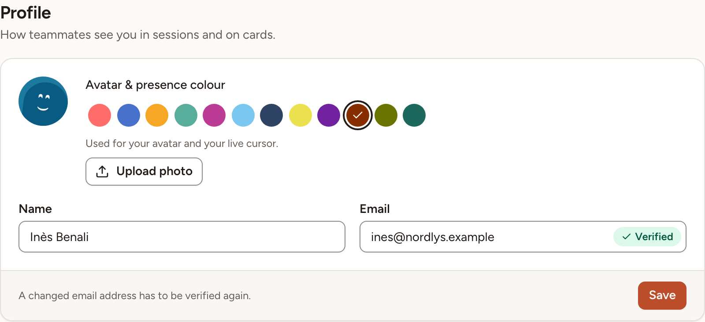
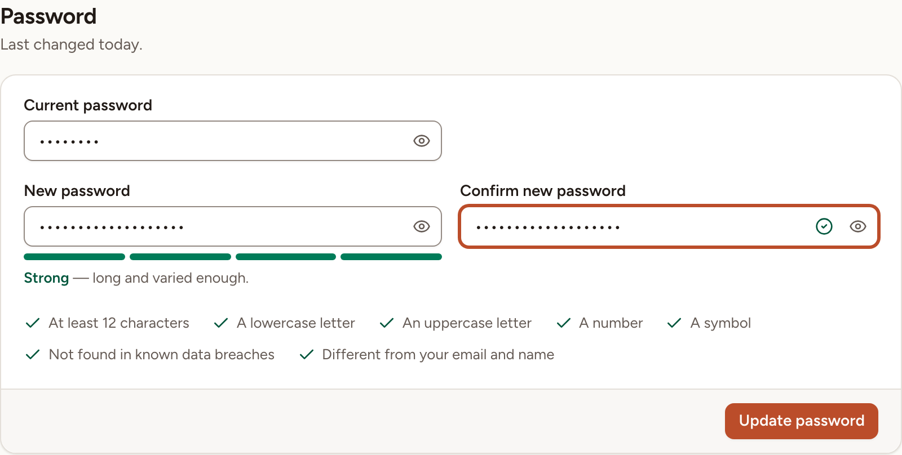
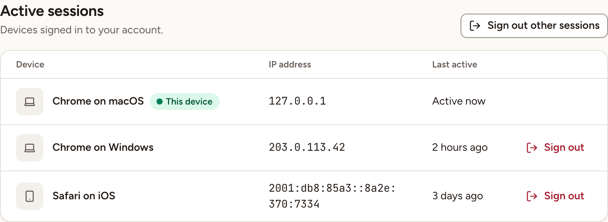
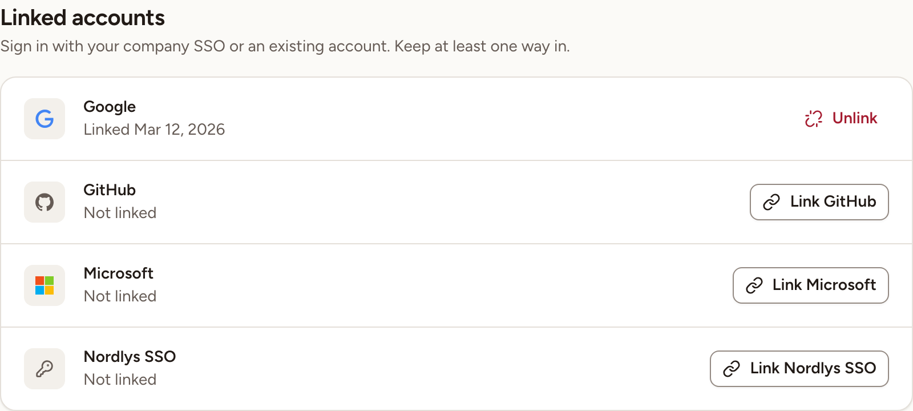
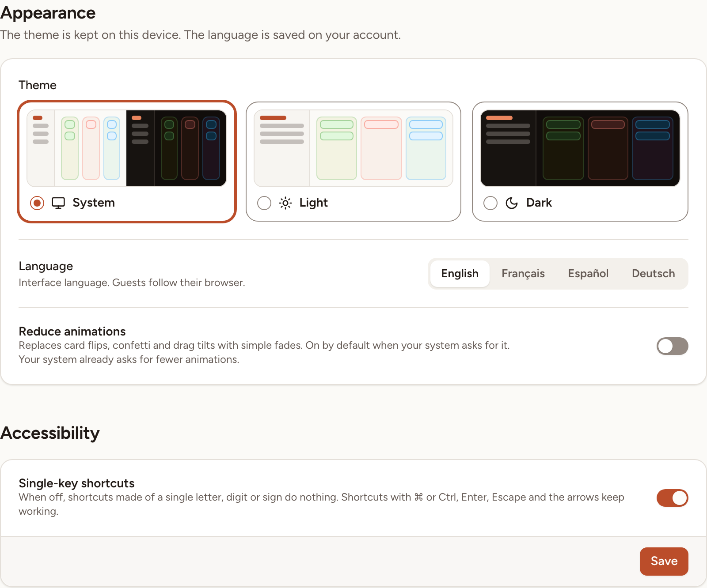
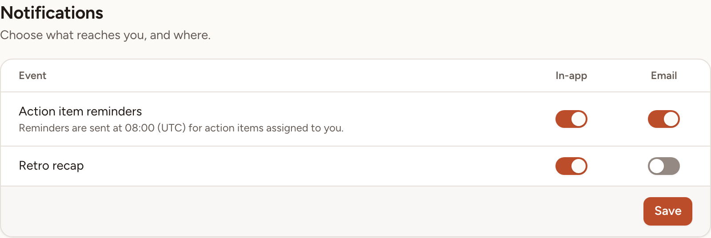

This page goes through the settings of your own account. They apply in every workspace you belong to.

To open them, select your name at the bottom of the sidebar, then **Settings**. The settings are one page with up to five sections: **Profile**, **Security**, **Appearance**, **Notifications** and **API tokens**. The navigation of the page jumps to each.

> Until the email address of your account is verified, the page shows **Profile** only.

## Profile

- **Name** is how teammates see you in sessions and on cards.
- **Email** is the address you sign in with. When you change it, Skrüm asks for your password, sends a verification link to the new address, and turns the email code off if you used it as a second factor.
- **Avatar & presence colour** offers twelve colours. The one you pick is used for your avatar and your live cursor.
- **Upload photo** takes a JPEG or PNG image and shows it as your avatar. The button is there when an instance admin allows profile photos.

Select **Save** to keep a new name, address or colour. A photo is saved as soon as you choose it.

The **Avatar style** card sets how your avatar is drawn when you have no photo. When an instance admin lets members choose, pick a style and select **Save avatar style**; **Use the instance style** goes back to the default. Otherwise the card says the style is set by the instance.

## Password

Skrüm asks you to confirm your password in a dialog before it shows or changes anything in **Security**. The same dialog opens when a direct link requires password confirmation.

1. In the **Password** card, enter your **Current password**.
2. Enter the **New password** and repeat it in **Confirm new password**. The card shows how strong it is and ticks each rule as you meet it.
3. Select **Update password**.

An account created with a company account has no password yet. The card is then titled **Set a password** and does not ask for a current one.

The two cards that follow, **Two-factor authentication** and **Passkeys**, are described in [Two-factor and passkeys](../two-factor-and-passkeys/).

## Active sessions

The **Active sessions** card lists the devices signed in to your account, each with its browser and system, its IP address and when it was last active. **This device** marks the one you are using.

- **Sign out** on a row signs that device out.
- **Sign out other sessions** signs out every device but this one, and ends **Remember me** on every device.

The card is absent when the instance does not keep sessions in the database.

## Linked accounts

The **Linked accounts** card lists the sign-in providers of the instance. It is there when an instance admin connected at least one.

- **Link …** sends you to the provider, and brings you back with that account linked. You can then sign in with it.
- **Unlink** removes it. Skrüm refuses to unlink your last way to sign in: set a password or link another account first.
- **Managed by your admin** marks an account you cannot unlink.

## Appearance

| Setting | What it does | Where it is kept |
|---|---|---|
| **Theme** | **System** follows your device; **Light** and **Dark** stay as chosen | On this device |
| **Language** | English, Français, Español or Deutsch, for the interface. Guests follow their browser | On your account |
| **Reduce animations** | Replaces card flips, confetti and drag tilts with fades. It is already in effect when your system asks for fewer animations | On your account |
| **Single-key shortcuts** | When off, shortcuts made of one letter, digit or sign do nothing. Select **Save** after changing it | On your account |

See [Keyboard shortcuts](../keyboard-shortcuts/) for the shortcuts themselves.

## Notifications

Each event has two switches: **In-app** for the notification bell, **Email** for your mailbox. Select **Save** after changing them.

| Event | What reaches you |
|---|---|
| **Action item reminders** | The action items assigned to you that are due or overdue. They are sent once a day at the time the card shows. See [Reminders and recurrence](../../action-items/reminders-and-recurrence/). |
| **Retro recap** | The results of a completed retrospective, when someone sends them by email. See [Summary and sharing](../../retrospectives/summary-and-sharing/). |

When reminders are turned off for the whole instance, the card says "Reminders are turned off on this instance."

## API tokens

The last section is there when the MCP server of the instance is on. See [API tokens](../api-tokens/).

## Delete your account

1. At the end of **Profile**, select **Delete account**.
2. Enter your **Password** and select **Delete account** again.

Your profile and your API tokens are deleted for good. Cards you wrote stay, shown as "Former member". A workspace where you are the only member is deleted with you.

Skrüm refuses in two cases:

- You are the only owner of a workspace that has other members. Transfer its ownership first; see [Workspaces](../../teams/workspaces/).
- You are the only instance admin. Name another one first; see [Users and admins](../../administration/users-and-admins/).
