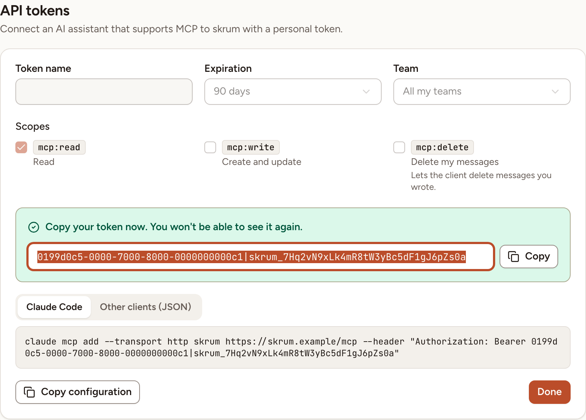
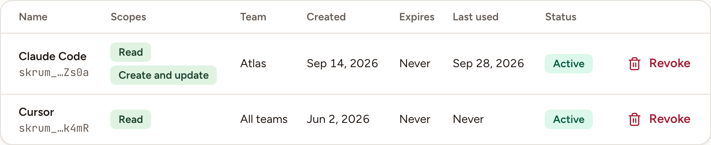

An API token lets an AI assistant that supports MCP read, and if you allow it change, what you can see in Skrüm. This page shows how to create one, where to copy it, and how to revoke it. Connecting the assistant itself is in [Connect an assistant](../../mcp/connect/).

Tokens are personal: everyone creates their own, and the assistant acts as you, in the teams you can see. The **API tokens** section is in **Settings** when the host enabled the MCP server and the e-mail address of your account is verified. Skrüm asks you to confirm your password before it shows your tokens or creates one.

## Create a token

1. Open **Settings** and go to **API tokens**.
2. Enter a **Token name** that tells you which assistant uses it, for example "Claude Code". Two of your tokens cannot have the same name.
3. Choose an **Expiration**: **30 days**, **90 days** (the default), **1 year** or **Never**.
4. Choose a **Team** to limit the token to one team, or leave **All my teams**.
5. Tick the **Scopes** the assistant needs (next section).
6. Select **Create token**.

## Scopes

| Scope | Label | What it allows |
|---|---|---|
| `mcp:read` | **Read** | Reading. Every token has it; it cannot be unticked |
| `mcp:write` | **Create and update** | Creating and updating |
| `mcp:delete` | **Delete my messages** | Deleting messages you wrote |

The tools of the server are listed in [Tools reference](../../mcp/tools/).

## Copy the token

The token is shown once, right after you create it, with the message "Copy your token now. You won't be able to see it again."

- **Copy** copies the token alone.
- **Client configuration** gives the token already placed in a configuration: the **Claude Code** tab is a command to run, **Other clients (JSON)** is a block for clients configured with a file. **Copy configuration** copies the one on screen.
- **Done** closes the panel. After that the token cannot be shown again; create another if you lost it.

The **MCP server** card under the list gives the **Server URL** of the instance. The assistant must be able to send an `Authorization` header; connectors that ask you to sign in on the web are not supported.

> What the assistant reads through a token is sent to the AI application you use.

## See and revoke your tokens

The list shows each token with the last characters of its value, its scopes, its team, when it was created, when it expires, when it was last used, and whether it is **Active** or **Expired**. A token limited to a team you have left shows "No access to this team anymore".

To revoke a token:

1. Select **Revoke** on its row.
2. Confirm with **Revoke**.

The assistant that used it loses access on its next request.

> Changing your password does not revoke your tokens. Revoke them here.
