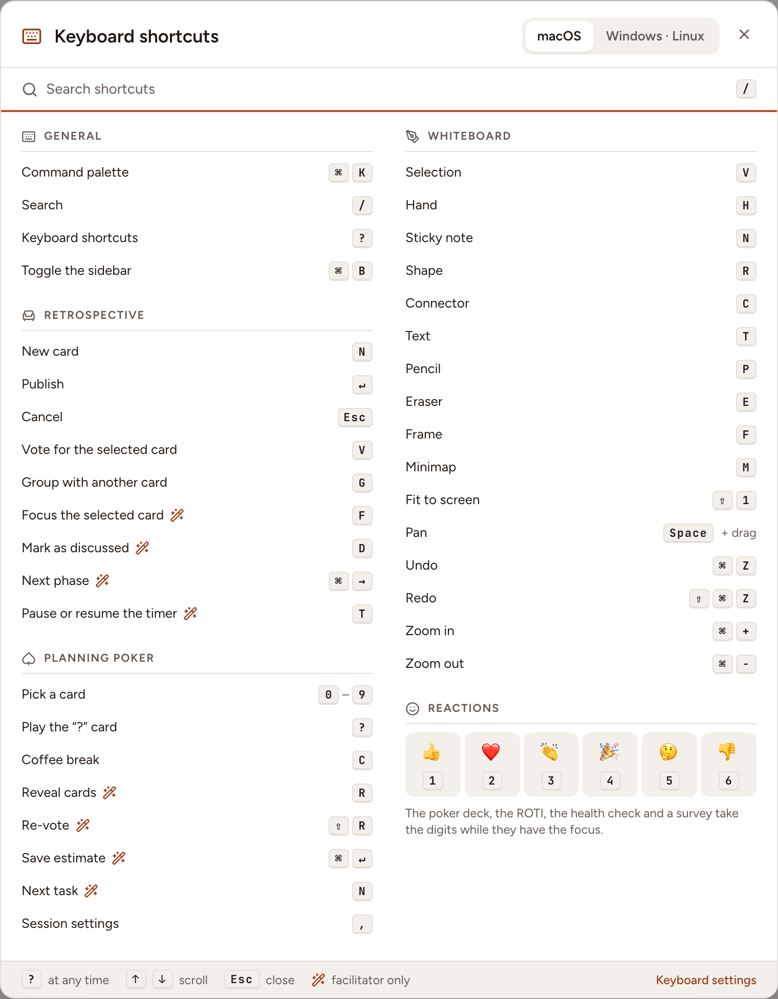
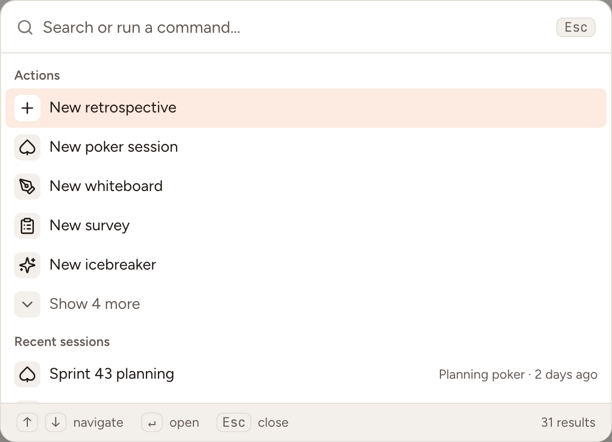

Skrüm has 43 keyboard shortcuts in five groups. This page lists them all, shows where to look them up in the application, and how to use the command menu.

In the tables, **Mod** is `⌘` on macOS and `Ctrl` on Windows and Linux.

## Open the shortcuts dialog

- Press `?` anywhere outside a text field.
- Or press **Mod** + `/`, which also works while you type in a field.
- Or open the menu on your name and select **Keyboard shortcuts**, or run **Show keyboard shortcuts** from the command menu.

On a whiteboard, `?` typed on the canvas belongs to the canvas. In a poker game whose deck has a "?" card, `?` plays that card. Use **Mod** + `/` there.

In the dialog:

- **macOS** and **Windows · Linux** switch the names of the keys. The dialog opens on the one that matches your device.
- **Search shortcuts** filters the list; press `/` to reach it.
- The group of the session you are in comes right after **General**.
- A wand marks a shortcut that works for the facilitator only.
- The list leaves out what the screen does not have: a session has no command palette, a guest has no sidebar, and the "?" and coffee cards are listed in a poker game only when its deck holds them.

## General

| Shortcut | Keys |
|---|---|
| Command palette | **Mod** + `K` |
| Search | `/` |
| Keyboard shortcuts | `?` |
| Toggle the sidebar | **Mod** + `B` |

## Retrospective

| Shortcut | Keys | Who |
|---|---|---|
| New card | `N` | Everyone |
| Publish | `Enter` | Everyone |
| Cancel | `Esc` | Everyone |
| Vote for the selected card | `V` | Everyone |
| Group with another card | `G` | Everyone |
| Focus the selected card | `F` | Facilitator |
| Mark as discussed | `D` | Facilitator |
| Next phase | **Mod** + `→` | Facilitator |
| Pause or resume the timer | `T` | Facilitator |

## Planning poker

| Shortcut | Keys | Who |
|---|---|---|
| Pick a card | `0` to `9` | Everyone |
| Play the “?” card | `?` | Everyone |
| Coffee break | `C` | Everyone |
| Reveal cards | `R` | Facilitator |
| Re-vote | `Shift` + `R` | Facilitator |
| Save estimate | **Mod** + `Enter` | Facilitator |
| Next task | `N` | Facilitator |
| Session settings | `,` | Everyone |

## Whiteboard

| Shortcut | Keys |
|---|---|
| Selection | `V` |
| Hand | `H` |
| Sticky note | `N` |
| Shape | `R` |
| Connector | `C` |
| Text | `T` |
| Pencil | `P` |
| Eraser | `E` |
| Frame | `F` |
| Minimap | `M` |
| Fit to screen | `Shift` + `1` |
| Pan | `Space` + drag |
| Undo | **Mod** + `Z` |
| Redo | `Shift` + **Mod** + `Z` |
| Zoom in | **Mod** + `+` |
| Zoom out | **Mod** + `−` |

## Reactions

| Reaction | Key |
|---|---|
| 👍 | `1` |
| ❤️ | `2` |
| 👏 | `3` |
| 🎉 | `4` |
| 🤔 | `5` |
| 👎 | `6` |

The poker deck, the ROTI, the health check and a survey take the digits while they have the focus.

## Turn single-key shortcuts off

To turn off the shortcuts made of a single letter, digit or sign:

1. Open **Settings** and go to **Appearance**. The **Keyboard settings** link at the bottom of the shortcuts dialog leads there.
2. Under **Accessibility**, switch **Single-key shortcuts** off.
3. Select **Save**.

Shortcuts with **Mod**, `Enter`, `Esc` and the arrows keep working, and the dialog says "Single-key shortcuts are off. Shortcuts with ⌘ or Ctrl still work." In a session, the dialog has the **Single-key shortcuts** switch itself, so that a guest can use it too.

## Use the command menu

The command menu searches the workspace, runs an action and opens a page from one field.

1. Select **Search…** in the top bar, or press **Mod** + `K` or `/`.
2. Type a few letters.
3. Move with `↑` and `↓`, open with `Enter`, close with `Esc`.

| Group | What it holds |
|---|---|
| **Actions** | **New retrospective**, **New poker session**, **New whiteboard**, **New survey** and **New icebreaker** when you are in a team and not an observer; **Join a session with a code**; **Invite to …** when you may manage the members of the workspace; **Switch to dark theme** or **Switch to light theme**; **Show keyboard shortcuts** |
| **Recent sessions** | The last sessions of your teams, the ones in progress first, marked **Live** |
| **Results** | From two characters typed: the retrospectives, poker sessions, whiteboards, games, surveys, action items and cards of the workspace that match |
| **Go to** | The pages of the sidebar, your other teams, and **Profile**, **Security** and **Notification settings** |

Some pages of **Go to** show two keys. Press `G`, then the second key, without opening the menu:

| Page | Keys |
|---|---|
| Home | `G` then `H` |
| Sessions | `G` then `E` |
| Action items | `G` then `A` |
| Insights | `G` then `I` |
| Members | `G` then `M` |
| Templates | `G` then `T` |
| Administration | `G` then `S` |

A page is listed, and its keys work, when you have that page.
