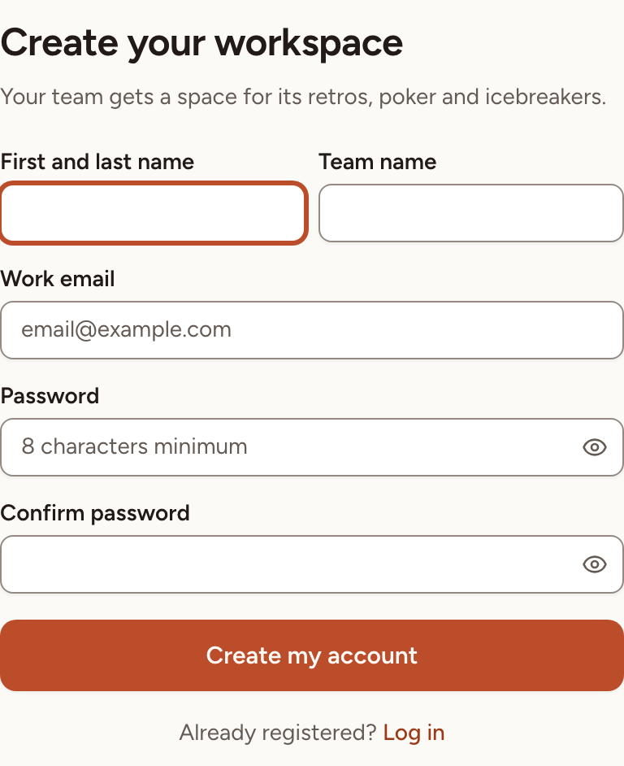
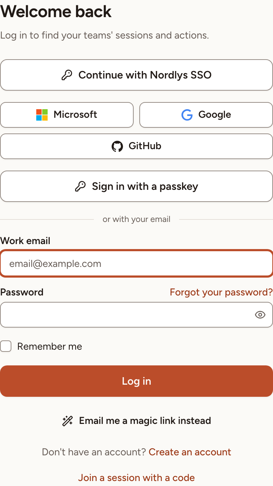
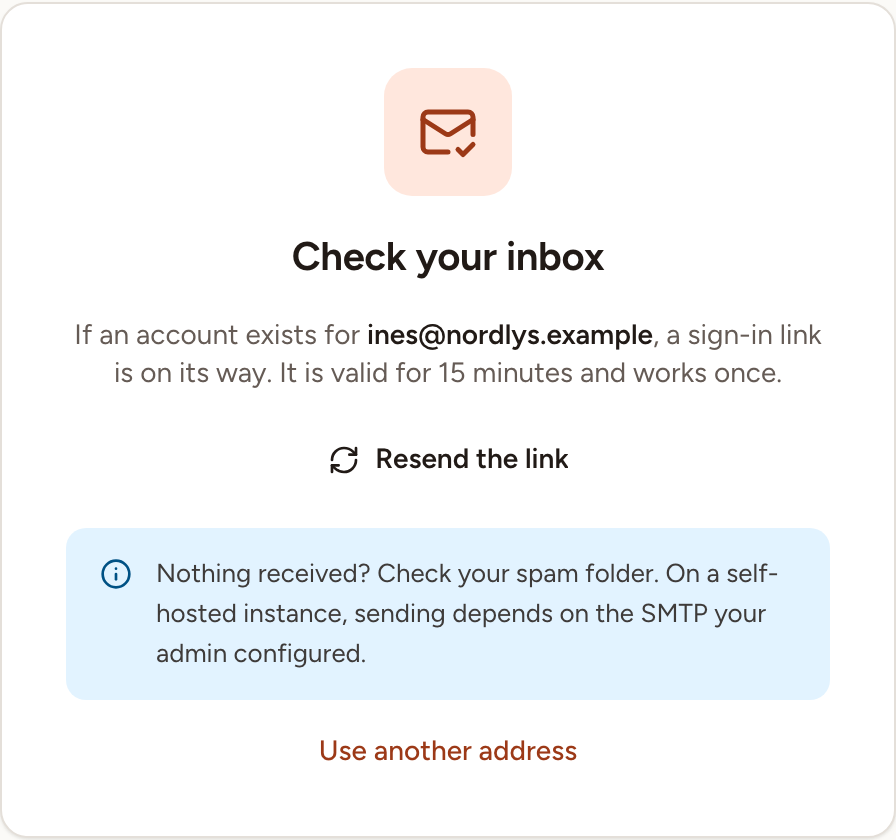

This page shows how to create your account and the ways to sign in. Which of them you see depends on what an instance admin turned on; their side is in [Sign-in and SSO](../../administration/sign-in-and-sso/).

To take part in one session without an account, see [Join as a guest](../../getting-started/join-as-guest/).

## Create an account

An instance accepts new accounts in one of three ways. An instance admin chooses it.

| Sign-up | What you do |
|---|---|
| Invitation only (the default) | Open the invitation you received by email, or the invite link a team owner gave you, and create your account from that page. The sign-in page has no **Create an account** link. See [Invitations and invite links](../../teams/invitations/). |
| Open to everyone | Select **Create an account** under the sign-in form. |
| Email domains | Select **Create an account** and use an address of one of the allowed domains. Another address is refused with "Signups are restricted on this instance." |

The first account created on a new instance is always accepted, and it becomes an instance admin.

To create an account with the form:

1. Open the sign-in page and select **Create an account**.
2. Fill in **First and last name** and **Work email**. When no invitation brought you, the page is titled **Create your workspace** and also asks for a **Team name**, which you may leave empty.
3. Choose a **Password** and type it again in **Confirm password**. The field shows the minimum length. On a production instance a password needs at least 12 characters, with a lowercase letter, an uppercase letter, a number and a symbol, it must not be your name or your address, and unless the check is turned off on the instance it must not appear in known data breaches.
4. Select **Create my account**.

When the page shows a **Continue with …** button, you can create the account with your company account instead of a password. The same sign-up rule applies to it.

## Verify your email address

After you create an account with the form, Skrüm sends a verification link to your address and shows the **Email verification** page until you have opened that link.

- **Resend verification email** sends a new link.
- **Log out** leaves the page, for instance to start again with another address.

An account created from an invitation sent to its address, or with a company account, is verified from the start.

## Sign in with a password

1. Open the sign-in page.
2. Enter your **Work email** and your **Password**.
3. Tick **Remember me** to stay signed in on this browser.
4. Select **Log in**.

Sign-in accepts five attempts a minute for one address from one network address. Wait a minute after that.

If your account has a second factor, Skrüm asks for it next. See [Two-factor and passkeys](../two-factor-and-passkeys/).

## Sign in with a magic link

A magic link signs you in without a password. The button is there when the instance can send email.

1. Enter your **Work email**.
2. Select **Email me a magic link instead**. On a phone, select the **Magic link** tab, then **Receive the magic link**.
3. Open the link in the email. It is valid for 15 minutes and works once.
4. The page says which address you are about to sign in as. Select **Continue**.

The **Check your inbox** card says the same thing whether or not an account exists for the address. **Resend the link** becomes available after 60 seconds, and **Use another address** goes back to the form. A link is only sent when the address belongs to an account and has been verified.

## Sign in with your company account

When an instance admin connected a sign-in provider, the page shows a **Continue with …** button for each: Google, GitHub, Microsoft, or the name your organisation gave to its own single sign-on.

1. Select the button.
2. Sign in at the provider.
3. You come back to Skrüm signed in.

The first time, Skrüm looks for an account with the address the provider confirmed. If you already have one, the provider is linked to it. If you have none, an account is created when the sign-up rule of the instance allows it. You can link and unlink providers later in [Account settings](../account-settings/).

> When the instance requires single sign-on, the page says "This instance signs in with single sign-on only." Passwords, magic links, passkeys and the registration form are refused. **Administrator sign-in** opens the password form, which then accepts instance admins only, with their second factor.

## Sign in with a passkey

If you added a passkey to your account, select **Sign in with a passkey** and confirm with your device. No address or password is asked. Adding a passkey is described in [Two-factor and passkeys](../two-factor-and-passkeys/).

## Reset a forgotten password

1. On the sign-in page, select **Forgot your password?**.
2. Enter your **Work email** and select **Email password reset link**.
3. Open the link in the email. It is valid for 60 minutes.
4. Enter a **New password**, repeat it in **Confirm password**, and select **Reset password**.

The page gives the same answer whether or not an account exists for the address.
