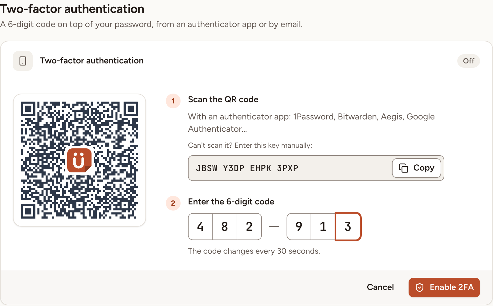
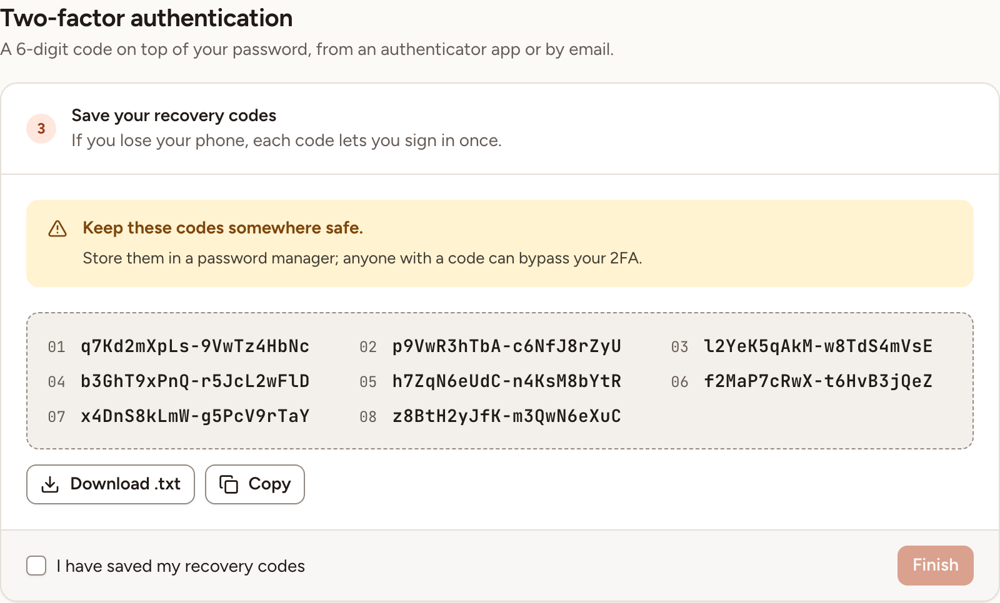
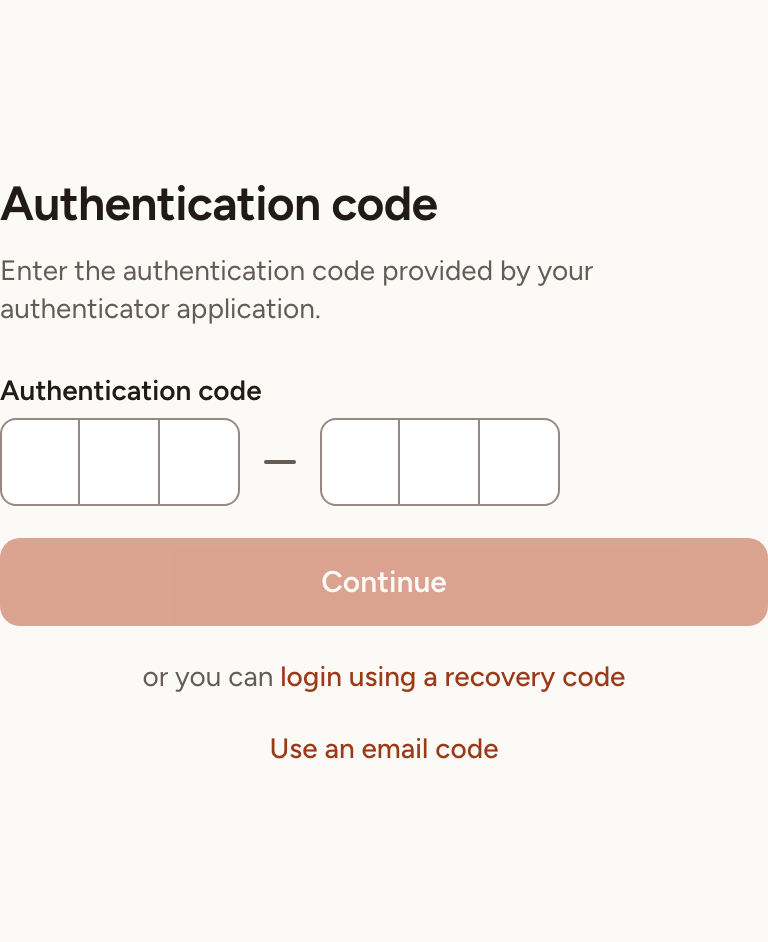
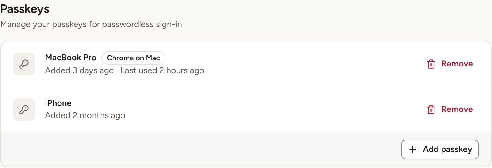

This page shows how to protect your account with a code from an authenticator app or by email, how to keep and use recovery codes, and how to add a passkey. Anyone can do this for their own account once its email address is verified.

Everything here is in **Settings**, section **Security**: open the menu on your name at the bottom of the sidebar, select **Settings**, then **Security**.

> Skrüm asks you to confirm your password before it shows or changes anything in **Security**. If you have a passkey, **Confirm with passkey** does the same. An account that has no password, because it was created with a company account, receives a code by email instead.

## Turn on an authenticator app

1. In the **Two-factor authentication** card, select **Enable 2FA**.
2. **Scan the QR code** with an authenticator app such as 1Password, Bitwarden, Aegis or Google Authenticator. If you cannot scan it, copy the key shown under "Can't scan it? Enter this key manually:".
3. Under **Enter the 6-digit code**, type the code the app shows, then select **Enable 2FA**.
4. Save the recovery codes (next section), tick **I have saved my recovery codes** and select **Finish**.

The card then shows **On**, the date the app was added and how many recovery codes are left.

## Keep your recovery codes

Skrüm gives you 8 recovery codes when you turn the app on. Each one signs you in once when you do not have your phone.

- **Download .txt** and **Copy** take the list out of the page. Store it in a password manager: anyone with a code can pass your second factor.
- Later, the **Recovery codes** row shows how many are left. **View recovery codes** shows the ones not used yet.
- **Regenerate codes** replaces them with 8 new ones. The old ones stop working at once. The card warns you when 3 or fewer are left.

If you lost your phone and your recovery codes, sign in with the email code if you turned it on. Skrüm has no screen where an instance admin resets a second factor, so keep the codes or turn on both methods.

## Turn on the email code

The **Email code** row is there when the instance can send email. With it, Skrüm sends a 6-digit code to your address each time you sign in.

1. In the **Email code** row, select **Send me a code**.
2. Type the code you received in **Code received by email**. A code is valid for 10 minutes.
3. Select **Turn on**.

The email code has no recovery codes: if it is your only second factor and you lose access to your mailbox, you lose access to your account. Changing the email address of your account turns the email code off.

## What sign-in looks like

After your password, a magic link or your company account, Skrüm opens the **Authentication code** page.

- Type the code from your app and select **Continue**.
- **login using a recovery code** switches to the **Recovery code** field.
- **Use an email code** sends a code to your address and opens the **Email code** page. This link is there when both methods are on. With the email code alone, the code is sent as soon as the page opens.

You have five attempts a minute.

## Turn a second factor off

- **Turn off 2FA** removes the authenticator app and its recovery codes. When the email code is also on, the button reads **Turn off the app** and the email code keeps protecting your account.
- **Turn off the email code** removes the email code.

Each asks for a confirmation. With no method left, your account is protected by your password only.

## Add a passkey

A passkey lets you sign in with your device instead of a password.

1. In the **Passkeys** card, select **Add passkey**.
2. Give it a **Passkey name** that tells you which device it is, for example "MacBook Pro".
3. Select **Register passkey** and follow what your browser asks.

The card lists each passkey with when it was added and last used. To sign in with one, select **Sign in with a passkey** on the sign-in page. A browser without passkey support shows "Passkeys are not supported in this browser." and no **Add passkey** button.

## Remove a passkey

1. In the **Passkeys** card, select **Remove** on its row.
2. Confirm with **Remove passkey**.

The passkey no longer signs you in.
