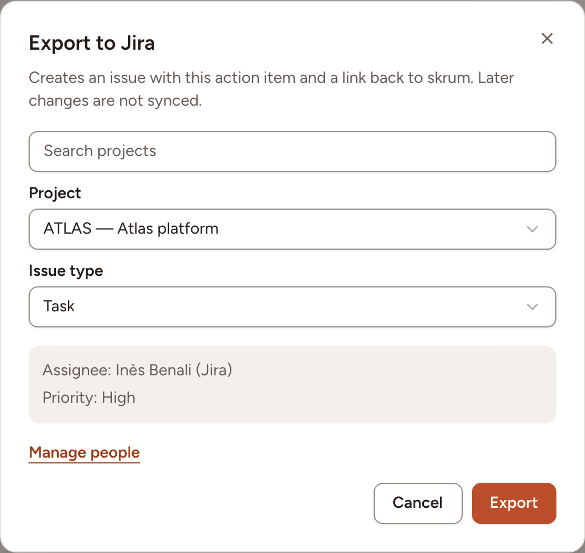
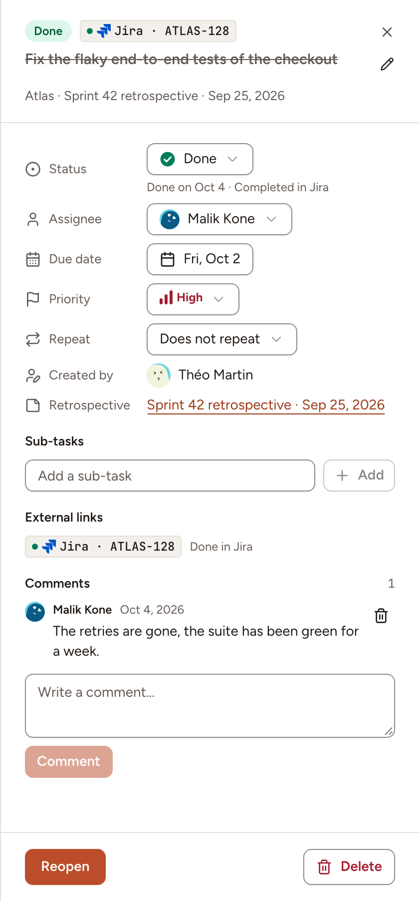

You can download the action items as a CSV file, or turn an item into an issue of your team's tracker: Jira Cloud, Jira Data Center, Linear or GitHub. With status sync on, the item and its issue then follow each other.

## Download a CSV file

In the **Action items** page, set the filters to the items you want, then select **Export** in the top bar. The file holds every item that matches the filters, on all pages, in the order of the list.

Its columns are **Action**, **Status**, **Team**, **Assignee**, **Priority**, **Due date**, **Source** (the title of the retro, or **Added outside a retro**), **Created**, **Completed**, **Tickets** (the keys of the issues the item was exported to) and **Link** (the address of the item in Skrüm).

## Export an item to a tracker

The team must have the tracker connected with read and write access: see [Jira Cloud](../../integrations/jira-cloud/), [Jira Data Center](../../integrations/jira-data-center/), [Linear](../../integrations/linear/) or [GitHub](../../integrations/github/). You can export the items you may edit: the ones you wrote, the ones of a retro you facilitated, and all of them if you are a workspace owner or admin.

1. In the **Ticket** column of the item, or at the bottom of its details, select the export button. With one tracker it reads **Export to Jira** (or the name of yours); with several, **Export** lists them.
2. Choose where the issue goes: a **Project** and an **Issue type** for Jira, a **Linear team** for Linear, a **Repository** for GitHub. Skrüm proposes the team's last choice.
3. Read the two lines under the fields: the assignee and the priority the issue will get.
4. Select **Export**.

The issue gets the first line of the item as its title, then its text, the retro it comes from, a link back to the item in Skrüm, and its due date.

- **Assignee**: the tracker account mapped to the member under **People**, in the settings of the team's tracker. A member who is not mapped yet is looked up by e-mail address (Jira, Linear) or by their GitHub sign-in. When nothing matches, or when the assignee is a guest, the issue is created unassigned and a message says so.
- **Priority**: mapped under **Priorities** (Jira, Linear) or **Priority labels** (GitHub), in the same settings.

An item is exported once to each tracker. Its key then shows in the **Ticket** column and under **External links** in the details; selecting it opens the issue. Guests of a retro do not see tickets.

To export several items of one team, select their rows and choose **Sync to Jira** (or your tracker) in the bar: you choose the target once, and the items already linked are skipped.

> Later changes to the item are not copied to the issue: renaming it or changing its assignee leaves the issue as it is. Only the status can follow.

## Keep the status in step

Status sync is off until the team's owner, or a workspace owner or admin, turns on **Sync status** under **Status sync**, in the settings of the team's tracker. The first sync takes the state of every linked issue: items may be completed or reopened to match. After that, the most recent change wins.

| When | Then |
|---|---|
| You mark the item as done, or reopen it | Its issue moves to a done status, or is reopened |
| You start the item | Its Jira or Linear issue moves to an in-progress status. A GitHub issue stays open |
| The issue is closed in the tracker | The item becomes **Done**, and its details say **Completed in Jira** (or your tracker) |
| The issue is reopened or started in the tracker | The item goes back to **To do** or **In progress** |

Changes made in the tracker arrive at once where the tracker can call Skrüm; otherwise Skrüm asks the tracker every few minutes, and **Status sync** says how often. Issues of items completed more than 90 days ago are no longer followed.

Under **Status mapping**, **Automatic** uses the done statuses of each workflow. Per Jira project or Linear team you can choose where an issue goes (**Start to**, **Complete to**, **Reopen to**) and, for Jira, which statuses complete the item (**Counts as done**). For Linear and GitHub, **Treat canceled as done** decides whether a canceled issue, or one closed as not planned, completes the item.

In the details of an item, each link says how its sync is doing: a status such as **Done in Jira** when the item and the issue agree, **Sync pending** while a change is on its way, **Sync failed** with the reason and a retry button, or **Not found in Jira** when the tracker no longer returns the issue.
