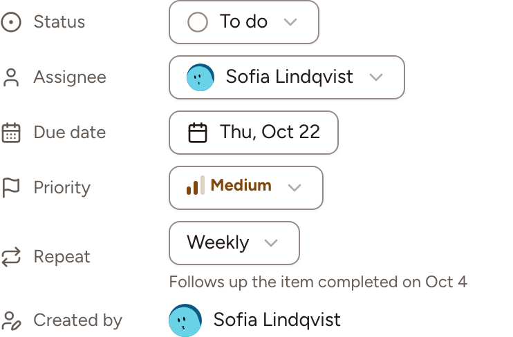

Skrüm reminds the assignee of an action item when its due date comes, and creates the next occurrence of an item that repeats. This page says when reminders are sent, how to turn them off, and what a repeat does.

## When a reminder is sent

Once a day, Skrüm looks for the action items that are not done, have a due date and are assigned to a member of their team.

| The due date is | You are reminded that the item is |
|---|---|
| Today or tomorrow | Due soon |
| One to seven days ago | Overdue |

You get one reminder of each kind for an item: the first when it becomes due soon, the second once its due date has passed. Changing the due date starts again.

Reminders go to the assignee only, and only when their email address is verified, their account is active and they are still a member of the item's team. An item without an assignee, or assigned to a guest, has nobody to remind.

## What you receive

- **In the bell**: one notification for each item, which opens that item. Marking the item as done marks it as read.
- **By email**: one message for the day, with the overdue items first, then the ones due soon, 20 at most. Each line links to its item, and **Open my action items** opens the list of what is assigned to you.

## Turn reminders off

1. Open your account settings and go to **Notifications**.
2. On the line **Action item reminders**, turn off **In-app**, **Email**, or both.
3. Select **Save**.

The line also says at what time, and in which time zone, the reminders are sent. See [Account settings](../../accounts/account-settings/).

Every reminder email ends with **Unsubscribe from reminders**. That link opens a page with one button, **Unsubscribe**, which stops the emails without asking you to sign in. The bell keeps its notifications until you turn off **In-app**.

> The person who hosts the instance chooses the time of the reminders (08:00 by default) and can turn them off for everyone, with `SKRUM_ACTION_ITEM_REMINDER_TIME` and `SKRUM_ACTION_ITEM_REMINDERS`. When they are off, **Notifications** says so. See [Configuration reference](../../self-hosting/configuration/).

## Repeat an action item

An item with a due date can repeat. In its details, or when you create it, set **Repeat** to **Weekly**, **Every 2 weeks** or **Monthly**; **Does not repeat** is the default. Removing the due date removes the repeat. Setting it needs the same rights as the other fields: see [Track action items](../track/).

When a repeating item is marked as done, Skrüm creates the next one at once, with:

- the same title, priority, assignee and repeat;
- the same sub-tasks, none of them ticked;
- the next due date, counted from the due date of the item just done, not from the day it was done. **Monthly** keeps the day of the month, or takes the last day of a shorter month. If that date is already past, Skrüm moves on by as many periods as it takes to reach today or later.

The new item is listed as **Added outside a retro**, even when the first one came from a retrospective, and its details say which completed item it follows. Comments and tickets stay with the item that was done. An assignee who has left the team is not carried over: the new item is unassigned.

Reopening the item that was done does not remove the one it created, and completing it again does not create another. In the list, a repeating item has a loop icon beside its due date.
