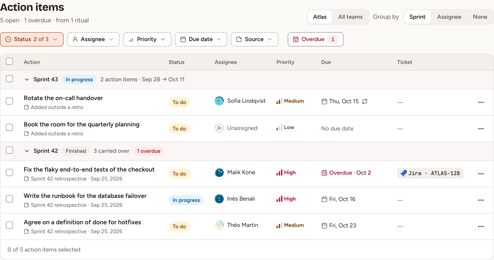
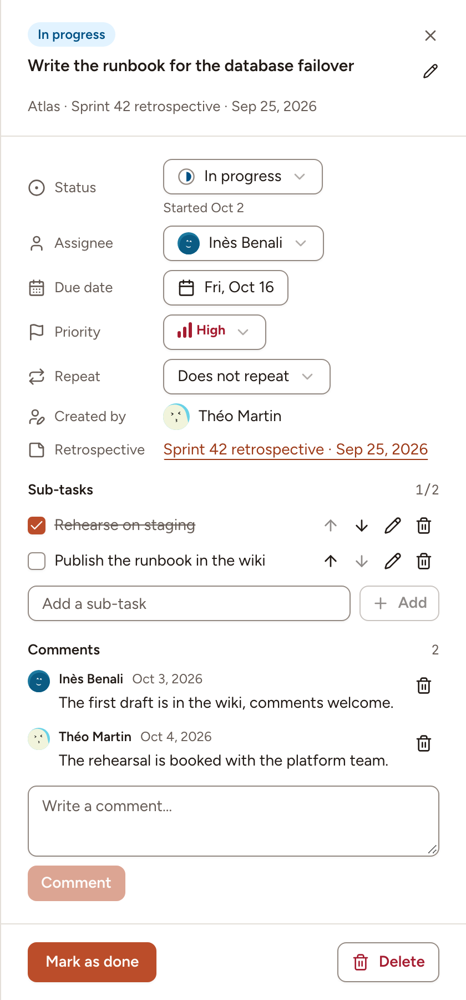
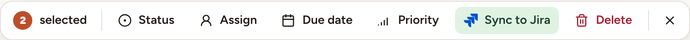

The **Action items** page lists what your teams decided to do, each item with its assignee, its due date and its status. Workspace owners and admins see the items of every team; members see the items of their own teams.

## Where action items come from

- A retrospective: see [Actions](../../retrospectives/actions/).
- The page itself: select **New action item**, choose the team, type what has to be done, then select **Create**. The assignee, due date, priority and repeat are optional. You can add an item to a team you are a member of, not to one you only observe.
- A repeating item, once completed: see [Reminders and recurrence](../reminders-and-recurrence/).
- An AI assistant: see [Tools reference](../../mcp/tools/).

## Open the list

Select **Actions** in the sidebar. A badge on that entry counts the overdue items assigned to you.

The page opens on your current team, with the items still to do. The switch at the top right goes from that team to **All teams**. The line under the title counts the open items, the overdue ones and the retros they come from. Items are sorted by due date, the overdue ones first, then by priority; items without a due date come after, completed ones last. A page holds 50 items.

| Control | What it does |
|---|---|
| **Status** | **To do**, **In progress**, **Done**. The page opens without **Done** |
| **Assignee** | **Anyone**, **Me**, **Unassigned**, or one person |
| **Priority** | **High**, **Medium**, **Low** |
| **Due date** | **Overdue**, **Today**, **Next 7 days**, **Later**, **No due date** |
| **Source** | **From a retro** or **Added outside a retro** |
| **Team** | One team, on **All teams** |
| **Overdue** | A shortcut to the overdue items, with their count |
| **Group by** | **Sprint**, **Assignee** or **None**, and **Team** on **All teams**. An item belongs to the sprint during which it was created |

The search field of the top bar finds an item by its text or by the key of its ticket. Your browser remembers the filters and the grouping for each workspace; **Reset** brings the page back to how it opens.

## Change an item

Select the status of a row to move it one step: **To do**, **In progress**, **Done**, then back to **To do**. Select its title to open its details.

There you set the **Status**, the **Assignee** (a member of the item's team), the **Due date**, the **Priority** and the **Repeat**. The pencil renames the item. **Delete** removes it for everyone, with its sub-tasks and comments.

- **Sub-tasks**: a checklist of at most 20 lines. Tick, rename, reorder or delete each one.
- **External links**: the tickets the item was exported to. See [Export and tracker sync](../export-and-sync/).
- **Comments**: write one and select **Comment**. You can edit your own.

| Action | Who |
|---|---|
| Edit the fields and the sub-tasks, delete the item | Its author, the facilitator of the retro it comes from, a workspace owner or admin |
| Change the status, tick a sub-task | The same people, the assignee, and the facilitator of a retro of the team that is still running |
| Comment | Everyone who sees the item |
| Delete a comment | Its author, and the people who may delete the item |

An observer of a team reads its items and changes nothing.

## Change or delete several at once

Tick the box of each row, the box of a group, or the box in the table's header to select every row of the page. In a window narrower than 1280 pixels the table becomes a list: select **Select** there first. A bar appears at the bottom.

**Status**, **Assign**, **Due date** and **Priority** change every selected item; **Delete** asks for confirmation first. When the whole page is selected and the filters match more items than it shows, the bar offers to select all the matching items, up to 500 at once.

The items you may not change are left as they are, and a message says how many. Press Escape or select the cross to clear the selection.
