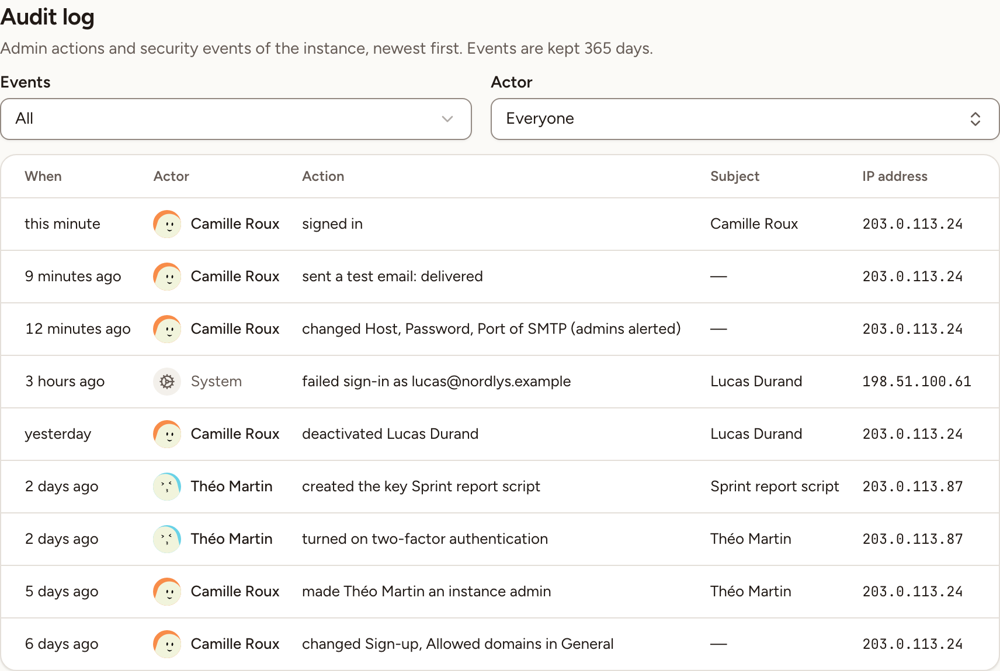

In Administration, **Audit log** shows an instance admin the admin actions and the security events of the instance, newest first.

## What is recorded

Skrüm records 18 kinds of events, in four groups.

| Group | Events |
|---|---|
| **Settings** | A change in General, Branding, the default workspace or the list of turned-off integrations; a change to a single sign-on provider, to the mail server or to an integration's app; the branding reset; a single sign-on connection test; a test email; single sign-on made required or optional |
| **Accounts** | Instance admin rights granted or revoked; an account deactivated or reactivated |
| **Sign-in** | A sign-in; a failed sign-in; two-factor authentication turned on or off; a password changed |
| **Tokens** | An API token created; a token revoked by its owner; a token revoked by an admin |

A settings event names the fields that changed, never their values: no secret and no configuration value is written to the log.

## For how long

Events are kept 365 days. Older ones are deleted once a day by the scheduled tasks of the instance: see [Processes and status](../../self-hosting/processes/).

## Read an entry

| Column | What it shows |
|---|---|
| **When** | How long ago. Hover it for the exact date and time |
| **Actor** | Who did it. **System** stands for an event without an account behind it, such as a failed sign-in. A person whose account was deleted since keeps the name they had |
| **Action** | A sentence: "changed Host, Password, Port of SMTP", "deactivated Lucas Durand", "created the key Sprint report script" |
| **Subject** | The account or the key the action was done to, when there is one |
| **IP address** | The address the request came from |

A change to a single sign-on provider or to the mail server also sends an email to every instance admin. Its entry ends with "(admins alerted)", or with "(the alert to the admins failed)" when that email could not be sent.

## Filter the list

- **Events** keeps one group: **All**, **Settings**, **Accounts**, **Sign-in** or **Tokens**.
- **Actor** keeps the events of one person. The list offers the people who appear on the page you are reading, and you can search it by name; **Everyone** removes the filter.

The log shows 50 events per page.
