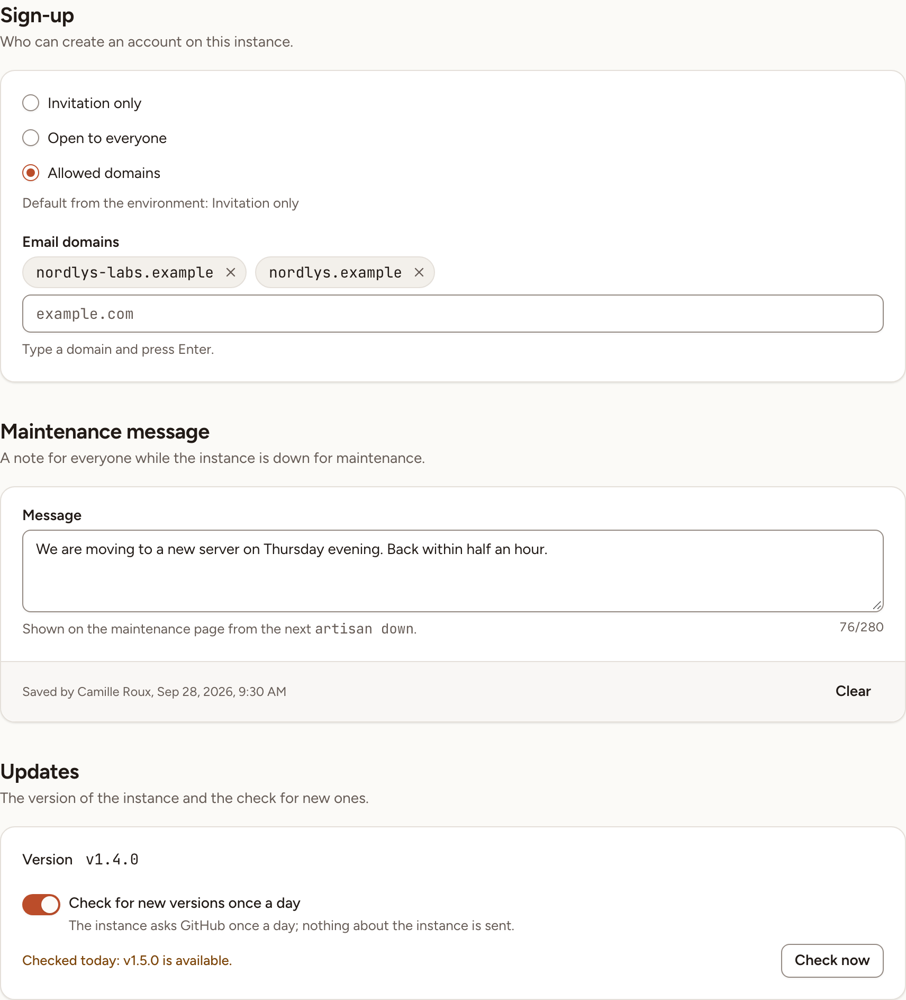
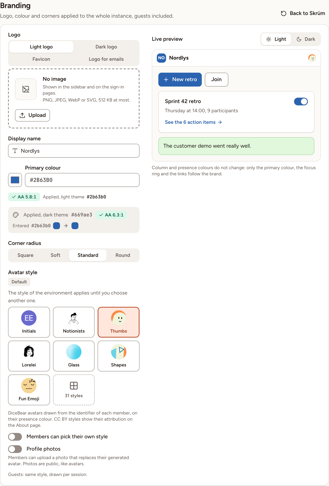
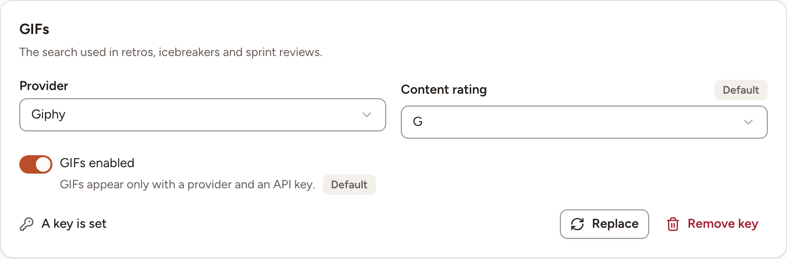

This page covers the first two sections of Administration: **General** (sign-up, the maintenance message, the update check) and **Branding** (name, logos, colour, corners, avatars, GIFs). Only an instance admin can open them.

## Open Administration

1. In the sidebar, select **Admin**. The entry is shown to instance admins only.
2. Skrüm asks for your password before it opens the first section. Type it and select **Confirm password**.

The sections are listed on the left, under **Instance** and **Supervision**. Under them, a box shows the address of the instance and its version.

On **General** and **Branding**, nothing is stored until you save. The bar at the top right counts your unsaved changes; **Save** stores them and **Cancel** puts the form back as it was.

## General

### Sign-up

**Sign-up** decides who can create an account on the instance.

| Choice | Who can create an account |
|---|---|
| **Invitation only** | Someone invited to a workspace by email, with the address the invitation was sent to, or someone who opens a team's invite link |
| **Open to everyone** | Anyone who reaches the sign-up page |
| **Allowed domains** | Anyone whose email address is on one of the domains you list. A person invited to a workspace by email can still sign up with the invited address, whatever its domain |

With **Allowed domains**, type a domain under **Email domains** and press Enter. You can list up to 20 domains, and you need at least one.

The line "Default from the environment" shows what `SKRUM_SIGNUP_MODE` (`invite`, `open` or `domain`) and `SKRUM_ALLOWED_EMAIL_DOMAINS` (domains separated by commas) set. What you save here wins over the environment.

The first account created on a new instance is accepted whatever the mode, and becomes an instance admin.

Sign-up through a single sign-on provider follows the same rule: see [Sign-in and SSO](../sign-in-and-sso/).

### Maintenance message

**Message** is a note of up to 280 characters for everyone while the instance is down for maintenance. It is shown on the maintenance page from the next `artisan down`, with the name of the admin who saved it. Under the field, the card shows who saved the current message and when. **Clear** empties the field.

### Updates

The **Updates** card shows the version of the instance and checks for newer ones. It is described in [Licence and updates](../licence-and-updates/).

## Branding

**Branding** applies to the whole instance, guests included. While you edit, **Live preview** shows the result in the light and the dark theme; the instance itself changes when you select **Save**.

| Field | What it sets |
|---|---|
| **Logo** | Four images, one per tab. **Light logo** is shown in the sidebar and on the sign-in pages. **Dark logo** is optional: the light logo is used without it. **Favicon** is the icon of the browser tab. **Logo for emails** must be a PNG or JPEG at least 128 px wide, because mail clients do not draw SVG; without it, emails use the light logo or the name. The other images are PNG, JPEG, WebP or SVG, 512 KB at most |
| **Display name** | The name of the instance, up to 60 characters. The default is the value of `APP_NAME` |
| **Primary colour** | Any hex colour with 3 or 6 digits, such as `#2B63B0`. Skrüm derives the shades and keeps text readable: under the field you read the colour applied in the light theme and in the dark theme, each with its contrast ratio, beside the colour you entered |
| **Corner radius** | **Square**, **Soft**, **Standard** or **Round** |
| **Avatar style** | The DiceBear style of the generated avatars. The default comes from `SKRUM_AVATAR_STYLE`. A style that requires attribution shows it on the About page |
| **Members can pick their own style** | Lets each member choose another avatar style for themselves |
| **Profile photos** | Lets members upload a photo that replaces their generated avatar. Photos are public, like avatars |

To change an image, open its tab and select **Upload** (or **Replace**), or **Remove**. The image is marked **Not saved** until you select **Save**.

Column and presence colours do not change with the brand: only the primary colour, the focus ring and the links follow it.

### The "Powered by" line

Under **Sign-in pages**, **Show "Powered by Skrüm"** adds a discreet mention on the sign-in pages and on the About page. It is on by default.

### Go back to the default look

**Back to Skrüm** deletes every setting of the Branding section: the colour and the radius, the logos and the favicon, the display name, the avatar style and the two avatar switches, the "Powered by" switch, and the GIF provider, rating and API key. Skrüm asks you to confirm with **Reset to Skrüm**. This cannot be undone.

## GIFs

The **GIFs** card, at the bottom of **Branding**, sets the GIF search used in retros, icebreakers and sprint reviews. GIFs appear only when a provider and an API key are set.

1. Get an API key from the provider.
   - Giphy: [GIPHY API documentation](https://developers.giphy.com/docs/api/), which links to the creation of a key.
   - Tenor: [Tenor API quickstart](https://developers.google.com/tenor/guides/quickstart). That page states that, as of January 2026, Tenor no longer accepts new API clients: choose Tenor only if you already have a key.
2. Under **Provider**, choose Giphy or Tenor. **None** hides GIFs.
3. Paste the key in **API key**. It is stored encrypted and never shown again; later the card reads **A key is set**, with **Replace** and **Remove key**.
4. Under **Content rating**, choose G, PG, PG-13 or R.
5. Leave **GIFs enabled** on, then select **Save**.

The same values can come from the environment: `SKRUM_GIF_PROVIDER` (`giphy` or `tenor`), `SKRUM_GIF_API_KEY` and `SKRUM_GIF_RATING` (`g`, `pg`, `pg-13` or `r`). A field for which nothing is saved here carries a **Default** mark; what you save here wins.
