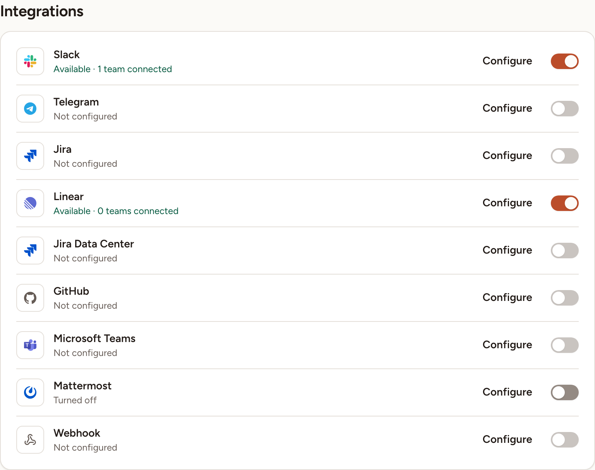
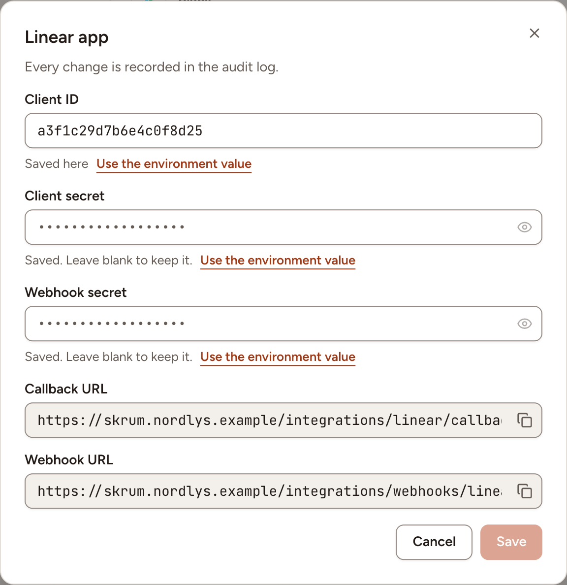

A team can connect an integration only after an instance admin has given Skrüm the provider's app credentials. In Administration, **Integrations** lists the nine providers, holds those credentials, and turns a provider on or off for the whole instance. Changing a value needs a password confirmation from the last five minutes.

## Read the list

Each row shows the provider, its state, a **Configure** button and a switch.

| State | Meaning |
|---|---|
| **Not configured** | A value the provider needs is missing. The switch is disabled and teams do not see the provider |
| "Available", with the number of teams connected | The provider is configured and turned on: teams can connect it |
| **Turned off** | The provider is configured, but you turned it off for every team |

In the list of sections, **Integrations** carries a badge such as `2/3`: of the three configured providers, two are turned on.

## Configure a provider

1. Select **Configure** on the provider's row. A dialog named after the provider opens.
2. Create the app on the provider's side, following the provider's page in the table below. When the dialog shows a **Callback URL** or a **Webhook URL**, copy it with the button beside it and paste it where the provider asks for it.
3. Fill in the fields with the values the provider gave you.
4. Select **Save**.

Under each field, a line says where the value comes from: **Saved here**, or "From the environment" with the name of the variable. A value saved here wins over the environment. A secret is never shown: leave its field blank to keep the saved one.

Every change is recorded in the [audit log](../audit-log/).

| Provider | Fields | Addresses to copy | How to set it up |
|---|---|---|---|
| Slack | **Client ID**, **Client secret** | **Callback URL** | [Slack](../../integrations/slack/) |
| Telegram | **Bot token** | | [Telegram](../../integrations/telegram/) |
| Jira | **Client ID**, **Client secret** | **Callback URL** | [Jira Cloud](../../integrations/jira-cloud/) |
| Linear | **Client ID**, **Client secret**, **Webhook secret** | **Callback URL**, **Webhook URL** | [Linear](../../integrations/linear/) |
| Jira Data Center | **Server URL**, **Client ID**, **Client secret**, **Personal access tokens** | **Callback URL** | [Jira Data Center](../../integrations/jira-data-center/) |
| GitHub | **App ID**, **App slug**, **Client ID**, **Client secret**, **Private key**, **Webhook secret** | **Callback URL**, **Webhook URL** | [GitHub](../../integrations/github/) |
| Microsoft Teams | **Enabled**, **Allowed hosts** | | [Microsoft Teams](../../integrations/microsoft-teams/) |
| Mattermost | **Server URL** | | [Mattermost](../../integrations/mattermost/) |
| Webhook | **Enabled** | | [Webhooks](../../integrations/webhooks/) |

## Turn a provider off, and back on

Use the switch on the provider's row. It works once the provider is configured.

When at least one team uses the provider, Skrüm asks you to confirm: the dialog says how many teams lose it until you turn it back on, and that their settings are kept. Select **Turn off**. Turning the switch back on gives the provider back to those teams as they left it.

## Remove a provider's credentials

1. Select **Configure** on the provider's row.
2. Under each saved field, select **Use the environment value**. The field goes back to the environment's value, or to nothing, when you save.
3. Select **Save**. When teams are connected, Skrüm asks you to confirm with **Clear**: those teams lose the provider until it is configured again, and their settings are kept.
