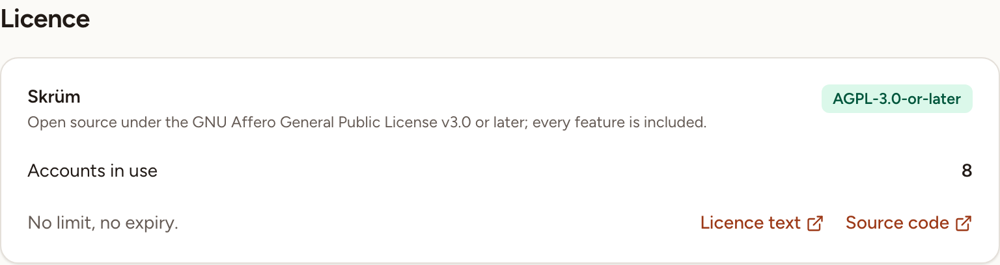
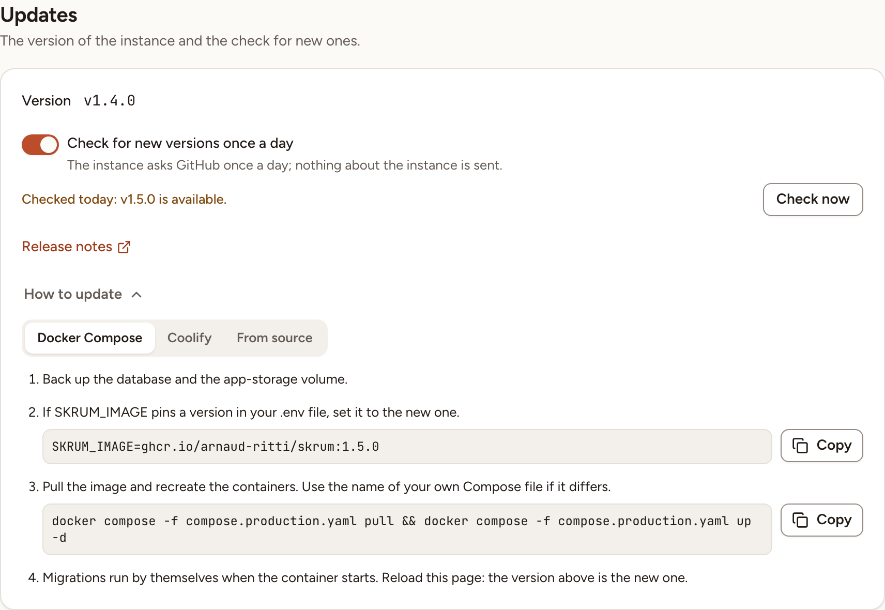

An instance admin reads the licence under **Licence**, and checks for a newer version under **General**, both in Administration.

## The licence

**Licence** is informative: there is no key to enter and nothing to renew. It shows:

- the licence of Skrüm, `AGPL-3.0-or-later`: open source under the GNU Affero General Public License v3.0 or later, with every feature included;
- **Accounts in use**, the number of accounts that are not deactivated. There is no limit and no expiry;
- **Licence text** and **Source code**, two links to the project's repository on GitHub.

## Check for a newer version

The **Updates** card is at the bottom of **General**.

1. Open **General** and go to **Updates**. **Version** is the version the instance runs.
2. Select **Check now**. Skrüm asks GitHub for the latest release of the project and compares it with yours.

The line beside the button then reads one of:

| Line | Meaning |
|---|---|
| "Never checked." | No check has succeeded yet |
| "Checked today: up to date." | No release is newer than yours |
| "Checked today: v1.5.0 is available." | A newer release exists |
| "This build is not a release: it is not compared with new versions." | The instance runs a build whose version is not a release number, such as a branch build |

If GitHub cannot be reached, Skrüm says so and keeps the result of the last check.

The same result is shown to instance admins under the list of sections, beside the version: "up to date", or "update available" with the version.

## Check every day

The daily check is enabled by default through `SKRUM_UPDATE_CHECK_ENABLED=true`. Set it to `false` and redeploy to disable the environment default. A choice saved in Administration overrides this value.

Use **Check for new versions once a day** to change the admin override, then select **Save** at the top right. Skrüm queues a first check when you turn a disabled check on, then checks once a day. **Check now** still works when the daily check is off.

The check is a request to GitHub for the latest release; nothing about the instance is sent. It runs with the scheduled tasks of the instance: see [Processes and status](../../self-hosting/processes/). The address it asks can be changed with the environment variable `SKRUM_UPDATE_FEED`.

Skrüm does not install anything by itself. To move to the newer version, follow [Upgrading](../../self-hosting/upgrading/).
