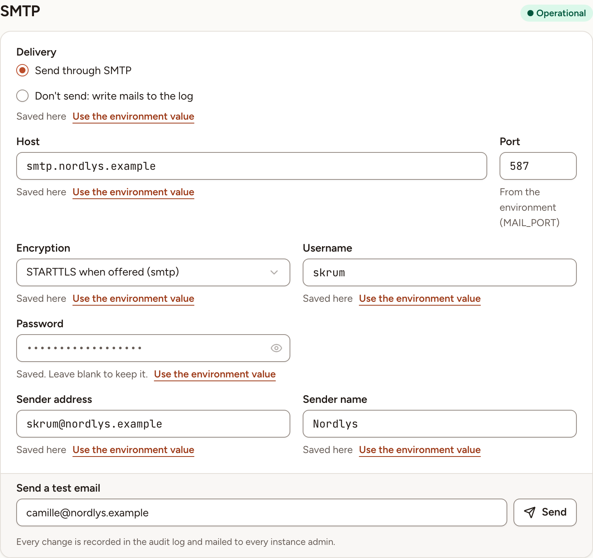

In Administration, **SMTP** is where an instance admin sets the mail server Skrüm sends through and tests it. Changing a value needs a password confirmation from the last five minutes; when yours is older, select **Confirm** in the line at the top of the page.

## Until mail is set

Out of the box, `MAIL_MAILER` is `log`: Skrüm sends nothing and writes every mail to the application log. The page then shows **Not configured** and "Mails are written to the log."

That covers what Skrüm sends by email, among which: address verification and password reset links, workspace invitations, magic links, two-factor codes, action item reminders, retrospective results, and the alert sent to instance admins when the sign-in or mail configuration changes. Nobody receives them until a mail server is set.

## Set the server

1. Under **Delivery**, choose **Send through SMTP**.
2. Fill in the fields of the table below.
3. Select **Save**, in the bar at the top right.

| Field | Environment variable | Notes |
|---|---|---|
| **Delivery** | `MAIL_MAILER` | **Send through SMTP**, or **Don't send: write mails to the log** |
| **Host** | `MAIL_HOST` | |
| **Port** | `MAIL_PORT` | |
| **Encryption** | `MAIL_SCHEME` | See below |
| **Username** | `MAIL_USERNAME` | |
| **Password** | `MAIL_PASSWORD` | Never shown. Leave the field blank to keep the saved one |
| **Sender address** | `MAIL_FROM_ADDRESS` | The address mails are sent from |
| **Sender name** | `MAIL_FROM_NAME` | |

**Encryption** has three choices:

| Choice | Meaning |
|---|---|
| **None** | Nothing is saved for the encryption. When the environment sets one, it cannot be turned off from here |
| **TLS on connect (smtps)** | The connection is encrypted from the start |
| **STARTTLS when offered (smtp)** | The connection starts in clear and switches to TLS when the server offers it |

Under each field, a line says where the value comes from: **Saved here**, or "From the environment" with the name of the variable. A value saved here wins over the environment, and **Use the environment value** removes the saved value when you save.

While **Don't send: write mails to the log** is chosen, the server fields are disabled. If the environment names a mailer other than `smtp` or `log`, the card says "Another mailer from the environment" with its name, and that mailer stays in use until you choose one of the two options.

Once mail is delivered through a server, the page shows **Operational**.

Every change is recorded in the [audit log](../audit-log/) and mailed to every instance admin. The alert is sent through the configuration that was in force before the change.

## Send a test email

1. Save your changes first: the test uses the saved values.
2. Under **Send a test email**, check the address. It starts as your own.
3. Select **Send**.

The result stays under the field until the next test: "Last test delivered", or "Last test failed" followed by the reason.

| Reason | Meaning |
|---|---|
| "no email was sent, mails are written to the log." | **Delivery** is still set to the log |
| "the mail server could not be reached or refused the message." | Check the host, the port, the encryption and the credentials |
| "an unexpected error stopped the email." | The error is in the application log |

You can send five tests in ten minutes; after that the page asks you to wait a few minutes. Each test is recorded in the audit log.
