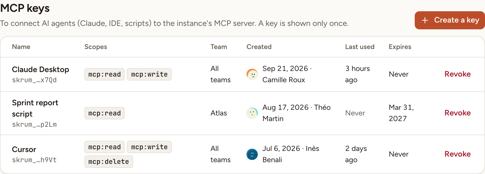

In Administration, **MCP keys** shows an instance admin every key that connects an AI assistant to the instance's MCP server, whoever created it, and lets them revoke any of them.

## A key always belongs to a person

Skrüm has no key at the level of the instance. Every key in this list is the personal API token of one account: the assistant that uses it acts as that person, within the scopes and the team the token was given.

**Create a key** therefore does not create a shared key. It opens the **API tokens** part of your own account settings, where you create a token for yourself: see [API tokens](../../accounts/api-tokens/). A key is shown only once, to the person who creates it.

## Read the list

Keys are listed from the newest to the oldest, 25 per page.

| Column | What it shows |
|---|---|
| **Name** | The name its owner gave the key and, under it, a fingerprint: the prefix `skrum_` and the last four characters. The key itself is never shown |
| **Scopes** | What the key may do: `mcp:read`, `mcp:write`, `mcp:delete` |
| **Team** | The one team the key is limited to, or **All teams** |
| **Created** | The date, and the person the key belongs to |
| **Last used** | How long ago an assistant last used it, or **Never** |
| **Expires** | The date it stops working, or **Never** |

## Revoke a key

1. On the key's row, select **Revoke**.
2. The dialog names the key and its owner. Confirm with **Revoke**.

Assistants using the key stop at once. The revocation is recorded in the [audit log](../audit-log/) with the name of the key and its owner. The owner can create a new token from their account settings.

The keys of a deactivated account are refused without being revoked: see [Users and admins](../users-and-admins/).

## When the MCP server is off

When the environment sets `SKRUM_MCP_ENABLED` to `false`, the page shows "The MCP server is off (SKRUM_MCP_ENABLED)." Existing keys stay in the list and can still be revoked.
