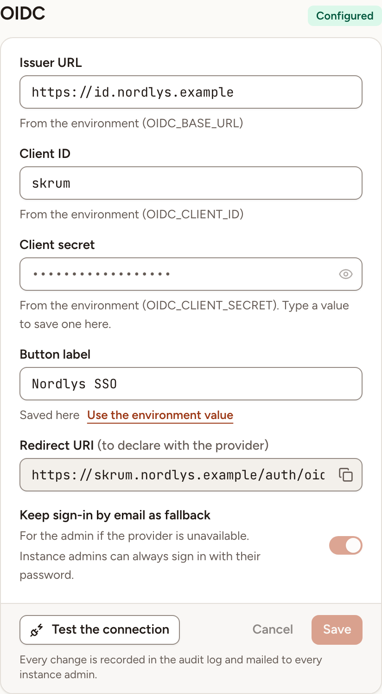
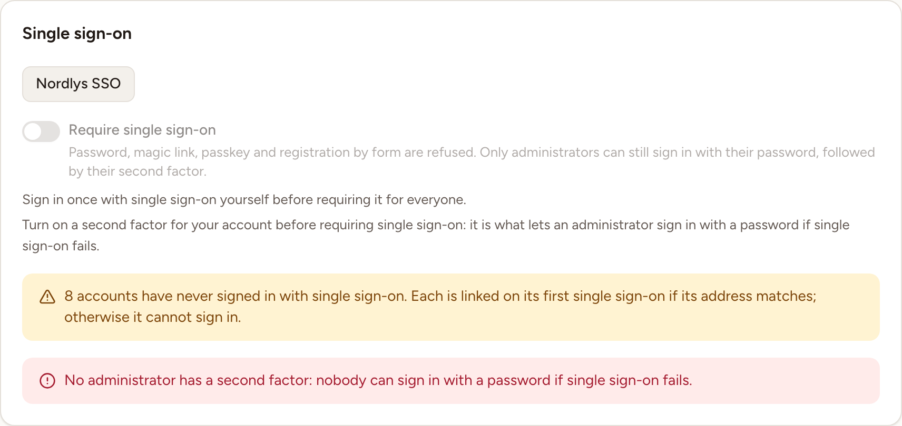

In Administration, **SSO authentication** is where an instance admin connects single sign-on providers, chooses the workspace new single sign-on accounts join, and decides whether single sign-on is required. Who may create an account at all is set under **Sign-up**, in [General and branding](../general-and-branding/).

Changing a value on this page needs a password confirmation from the last five minutes. When yours is older, the fields are read-only and a line says "Confirm your password to change these settings.": select **Confirm**.

In the addresses below, `{APP_URL}` is the public address of your instance.

## How a provider card works

The page has one card per provider: Google, GitHub, Microsoft Entra and OIDC. A card is marked **Configured** when every value the provider needs is set, here or in the environment; its button then appears on the sign-in page. Otherwise it is marked **Not configured**.

- Under each field, a line says where the value comes from: **Saved here**, or "From the environment" with the name of the variable. A value saved here wins over the environment. **Use the environment value** removes the saved value when you save.
- A secret is never shown. Leave the field blank to keep the saved one, or type a new value to replace it.
- **Redirect URI** is the address to declare with the provider. The button beside it copies it.
- **Keep sign-in by email as fallback** is shown switched on and cannot be changed: it reminds you that instance admins keep a way in with their password.
- You edit one card at a time: **Save** or **Cancel** its changes before you touch another.

Every change is recorded in the [audit log](../audit-log/) and mailed to every instance admin.

## Google

1. In the Google Cloud console, create an OAuth client of the type "Web application" and add `{APP_URL}/auth/google/callback` to its authorized redirect URIs. Google describes the steps in [Manage OAuth Clients](https://support.google.com/cloud/answer/15549257) and the flow in [Using OAuth 2.0 for Web Server Applications](https://developers.google.com/identity/protocols/oauth2/web-server).
2. In the **Google** card, fill in the two fields and save.

| Field | Environment variable |
|---|---|
| **Client ID** | `GOOGLE_CLIENT_ID` |
| **Client secret** | `GOOGLE_CLIENT_SECRET` |

Skrüm requests the scopes `openid`, `profile` and `email`.

## GitHub

1. On GitHub, create an OAuth app and set its "Authorization callback URL" to `{APP_URL}/auth/github/callback`: see [Creating an OAuth app](https://docs.github.com/en/apps/oauth-apps/building-oauth-apps/creating-an-oauth-app). This OAuth app is not the GitHub App that the [GitHub integration](../../integrations/github/) uses; the two are created separately.
2. In the **GitHub** card, fill in the two fields and save.

| Field | Environment variable |
|---|---|
| **Client ID** | `GITHUB_CLIENT_ID` |
| **Client secret** | `GITHUB_CLIENT_SECRET` |

Skrüm requests the scope `user:email`.

## Microsoft Entra

1. In the Microsoft Entra admin center, register an application: see [Register an application in Microsoft Entra ID](https://learn.microsoft.com/en-us/entra/identity-platform/quickstart-register-app). Then give it the redirect URI `{APP_URL}/auth/entra/callback` and a client secret; that page links to both steps under "Related content".
2. Add the optional claim `xms_edov` to the application's ID token. It tells Skrüm that the owner of the email domain has been verified; it is listed in Microsoft's [Optional claims reference](https://learn.microsoft.com/en-us/entra/identity-platform/optional-claims-reference). Without it, Skrüm treats the address as unverified and refuses the first sign-in of every person. Skrüm also expects the token's `email` claim to be the address the person signs in with.
3. In the **Microsoft Entra** card, fill in the three fields and save.

| Field | Environment variable | Notes |
|---|---|---|
| **Tenant ID** | `ENTRA_TENANT` | Your tenant's identifier. The default, `common`, also admits personal Microsoft accounts |
| **Client ID** | `ENTRA_CLIENT_ID` | |
| **Client secret** | `ENTRA_CLIENT_SECRET` | |

Skrüm requests the scopes `openid`, `email` and `profile`. On the sign-in page the button reads "Microsoft".

## OpenID Connect

The **OIDC** card connects any provider that publishes an OpenID Connect discovery document, as defined in [OpenID Connect Discovery 1.0](https://openid.net/specs/openid-connect-discovery-1_0.html).

1. At your provider, create a client with the redirect URI `{APP_URL}/auth/oidc/callback`.
2. In the **OIDC** card, fill in the fields and save.

| Field | Environment variable | Notes |
|---|---|---|
| **Issuer URL** | `OIDC_BASE_URL` | The provider's issuer, an HTTPS address. Skrüm reads `/.well-known/openid-configuration` under it |
| **Client ID** | `OIDC_CLIENT_ID` | |
| **Client secret** | `OIDC_CLIENT_SECRET` | |
| **Button label** | `OIDC_LABEL` | The text of the button on the sign-in page. Without it the button reads "Single sign-on" |

Skrüm requests the scopes `openid`, `email` and `profile`. The provider must send the claim `email_verified` as true, otherwise Skrüm treats the address as unverified.

## Test the connection

The Microsoft Entra and OIDC cards have a **Test the connection** button. It fetches the provider's discovery document and checks that it names the issuer you entered. It does not check the client ID or the client secret.

Save your changes first: the test uses the saved values. The result is shown in the card:

| Result | Meaning |
|---|---|
| **Connected**, with a time in milliseconds and the issuer | The discovery document was read and its issuer matches |
| "The provider's discovery document could not be reached." | No answer, or an error, from the address |
| "The address answers, but not with an OpenID Connect discovery document." | The address is not an issuer |
| "The provider names another issuer" | The document belongs to another issuer than the one you entered |

Each test is recorded in the audit log.

## What happens at a first single sign-on

- When the address matches an existing account, the identity is linked to that account, provided the provider reports the address as verified and the account's own address is verified. Otherwise the sign-in is refused.
- When nobody has this address, an account is created, provided the provider reports the address as verified and the sign-up mode accepts it (see [General and branding](../general-and-branding/)).
- When the matching account is deactivated, the sign-in is refused.

Under **New SSO accounts**, **Default workspace** is the workspace that accounts created through single sign-on without an invitation join. They join it as members and start by creating their team. With **None**, they join no workspace on their own.

## Require single sign-on

In the **Single sign-on** card, **Require single sign-on** refuses the password, the magic link, the passkey and registration by form. Only instance admins can still sign in with their password, followed by their second factor.

The switch stays locked until all of this is true, and the card tells you what is missing:

- a single sign-on provider is configured;
- you have signed in once with single sign-on yourself;
- your own account has a second factor (see [Two-factor and passkeys](../../accounts/two-factor-and-passkeys/)).

Before you turn it on, read the two lines under the switch. The first counts the accounts that have never signed in with single sign-on: each is linked on its first single sign-on if its address matches, and otherwise can no longer sign in. The second counts the admins who can still sign in with a password and a second factor if single sign-on fails; when it says that no administrator has a second factor, nobody could get back in that way.

While single sign-on is required, **SSO authentication** carries an **active** badge in the list of sections, and Skrüm refuses a change that would leave no provider configured: turn the switch off first.

If the setting is stored but no provider is configured, it is not in force and every sign-in method works. Instance admins then see a warning with a link to **Sign-in settings**.
