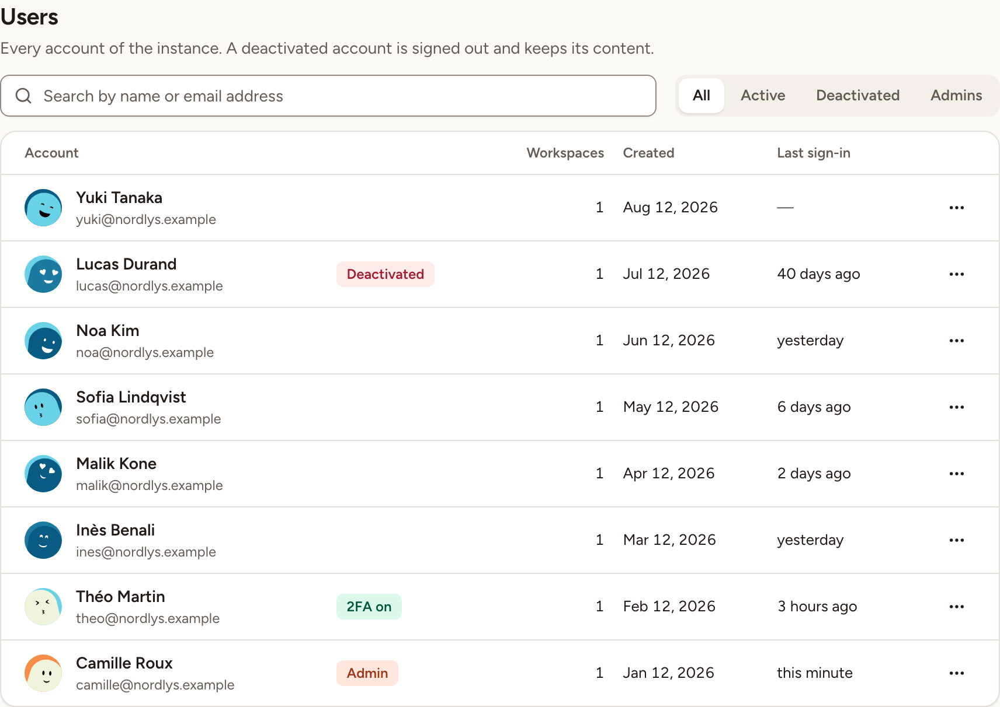
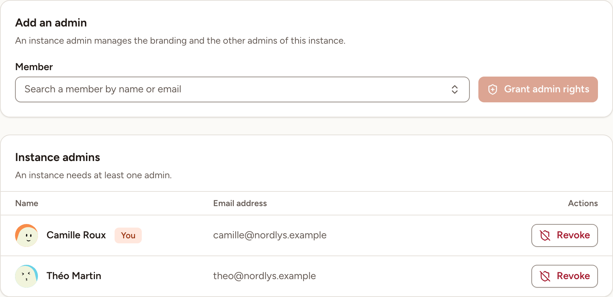

In Administration, **Users** lists every account of the instance and **Admins** lists the people who can open Administration. Both are for instance admins only.

## Find a user

1. Open **Users**. Accounts are listed from the newest to the oldest, 25 per page.
2. Type a name or an email address in the search field, or choose a filter: **All**, **Active**, **Deactivated** or **Admins**.

Each row shows the person's name and address, the number of workspaces they belong to, the date the account was created and their last sign-in. A badge marks an instance admin (**Admin**), a deactivated account (**Deactivated**) and an account with a second factor (**2FA on**).

## Deactivate an account

1. On the person's row, open the menu at the end of the row and select **Deactivate**.
2. Confirm with **Deactivate**.

A deactivated person:

- is signed out the next time they load a page;
- cannot sign in again, whatever the method: the sign-in page says "This account is deactivated. Ask an admin of the instance.";
- cannot use their API tokens: an AI assistant connected with one is refused;
- no longer receives action item reminders or retrospective results by email;
- cannot be made an instance admin;
- is no longer counted in **Accounts in use**, on the [Licence](../licence-and-updates/) page.

Their content stays: cards, action items and everything else they wrote are kept.

You cannot deactivate yourself, and you cannot deactivate the last active instance admin. In both cases the menu entry is disabled.

## Reactivate an account

Open the menu on the person's row and select **Reactivate**. The account can sign in again at once.

## Add an instance admin

The first account created on a new instance is its first instance admin. Others are added from **Admins**.

1. Open **Admins**. From **Users**, the menu entry **Make admin** brings you to the same page.
2. Under **Member**, type at least two characters of the person's name or address and choose them in the list. The list holds active accounts that are not admins yet.
3. Select **Grant admin rights**.

## Remove an instance admin

1. On the admin's row, select **Revoke**.
2. Confirm with **Revoke**. The person loses access to Administration and keeps their account.

You can revoke your own rights; Skrüm then takes you back to the dashboard. An instance needs at least one admin: the last active one cannot be revoked.

Deactivations, reactivations, and admin rights granted or revoked are all recorded in the [audit log](../audit-log/).
