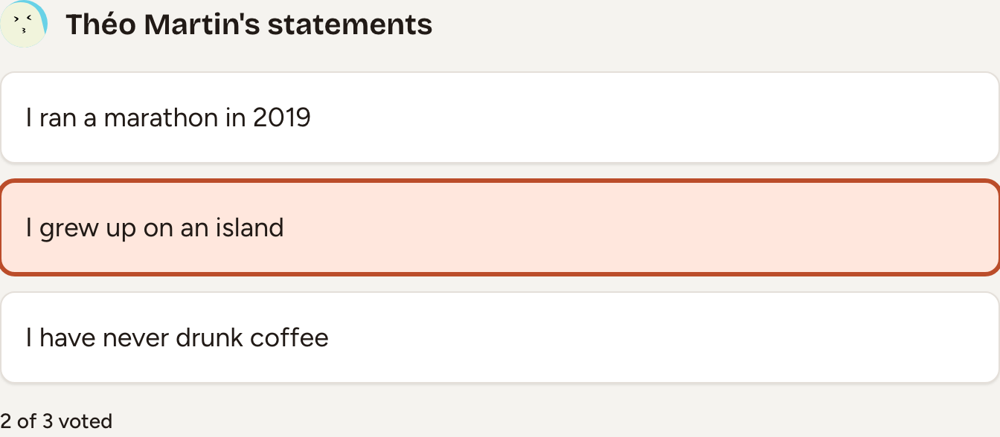
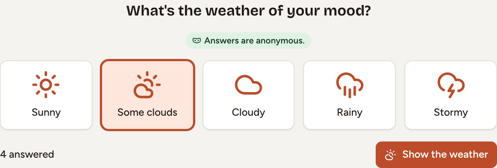
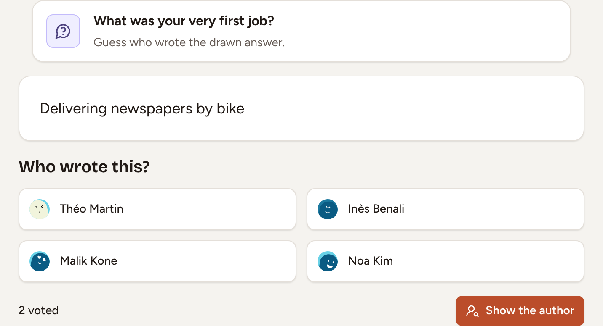
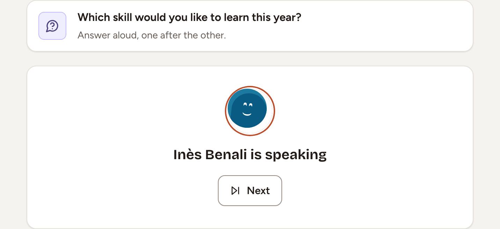

This page explains how a round of Two truths and a lie, Mood weather, Guess who? and Quick question is played, how it ends and what it scores. The host of the room starts each round; see [Games overview](../overview/) to open a room and bring people in.

The questions of Guess who? and Quick question come from Skrüm's list, in the language set in **Room settings**.

## Two truths and a lie

Each player writes three statements about themselves, one of them false. The others look for the lie. The game needs three players.

1. Under **My statements**, write **Statement 1**, **Statement 2** and **Statement 3**, up to 120 characters each, mark the one that is the lie, and select **Save**. Nobody else sees them yet. You can write them before the first round, between two rounds, or in the side panel while someone else is telling.
2. The host chooses a player under **Who tells?**, then selects **Start**. Only the players whose statements are ready are offered.
3. The teller's three statements appear. Everyone else selects the one they believe is the lie. Selecting it again takes the vote back.
4. The teller or the host selects **Reveal the lie**. Skrüm marks the lie and shows who picked which statement.

Each voter who found the lie gets 5 points and wins the round. The teller gets 2 points for each voter who picked a true statement. If the teller or the host selects **Pass**, nobody scores.

Statements are played once: to tell again, select **Write new ones**. With **Time per turn** set in **Game settings**, the lie is revealed when the time runs out.

## Mood weather

Everyone says how they feel with a weather, and the team sees the forecast, never who chose what.

1. The host selects **Start**.
2. Choose **Sunny**, **Some clouds**, **Cloudy**, **Rainy** or **Stormy**. You can change your choice, or select it again to take it back. The others see how many people answered, not what.
3. The host selects **Show the weather**. Skrüm shows how many people chose each weather.

With fewer than three answers the weather is not shown: Skrüm says "Not enough answers to show the weather (3 needed)." The game gives no points and has no settings.

## Guess who?

Everyone answers a question, one answer is drawn, and the team guesses who wrote it. The game needs three players.

1. The host selects **Start**. Skrüm asks a question such as "What was your very first job?". Until the first answer, the host can replace it with **Shuffle question** or **Edit question**.
2. Write **Your answer**, up to 120 characters, and select **Send**. You can change or remove it until the draw. The others see who has answered, not what.
3. With at least two answers in, the host selects **Draw an answer**. Skrüm picks one at random and shows it without its author. The other answers are never shown.
4. Under **Who wrote this?**, select a name among the players who answered. The author does not vote. Only the number of votes is shown.
5. The host selects **Show the author**. Skrüm names the author and shows who named whom.

Each voter who named the author gets 5 points and wins the round. The author gets 2 points for each voter who named someone else.

## Quick question

One question, and everyone answers it aloud, one after the other.

1. The host selects **Start**. Skrüm asks a question and puts the players who are online in a **Speaking order**. Until the first speaker has finished, the host can replace the question with **Another question** or **Edit question**.
2. The first speaker answers aloud, then selects **Done**. The host can move on in their place with **Next**.
3. The turn passes down the order. After the last speaker, the round ends with **Everyone has spoken**.

With **Time per person** set in **Game settings**, the turn passes by itself when the time runs out. The host can end the round early with **Pass**. The game gives no points.
