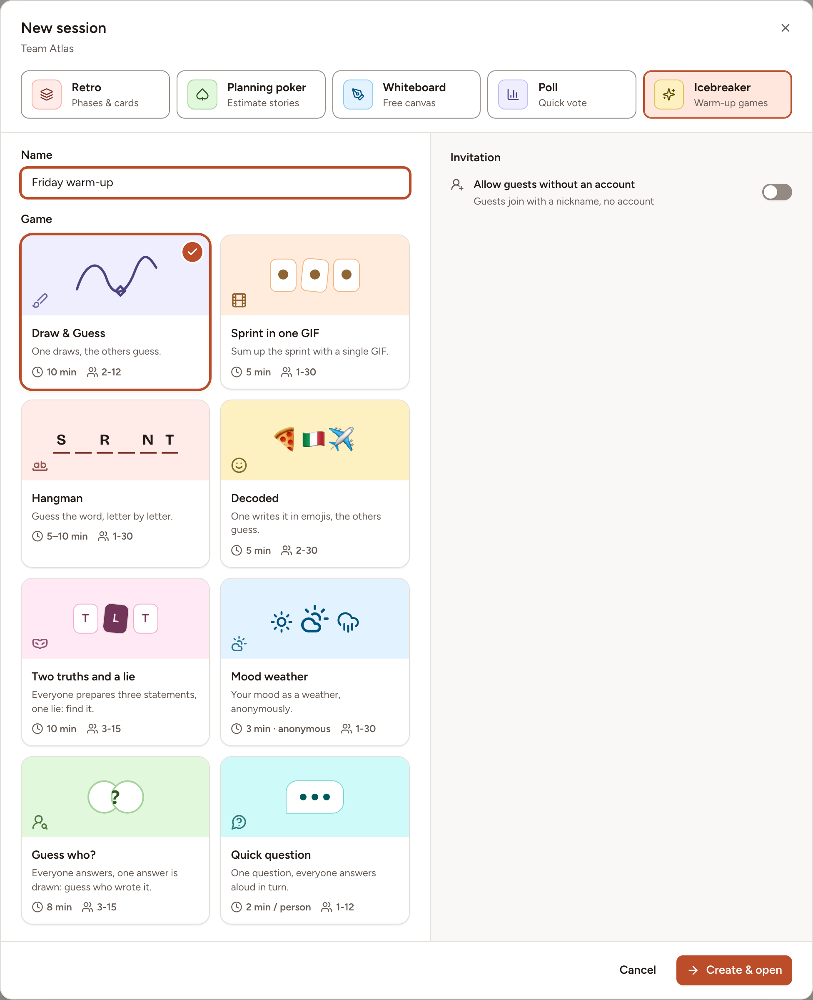
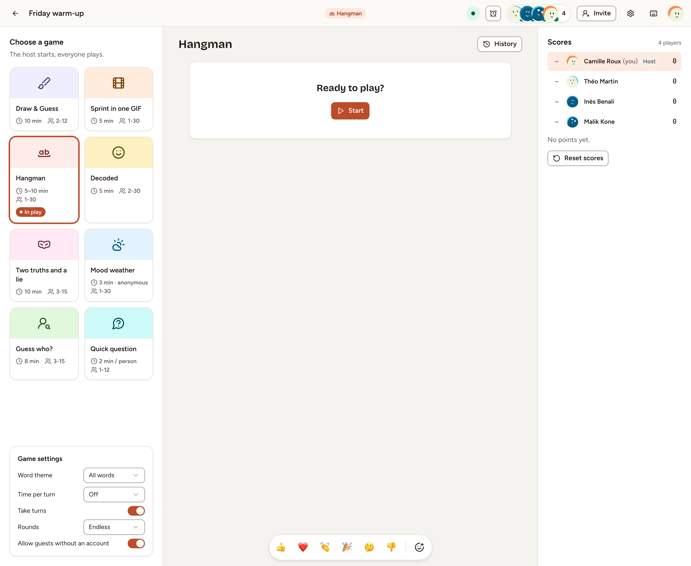
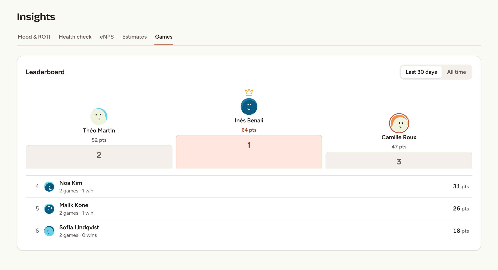

Skrüm has nine short games to warm a team up. This page shows how to open a game room, bring people in, play rounds and read the scores. Any member of a team can open a room, except observers; workspace owners and admins can too.

## Start a game

In Skrüm a game room is a session of the type **Icebreaker**.

1. Open your team and select **New session**.
2. Choose the type **Icebreaker**.
3. Give the room a **Name**, up to 60 characters.
4. Under **Game**, choose the game to start with. You can change it later.
5. To let people play without an account, turn on **Allow guests without an account**.
6. Select **Create & open**.

A team can have 10 game rooms. Once it has them, the **Icebreaker** type is shown disabled with the message "This team already has 10 game rooms." Rooms are listed on the team's **Sessions** page, under **Icebreaker**.

The same games can open a retrospective: see [Icebreaker](../../retrospectives/icebreaker/).

## The room

The person who creates the room is its host. The host chooses the game under **Choose a game**, starts each round with **Start**, then **Next round**, and sets the options of the game in **Game settings**. Everyone else sees "Waiting for the host to start."

- Choosing another game while a round is in play abandons that round for everyone.
- The host can start a countdown with the timer in the header. When it reaches zero, the round in play ends or moves to its next step.
- **History** lists the last rounds of the room, up to 20.
- The bar at the bottom sends emoji reactions, unless **Reactions** is turned off in the room's settings.

The gear in the header opens the room's menu:

| Entry | What it does | Who sees it |
|---|---|---|
| **Room settings** | The room's **Name**, guest access, **Language of words and questions**, **Reactions** | The host, the room's creator, workspace owners and admins |
| **Hand over hosting** | Makes another player the host. A guest cannot host | The host |
| **Become host** | Takes hosting | The room's creator, workspace owners and admins, the team's owners and facilitators |
| **Delete room** | Deletes the room with its rounds and scores, for everyone | The room's creator, workspace owners and admins |

## Invite players and guests

Members of the team open the room from **Sessions** and become players. Up to 12 players can be online in a room at once.

To bring in someone without an account, the host, the room's creator or a workspace owner or admin selects **Invite**. With **Allow guests without an account** on, the dialog shows:

- the guest link, with **Copy**;
- a QR code, with **Download the QR code**;
- the **Session code**, which a guest types on the `/join` page of your instance.

A guest chooses a nickname and an avatar colour, then selects **Join the session**. More in [Join as a guest](../../getting-started/join-as-guest/).

**Regenerate link** replaces the link and the code, and signs out every guest who joined with the old ones. Turning guest access off removes the guests from the room.

An observer of the team can open the room and watch, without playing.

## Rounds and scores

A game is played in rounds. **Rounds**, in **Game settings**, is **Endless** by default; set it to 3, 5, 6, 8 or 10 and the last round ends on **Game over** with the **Final scores** of the room. Changes to the settings apply from the next round.

Seven games give points, shown in the room under **Scores**. Mood weather and Quick question give none. **Reset scores**, for the host, the room's creator and workspace owners and admins, puts the room's scores back to zero and keeps the team leaderboard as it is.

The team's leaderboard is on **Insights**, tab **Games**. It adds up the points of the team's members across rooms, over the **Last 30 days** or **All time**, with the games played and the rounds won. Guests are not on it.

## The nine games

| Game | In a sentence | Players needed to start | Page |
|---|---|---|---|
| **Hangman** | Guess the word, letter by letter | 1 | [Word and drawing games](../word-and-drawing-games/) |
| **Draw & Guess** | One draws, the others guess | 2 | [Word and drawing games](../word-and-drawing-games/) |
| **Decoded** | One writes the word in emoji, the others guess | 2 | [Word and drawing games](../word-and-drawing-games/) |
| **Sprint in one GIF** | Everyone answers a question with a GIF, then votes | 1 | [Word and drawing games](../word-and-drawing-games/) |
| **Two truths and a lie** | Three statements, one of them false: find it | 3 | [Conversation games](../conversation-games/) |
| **Mood weather** | Your mood as a weather, anonymously | 1 | [Conversation games](../conversation-games/) |
| **Guess who?** | One answer is drawn: guess who wrote it | 3 | [Conversation games](../conversation-games/) |
| **Undercover** | Describe your secret word and find the players with a different one | 3 | [Undercover](../undercover/) |
| **Quick question** | One question, answered aloud in turn | 1 | [Conversation games](../conversation-games/) |

> **Sprint in one GIF** needs a GIF provider. Until an instance admin sets one, its card reads **Not available**. See [General and branding](../../administration/general-and-branding/).
