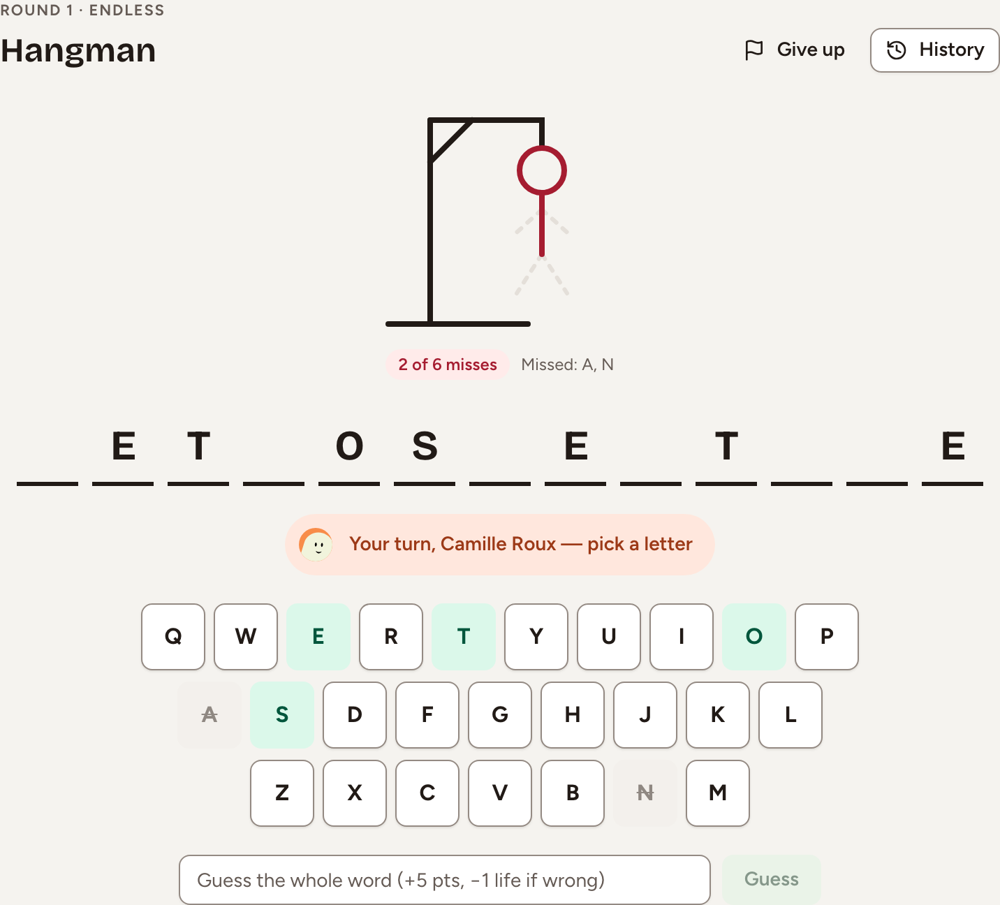
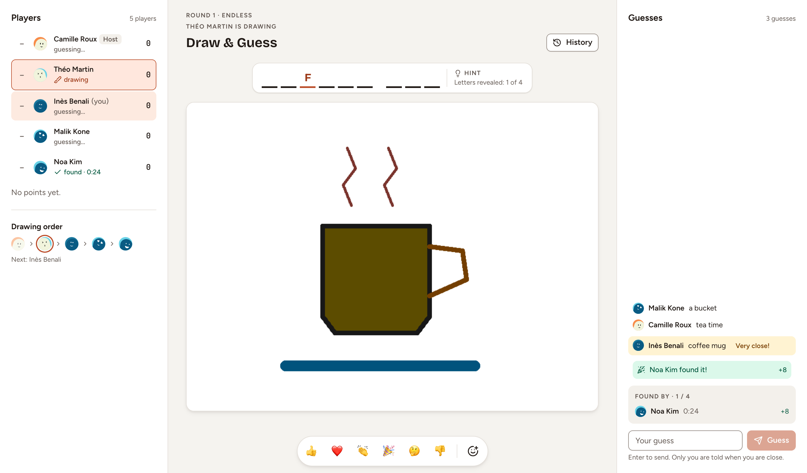
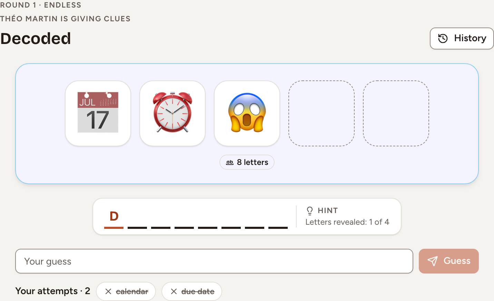
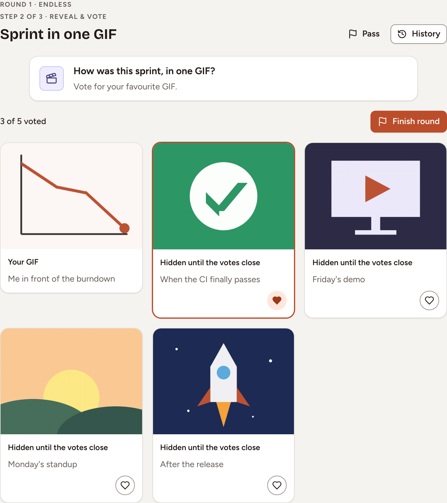

This page explains how a round of Hangman, Draw & Guess, Decoded and Sprint in one GIF is played, how it ends and what it scores. The host of the room starts each round; see [Games overview](../overview/) to open a room and bring people in.

The words of the first three games come from Skrüm's word lists, in the language set in **Room settings**. The host can narrow them to one theme: **Team & tech**, **Everyday objects**, **Food** or **Nature & animals**.

## Hangman

The team finds a hidden word before it runs out of lives.

1. The host selects **Start**. Skrüm draws a word and shows one blank per letter.
2. Pick a letter on the keyboard. A letter that is in the word is revealed everywhere it stands; one that is not costs a life.
3. With **Take turns** on, which it is in a new room, only the player named in the banner can pick, and the turn passes after each letter. With it off, anyone picks at any time.
4. If you know the word, type it in **Guess the whole word** and select **Guess**. A wrong word costs a life.

The round ends when the word is complete, at the sixth miss, or when the host selects **Give up**. With **Time per turn** set, a turn that runs out passes to the next player without costing a life; with **Take turns** off, the round ends when that time runs out.

Each letter you find gives you one point per place it fills. The player who completes the word, by a letter or by the whole word, gets 5 more and wins the round.

## Draw & Guess

One player draws a word, the others guess it.

1. The host chooses the drawer under **Who draws?**, then selects **Start**. Skrüm proposes the players in turn, as **Drawing order** shows.
2. The drawer sees the word, which the guessers do not, and draws it with the **Pencil**, the **Eraser** and **Fill**, in three stroke sizes and a palette of colours. **Undo**, **Redo** and **Clear** correct the drawing.
3. The drawer may take another word once with **New word (1)**, as long as nobody has found the first one, and may give a letter away with the **Reveal a letter** button, which says how many are left: up to half the letters of the word.
4. The others type in **Your guess** and select **Guess**. A wrong guess is shown to everyone. A guess that is nearly right is marked **Very close!** for its author only. The right word is never shown: the list says who found it.

The round goes on until every guesser has found the word, the time runs out, or the drawer or the host selects **Pass**.

A guesser who finds the word gets 10 points, less 2 for each letter that was revealed by then, and never fewer than 4. The drawer gets 5 points for each player who found it.

In **Round settings**, **Time per turn** limits the round, and **Auto hints** reveals letters by itself at regular intervals.

## Decoded

One player describes a word with emoji, the others guess it.

1. The host chooses the player under **Who gives the clues?**, then selects **Start**.
2. That player sees the word and adds up to five emoji as a clue. Letters and digits are refused. They can change the clue during the round and reveal letters as in Draw & Guess.
3. The others type in **Your guess** and select **Guess**. Your wrong attempts are listed under the field.

The first right guess ends the round. It also ends when the time set in **Time per round** runs out, or when the clue giver or the host selects **Pass**.

The player who finds the word gets 10 points, less 2 for each letter revealed, and never fewer than 4; they win the round. The clue giver gets 5 points when the word is found.

In **Game settings**, **Categories** takes several themes at once, and **Auto hints** works as in Draw & Guess.

## Sprint in one GIF

Everyone answers a question with a GIF, then the team votes. This game is offered only when an instance admin has set a GIF provider: see [General and branding](../../administration/general-and-branding/).

1. The host selects **Start**. Skrüm asks a question such as "How was this sprint, in one GIF?". Until the first answer, the host can replace it with **Shuffle question** or **Edit question**.
2. **Pick a GIF.** Choose a GIF, add a **Caption** if you like, and select **Send my GIF**. Until the reveal you can change or remove it, and nobody sees it.
3. **Reveal & vote.** The host selects **Reveal the GIFs**. Select the heart of the GIFs you prefer; you cannot vote for your own. **Your votes**, in the side panel, counts the votes you have used.
4. **Results.** The host selects **Finish round**. Skrüm shows the winner, the ranking and who sent each GIF.

Each vote a GIF receives gives its author 2 points. The author of the GIF with the most votes wins the round; a tie has several winners. If the host selects **Pass** instead, the round ends without a result.

In **Game settings**, **Votes** gives each player 1, 2 or 3 votes, and **Hide authors until the votes close** keeps the names back during the vote. A new room starts with 2 votes and hidden authors.
