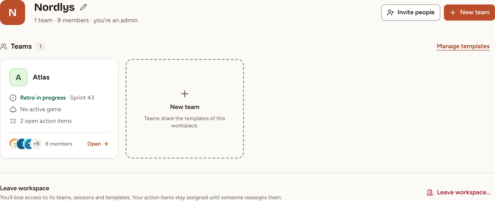

Skrüm is an open-source tool for a team's agile rituals. You host it yourself: one Docker image and a database, and your data stays on your infrastructure. It is released under the AGPL-3.0-or-later licence. This page says what Skrüm does, how it is organised, and which page to read first.

## What Skrüm does

- **[Retrospectives](../../retrospectives/create-a-retro/)**: 52 templates, a board that moves through phases from writing to a return-on-time-invested vote, and actions with an owner.
- **[Action items](../../action-items/track/)**: what a team decided, tracked across sessions, with reminders and export to Jira, Linear and GitHub.
- **[Planning poker](../../planning-poker/start-a-game/)**: hidden votes, a reveal, tasks imported from your tracker and estimates written back.
- **[Whiteboard](../../whiteboard/basics/)**: a shared canvas with live cursors.
- **[Surveys](../../surveys/create-a-survey/)**: health checks, team pulses and eNPS, compared over time.
- **[Games](../../games/overview/)**: eight short icebreakers.
- **[Team insights](../../insights/insights/)**: the team's mood and return on time invested, its health checks, its eNPS and its estimates, over time.
- **[Integrations](../../integrations/overview/)**: Slack, Microsoft Teams, Mattermost, Telegram, Jira, Linear, GitHub and outgoing webhooks.
- **[AI assistants](../../mcp/connect/)**: a Model Context Protocol server that lets an assistant read your team's retrospectives, action items and planning poker games, and make the changes you allow.

People without an account can join a session through a link or a code: see [Join as a guest](../join-as-guest/).

The interface is available in English, French, Spanish and German.

## How Skrüm is organised

An instance holds workspaces. A workspace holds teams. A team runs sessions: retrospectives, planning poker games, whiteboards, surveys and games.

Once your account is set up, signing in opens the page of your team, or the workspace when you belong to no team yet. **All teams** in the sidebar opens the workspace: one tile per team, with its retro in progress, its active poker games and its open action items. **Open** on a tile leads to the team.

**Invite people** and **New team** are shown to the owner and the admins of the workspace. See [Workspaces](../../teams/workspaces/) and [Members and roles](../../teams/members-and-roles/).

## Who these pages are for

The sections from Getting started to AI assistants are for the people who use Skrüm in a team. **Self-hosting** and **Administration** are for the person who runs the instance. **Reference** lists the roles and what each may do, and the events sent to webhooks.

## Where to start

- You run the instance: start with [Install with Docker](../../self-hosting/install/). The first account to sign up becomes the instance admin.
- Your team already has an instance: follow the [Quick start](../quick-start/), from signing in to a finished retrospective.
- Someone sent you a link or a code and you have no account: read [Join as a guest](../join-as-guest/).
