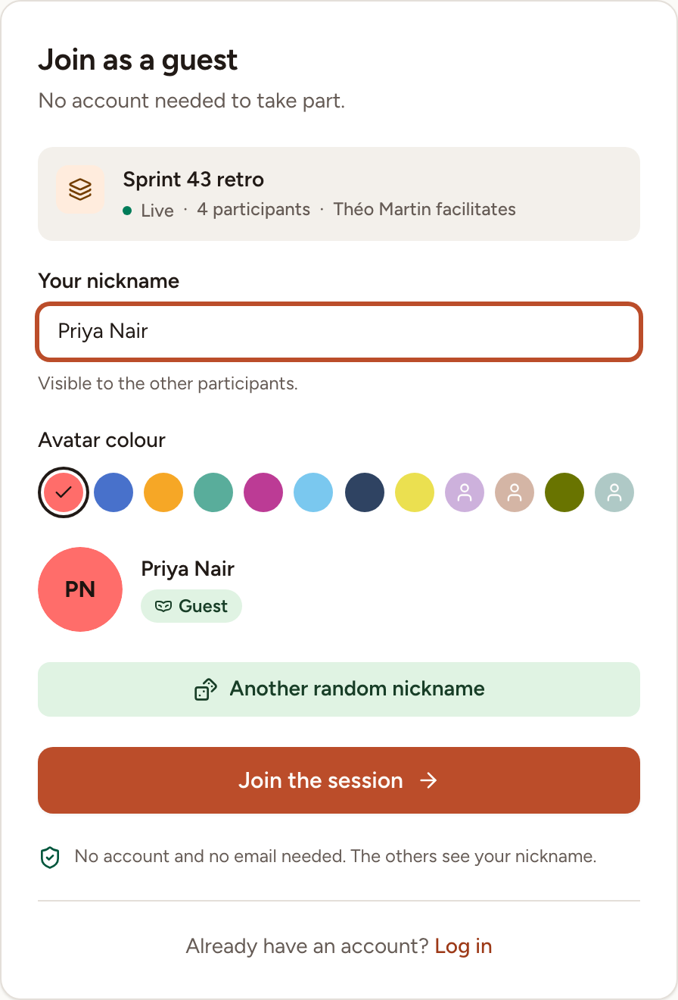
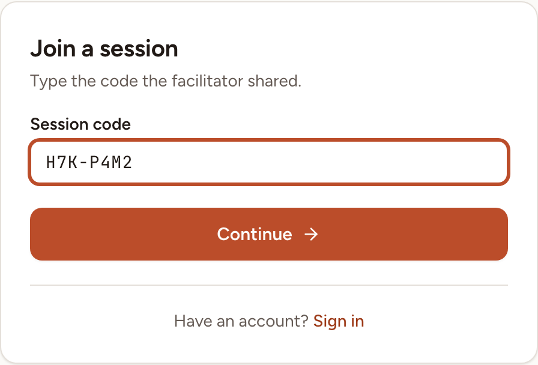
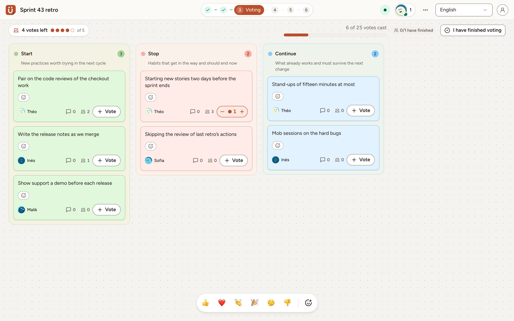

You can take part in a session without an account: the person who runs it sends you a link or a code, and you choose a nickname. This page is for guests, and for facilitators who want to let guests in.

Guests can join retrospectives, planning poker games, whiteboards, surveys and games.

## Join with a link

1. Open the link you received. The page **Join as a guest** shows the name of the session, how many people are in it and who facilitates.
2. Check **Your nickname**. Skrüm suggests one; type your own, up to 50 characters, or select **Another random nickname**. The others see this name.
3. Pick an **Avatar colour**. The colours already worn in the session cannot be picked.
4. Select **Join the session**.

A planning poker game adds one choice: **Join as spectator**, to watch without voting.

You are asked for no email address and no password. Your browser remembers you for that session for 30 days: open the link again from the same browser and you are back in the session, under the same nickname.

If you are signed in and belong to the session's team, the link takes you straight to the session.

## Join with a code

A session open to guests also has a code, such as `H7K-P4M2`, which the facilitator can read out.

1. Open `/join` on your team's instance, for example `https://skrum.example.com/join`.
2. Type the code in **Session code**. Capitals, spaces and the hyphen do not matter.
3. Select **Continue**. You arrive on the same page as with the link.

**No session matches this code.** means that the code is wrong, or that the session no longer accepts guests. Ask the facilitator for the current code.

## What a guest can do

In a retrospective, a guest takes part like a member: writing cards, voting, and adding action items. The picture shows a guest on a board in the **Voting** phase.

A guest never facilitates: the phases, the settings and the **Share** dialog belong to the facilitator, and the role can only be handed to a member of the team. A guest sees the session and nothing else of the team: no link back to the team page, and none of the action items carried over from earlier retros.

In the other kinds of session:

| Session | A guest can | A guest cannot |
|---|---|---|
| Planning poker | vote, or watch as a spectator | add, edit or import tasks; facilitate |
| Whiteboard | work on the board | save it as a template, duplicate it, facilitate |
| Survey | answer | edit, duplicate or export the survey, or compare it with another |
| Game | play | host the room |

## Let guests in

Guest access is off when a session is created. It is turned on by the person who creates the session or, later, by the person who runs it: the facilitator, or the host of a game room.

- **When creating the session**: in the **New session** dialog, under **Invitation**, turn on **Allow guests without an account**. Each of the five session types has this switch.
- **In a session that is running**: select **Share** in the header (**Invite** in a game room), then turn on **Allow guests without an account**.

The **Share** dialog then shows the guest link with a **Copy** button, a QR code of that link, and the **Session code** with **Copy the code**.

Two limits apply:

- A survey accepts guests once it is no longer a draft.
- An icebreaker played inside a retro has no link of its own: guests of the retro take part in it.

To stop letting guests in, turn the switch off: the link and the code stop working, and the guests who are in the session lose access. **Regenerate link** replaces the link and the code: the old ones stop working, and the guests who had joined with the old link have to join again.
