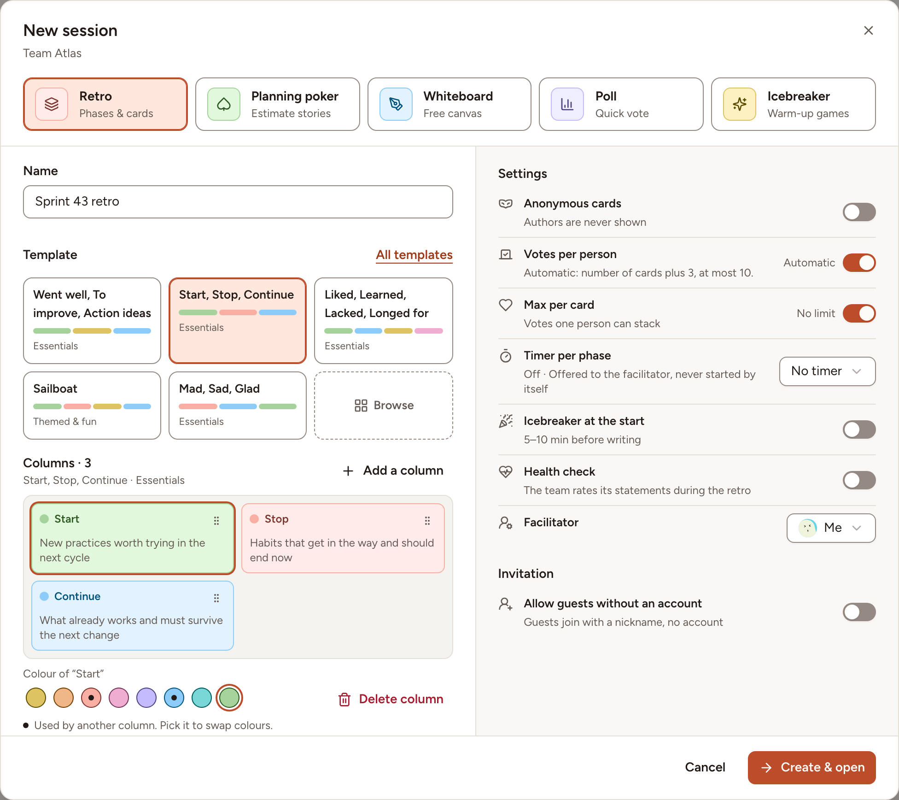
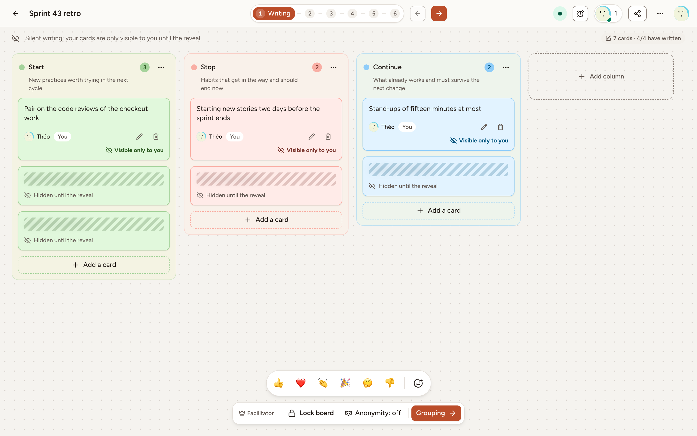
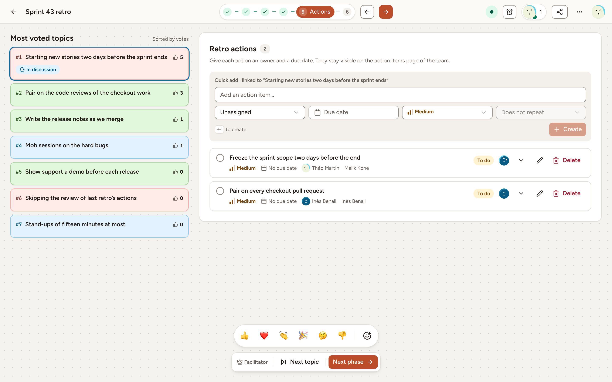

This page takes you from signing in to a finished retrospective with its action items. You need an account on your team's instance and a place in a team: a workspace owner or admin [creates the team](../../teams/create-a-team/) and [invites its members](../../teams/invitations/). Every member of a team can start a retrospective, except observers.

## Start a retro from a template

1. [Sign in](../../accounts/sign-in/). Skrüm opens the page of your team; **Home** in the sidebar brings you back to it.
2. Select **New session**. The dialog opens on **Retro**.
3. Check the **Name**. When the team has a current sprint, it is already filled in, for example "Sprint 43 retro".
4. Under **Template**, pick one of the templates shown, or select **Browse** to see all of them. The columns of the template appear under it.
5. Select **Create & open**.

The board opens in the **Writing** phase and you are its facilitator: you move the retro from one phase to the next. To give that role to someone else, choose them under **Facilitator** before you create the retro. [Create a retro](../../retrospectives/create-a-retro/) explains every setting of the dialog, and [Templates](../../retrospectives/templates/) lists the templates.

## Bring the team in

People who are signed in and belong to the team find the retro on the team page. You can also send them the address of the board from your browser.

For people without an account:

1. Select **Share** in the header of the board.
2. Turn on **Allow guests without an account**.
3. Send the guest link, or read out the **Session code**.

[Join as a guest](../join-as-guest/) describes what they see.

## Write

1. Select **Add a card** under a column.
2. Type your card, then select **Save**.

During this phase your cards are marked **Visible only to you**, and the cards of the others show **Hidden until the reveal**.

When everyone has written, the facilitator moves on: the arrow to the right of the phases is **Next**, and the button at the end of the facilitator bar is named after the phase it leads to, here **Grouping**. See [Writing](../../retrospectives/writing/).

## Group and vote

In **Grouping**, every card is revealed. Drag a card onto another to group the ones that say the same thing. This step can be left as it is. See [Grouping](../../retrospectives/grouping/).

In **Voting**:

1. Select **Vote** on the cards you want the team to talk about. The number of votes you have left is shown above the columns.
2. Select **I have finished voting** when you are done.

See [Voting](../../retrospectives/voting/).

## Discuss and add action items

In **Discussing**, the cards become topics, sorted by votes. The team talks about them one after the other. See [Discussion](../../retrospectives/discussion/).

In **Actions**, the most voted topics are listed beside the action items of the retro. To add an action item:

1. Type it in **Add an action item…**.
2. Choose who owns it in the list that reads **Unassigned**, and a **Due date**.
3. Press Enter, or select **Create**.

Adding action items is not reserved to the facilitator: members and guests can add them too. Observers of the team follow the session and change nothing in it.

See [Actions](../../retrospectives/actions/).

## Close the retro

1. The facilitator selects **Next phase**. In **ROTI**, each person rates the time spent in the session, from 1 to 5.
2. The facilitator selects **End session**.

The retro is now **Completed**. It shows its results and, under **Board**, the cards as they were left. Its action items stay with the team: follow them in [Track action items](../../action-items/track/). See [ROTI and close](../../retrospectives/roti-and-close/) and [Summary and sharing](../../retrospectives/summary-and-sharing/).
