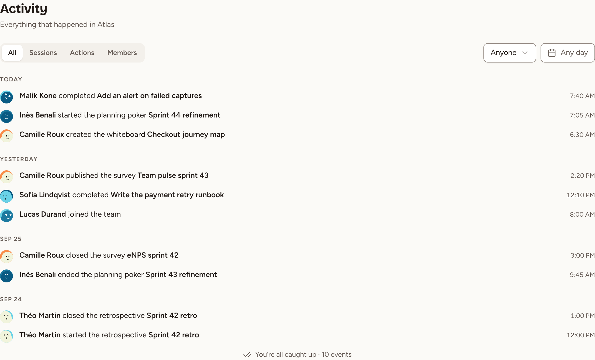
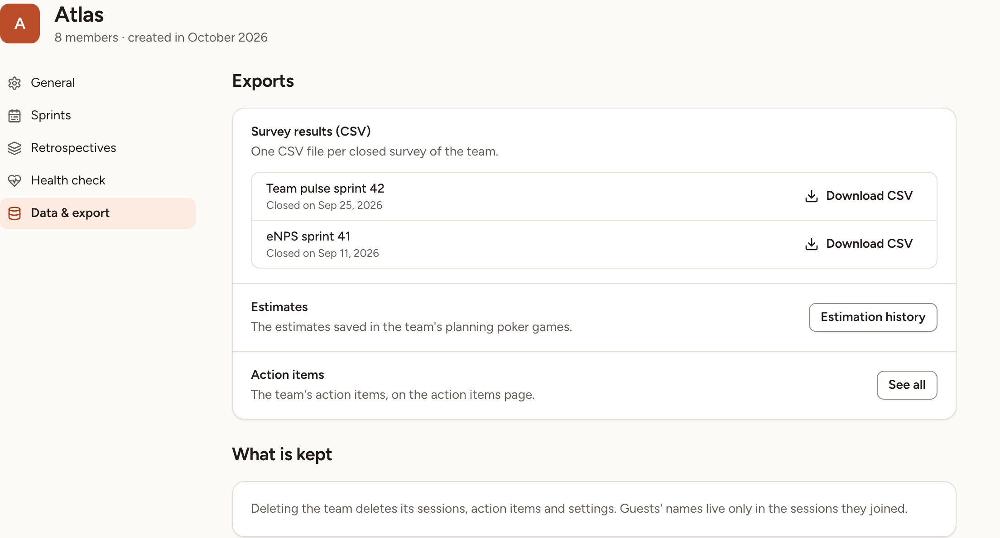

The activity page is the journal of a team: who started, closed or completed what, and when. The **Data & export** page of the team settings gathers the ways to get the team's data out.

## Read the activity of a team

Every member of the team can read the activity, observers included, and so can the owners and admins of the workspace.

1. Select **Activity** in the sidebar. On the home page of the team, the **Recent activity** card shows the last five lines, and **All activity** leads to the same page.
2. Read the lines. They are grouped by day, newest first, under **Today**, **Yesterday**, then the date. Each line names the person, what they did, and the time of day.

The page loads 30 lines at a time. **Load more** brings the next ones; at the end it reads **You're all caught up** with the number of events.

### What is recorded

Skrüm writes a line for these nine events and for nothing else.

| When | The line reads |
|---|---|
| A retrospective is created | *Name* started the retrospective *title* |
| A retro is completed | *Name* closed the retrospective *title* |
| A planning poker game is created | *Name* started the planning poker *title* |
| A planning poker game is ended | *Name* ended the planning poker *title* |
| A whiteboard is created | *Name* created the whiteboard *title* |
| A survey is published | *Name* published the survey *title* |
| A survey is closed | *Name* closed the survey *title* |
| An action item is completed | *Name* completed *title* |
| Someone joins the team | *Name* joined the team |

- The health check of a retro is part of its retro: publishing or closing it writes no line.
- A person joins when a manager adds them, when they use an invite link, or when their request for access is accepted.
- A line about a guest carries the name they joined the session with. When an action item is completed from a connected tracker, the line names the tracker.
- The lines of a deleted account read **Former member**.
- The title in a line opens the session while it still exists. The title of an action item opens the action items of the team.

### Filter the activity

- **All**, **Sessions**, **Actions** and **Members** keep one kind of line: **Sessions** is the seven lines about retros, planning poker, whiteboards and surveys, **Actions** is the completed action items, **Members** is the people who joined.
- The member list, on **Anyone** at first, keeps the lines of one person. It offers the members of the team and anyone else who has a line.
- The day picker, on **Any day** at first, keeps one day. **Today** and **Yesterday** are shortcuts; a day in the future cannot be chosen.

The filters combine, and they are written in the address of the page, so a filtered view can be bookmarked or shared. When nothing matches, **Clear filters** shows everything again.

## Get the data of a team out

The team's owner and the owners and admins of the workspace can open this page.

1. Select **Settings** in the sidebar.
2. Select **Data & export**.

The **Exports** card has three lines.

| Line | What it gives you |
|---|---|
| **Survey results (CSV)** | One **Download CSV** per closed survey of the team |
| **Estimates** | **Estimation history** opens the **Estimates** tab of Insights: see [Estimates history](../../planning-poker/estimates-history/) |
| **Action items** | **See all** opens the action items page on this team: see [Track action items](../../action-items/track/) |

About the surveys of the first line:

- A survey is listed once it is closed and at least three people answered it. Under that number a survey shows no results, so it has none to export.
- The health check of a retro is not listed.
- The list holds the 50 most recently closed surveys.
- An owner or admin of the workspace sees every survey of the team. A team owner who is neither sees the surveys they created.

The page has no single export of everything the team holds: these three lines are what it offers.

### What is kept

The **What is kept** card says what deleting the team removes: "Deleting the team deletes its sessions, action items and settings. Guests' names live only in the sessions they joined."
