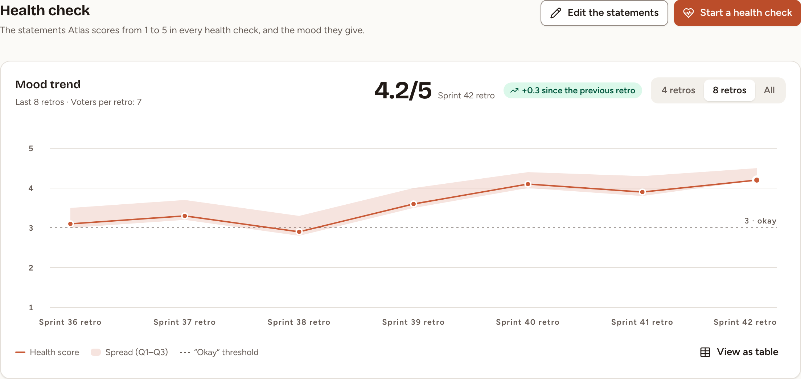
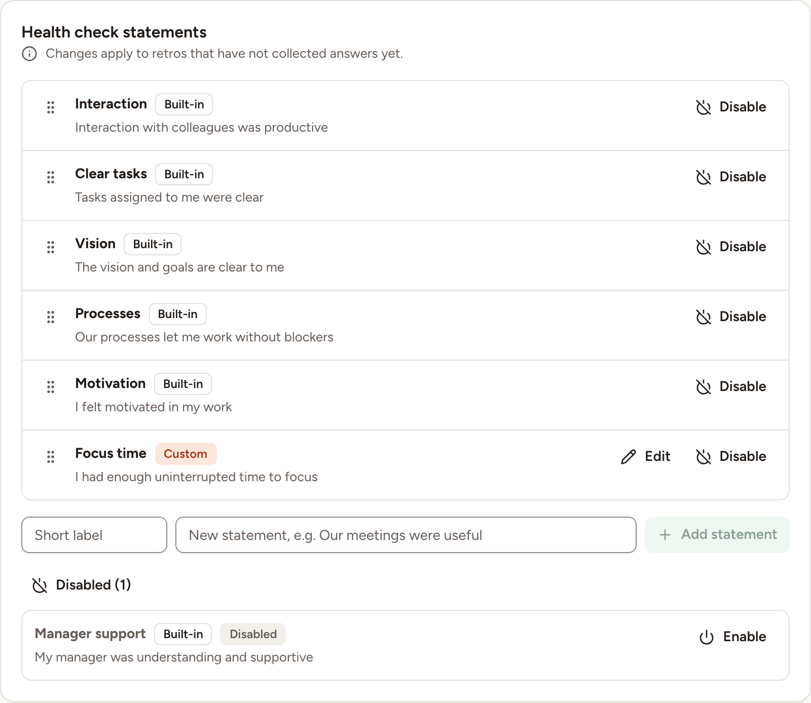
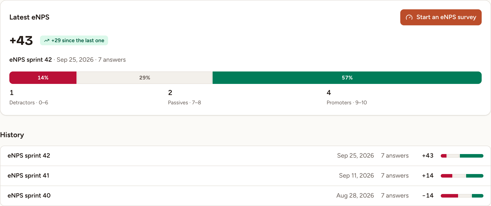

Two tabs of Insights follow a score from one session to the next: **Health check** and **eNPS**. Every member of the team can read them, observers included, and so can the owners and admins of the workspace. Changing the statements of the health check is for the team's owner and for the owners and admins of the workspace.

## Read the health check trend

1. Select **Insights** in the sidebar.
2. Select the **Health check** tab.

The **Mood trend** card draws one point per health check that counts: the health check of a retro once that retro is completed, and a health check run as a survey once the survey is closed. Either needs at least one answer.

- The points come from the team's eight most recent results, the same ones as on **Mood & ROTI**: see [Team insights](../insights/).
- The large figure, such as **4.2/5**, is the latest score, with the name of its session. The badge, such as **+0.3 since the previous retro**, is the difference with the point before.
- **4 retros**, **8 retros** and **All** choose how many points are drawn.
- From three points on, the chart adds the line, the shaded **Spread (Q1–Q3)** and a dashed **“Okay” threshold** at 3. Before that it reads **Not enough data for a trend yet. It appears from 3 retros.**
- Hover a point, or reach it with the arrow keys, to read its **Health score**, **Spread** and **Voters**. Select it to open its retro or the results of its survey.
- **View as table** gives the same figures as a table, with the **Kind** of each point: **Retro** or **Survey**.

**Start a health check** opens the new session dialog on a survey with the health check chosen. Observers do not have this button. [Health check, pulse and eNPS](../../surveys/health-check-pulse-enps/) describes the survey itself.

### How the health score is computed

1. Each person scores each statement from 1 to 5.
2. Each statement gets the average of its answers, rounded to one decimal.
3. The health score is the average of those statement averages, rounded to one decimal.

**Voters** is the number of people who answered. **Spread** runs from the first to the third quartile of the averages each person gave across the statements.

## Edit the health check statements

The statements are the sentences a health check asks the team to score. The team's owner and the owners and admins of the workspace can change them. A facilitator can open the page and read them.

1. Select **Settings** in the sidebar, then **Health check**. **Edit the statements**, on the **Health check** tab of Insights, leads to the same page.
2. Change the list. Each change is saved as you make it.

A new team has six statements, marked **Built-in**:

| Label | Statement |
|---|---|
| **Interaction** | Interaction with colleagues was productive |
| **Clear tasks** | Tasks assigned to me were clear |
| **Manager support** | My manager was understanding and supportive |
| **Vision** | The vision and goals are clear to me |
| **Processes** | Our processes let me work without blockers |
| **Motivation** | I felt motivated in my work |

- **Add a statement.** Fill **Short label** (30 characters at most) and the statement (150 characters at most), then select **Add statement**. It is marked **Custom**.
- **Reword a statement of your own.** Select **Edit**, change it, then **Save**. A built-in statement cannot be reworded.
- **Change the order.** Drag a statement by its handle. With the keyboard, focus the handle, press Space, move with the up and down arrows, then press Space to drop or Escape to cancel.
- **Take a statement out.** Select **Disable**. The statement is no longer asked and moves to a list at the bottom of the card, opened by **Disabled (1)**, the number being how many it holds. **Enable** puts a statement back, at the end of the active list.

A team needs between 3 and 10 active statements, and can hold 30 in all, disabled ones included.

> A health check that has no answer yet takes your changes. One that already has an answer, or is closed, keeps the statements it had.

## Read the eNPS

1. Select **Insights** in the sidebar.
2. Select the **eNPS** tab.

**Latest eNPS** gives the score of the most recent survey that counts, from −100 to +100, and a badge such as **+29 since the last one** for the difference with the survey before. Under it are the title of the survey, which opens its results, the day it closed and its number of answers. The bar splits the answers into **Detractors · 0–6**, **Passives · 7–8** and **Promoters · 9–10**.

**History** lists the surveys that count, newest first, up to 24. Select a line to open the results of that survey.

**Start an eNPS survey** opens the new session dialog on a survey with the eNPS template chosen. Observers do not have this button. Until a survey counts, the tab reads **No eNPS survey has closed yet.**

### Which surveys count

A survey created from the **eNPS** template counts when all of this is true:

- it is closed;
- at least three people answered it, the number under which a survey shows no results;
- it still has the first question of the template, "How likely are you to recommend working in this team to a friend or colleague?", with at least one answer.

### How the eNPS is computed

The score uses the answers to that first question, each from 0 to 10.

1. Count the promoters (9 or 10) and the detractors (0 to 6). Answers of 7 or 8 are passives.
2. Subtract the detractors from the promoters, divide by the number of answers and multiply by 100.
3. Round to a whole number.

In the picture above, 4 promoters and 1 detractor out of 7 answers give +43. The second question of the template, about the company, is not part of this score.
