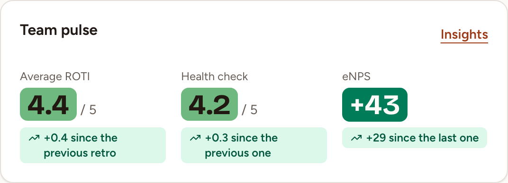
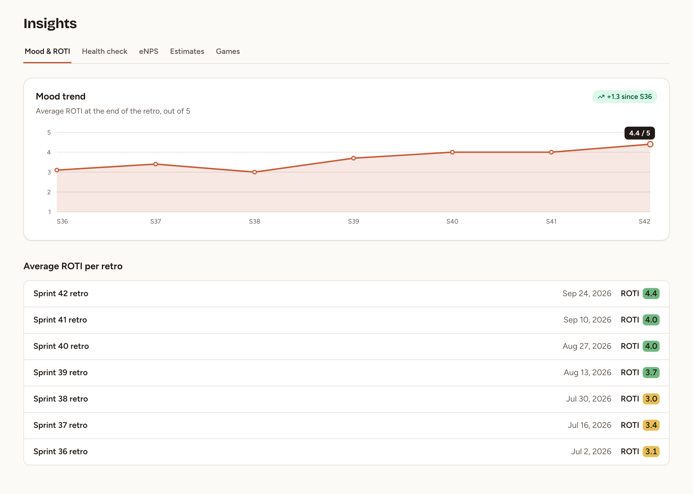
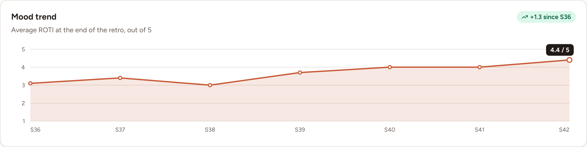

Insights gathers what your team's sessions have measured: the return on time invested (ROTI) of its retrospectives, its health checks, its eNPS, its estimates and its games. Every member of the team can read these pages, observers included, and so can the owners and admins of the workspace.

## Read the team pulse on the home page

The home page of a team has a **Team pulse** card with three figures. Each one is a link to its tab of Insights.

| Figure | What it is | The change under it |
|---|---|---|
| **Average ROTI** | The last point of the mood trend described below: the average ROTI of the most recent retro that has one, out of 5 | The difference with the retro before |
| **Health check** | The score of the most recent health check that counts, out of 5 | The difference with the health check before |
| **eNPS** | The score of the most recent eNPS survey that counts | The difference with the survey before |

[Health and eNPS trends](../health-and-enps-trends/) says which health checks and which surveys count.

A figure without data reads **No retro yet** or **Not run yet**. A change appears from the second result on.

## Open Insights

1. Select **Insights** in the sidebar, or **Insights** at the top of the **Team pulse** card.
2. Select a tab. Each tab is a page of its own, with its own address.

| Tab | What it shows |
|---|---|
| **Mood & ROTI** | The ROTI of the team's retros, described on this page |
| **Health check** | The health check score over time: see [Health and eNPS trends](../health-and-enps-trends/) |
| **eNPS** | The eNPS over time: see [Health and eNPS trends](../health-and-enps-trends/) |
| **Estimates** | The estimates saved in planning poker: see [Estimates history](../../planning-poker/estimates-history/) |
| **Games** | The leaderboard of the team's games: see [Games overview](../../games/overview/) |

## Read the mood trend

On **Mood & ROTI**, the **Mood trend** card draws the average ROTI at the end of each retro, out of 5.

- There is one point per completed retro in which at least one person gave a ROTI. Its value is the average of the scores given in that retro, rounded to one decimal.
- The chart is drawn from the team's eight most recent results, oldest on the left. A completed retro that has a ROTI or a health check is one result, and so is a health check run as a survey. The retros among them that have a ROTI get a point.
- The label under a point is the sprint of the retro, such as **S42**, when every retro of the chart was created during one of the team's [sprints](../../teams/sprints/). Otherwise it is the day each retro was completed.
- The dark label on the last point is the latest average. The badge at the top right, such as **+1.3 since S36**, is the difference between the last point and the first point of the chart.
- Hover a point to read the name of its retro and its value.

A team without any ROTI yet sees **No ROTI results yet.**

## Find the ROTI of one retro

Under the chart, **Average ROTI per retro** lists the completed retros that have a ROTI, newest first, up to 50. Each line gives the title of the retro, the day it was completed and its average ROTI. Select the title to open the retro.

The ROTI itself is collected in the last phase of a retro: see [ROTI and close](../../retrospectives/roti-and-close/).
