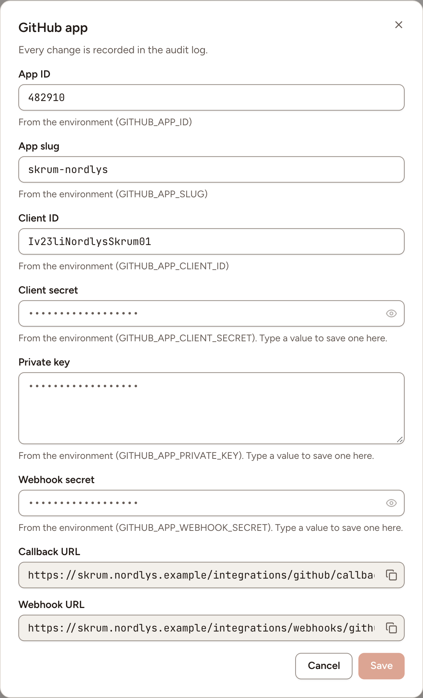
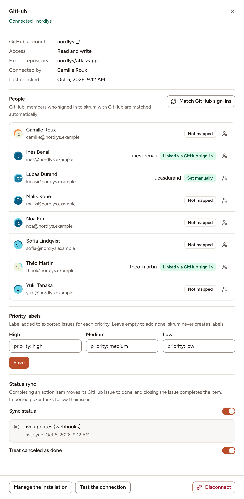

After this page, a team can import GitHub issues into planning poker, write estimates into them, export action items as issues and keep their status in step. An instance admin registers one GitHub App; each team then installs it on its organisation or account.

## What it does

- Import issues into planning poker, by milestone or by search.
- Write the estimate of a task into the description of its issue.
- Export action items as issues, with an assignee and a label for the priority.
- With the status sync on: completing an action item closes its issue, closing the issue completes the item, and imported poker tasks follow their issue.

Writing needs the installation to have write access to issues; with read access the team can only import.

> GitHub cannot guard a write against a concurrent edit. An issue description changed in GitHub at the very moment Skrüm writes an estimate into it can be overwritten.

## Who can set it up

- The GitHub App and its values: an instance admin, in **Administration**, then **Integrations**: see [Integration apps](../../administration/integration-apps/).
- A team's connection: a workspace owner or admin, or the team's owner, on the team's **Integrations** page. That person must be allowed to install the app on the GitHub account, or already see its installation there.

## Before you start

- It is a GitHub App, not an OAuth App. The one used for [signing in with GitHub](../../administration/sign-in-and-sso/) is a separate OAuth App and cannot serve here.
- It works with github.com only. GitHub Enterprise Server is not supported.
- The callback address is opened by the browser of the person who connects. The server running Skrüm must reach `github.com` and `api.github.com`.
- The webhook is optional. It gives live status updates and needs GitHub to call your instance, so `APP_URL` must be a public HTTPS address. Without it, or on a private network, leave the webhook inactive: Skrüm asks GitHub every `INTEGRATIONS_POLL_MINUTES` minutes, 5 by default. See [Integrations overview](../overview/).

## On the vendor's side

Register a GitHub App, under your organisation's or your own **Developer settings**, with these values. Put your own address in place of `{APP_URL}`.

| Field in GitHub | Value |
|---|---|
| **Callback URL** | `{APP_URL}/integrations/github/callback` |
| **Request user authorization (OAuth) during installation** | Selected. Skrüm needs both the installation and a proof of who installed it, at the callback address |
| **Setup URL** | Leave it empty: with **Request user authorization (OAuth) during installation** selected, GitHub does not let you enter one |
| **Webhook**, **Active** | Selected for live updates, cleared otherwise |
| **Webhook URL** | `{APP_URL}/integrations/webhooks/github` |
| **Webhook secret** | A long random string of your own. You enter the same one in Skrüm |
| **Where can this GitHub App be installed?** | An option that includes every account your teams will install it on |

Permissions:

| Kind | Permission | Access | Why |
|---|---|---|---|
| Repository | **Issues** | Read and write | Import issues, write estimates, create issues. Read-only makes every connection read only |
| Repository | **Metadata** | Read-only | List the repositories of the installation |
| Organization | **Members** | Read-only | List the organisation's members when you map people |

Under **Subscribe to events**, select `issues`. Skrüm also acts on the `installation` and `installation_repositories` events, to notice that the app was uninstalled or suspended, or lost a repository: select them as well if the form lists them.

Then, on the app's page:

1. Note the **App ID**, the **Client ID** and the app's slug, which is the last part of its public address, `https://github.com/apps/{slug}`.
2. Generate a client secret.
3. Under **Private keys**, select **Generate a private key**. GitHub downloads a `.pem` file.

GitHub describes the form in [Registering a GitHub App](https://docs.github.com/en/apps/creating-github-apps/registering-a-github-app/registering-a-github-app), the permissions in [Choosing permissions for a GitHub App](https://docs.github.com/en/apps/creating-github-apps/registering-a-github-app/choosing-permissions-for-a-github-app), the webhook in [Using webhooks with GitHub Apps](https://docs.github.com/en/apps/creating-github-apps/registering-a-github-app/using-webhooks-with-github-apps) and the key in [Managing private keys for GitHub Apps](https://docs.github.com/en/apps/creating-github-apps/authenticating-with-a-github-app/managing-private-keys-for-github-apps).

## In Skrüm, Administration

Open **Administration**, select **Integrations**, then **Configure** on the GitHub row.

| Field | Environment variable |
|---|---|
| **App ID** | `GITHUB_APP_ID` |
| **App slug** | `GITHUB_APP_SLUG` |
| **Client ID** | `GITHUB_APP_CLIENT_ID` |
| **Client secret** | `GITHUB_APP_CLIENT_SECRET` |
| **Private key** | `GITHUB_APP_PRIVATE_KEY` |
| **Webhook secret** | `GITHUB_APP_WEBHOOK_SECRET` |

Paste the whole content of the `.pem` file into **Private key**. In the environment variable, write the key on one line with `\n` for each line break, or give the path of the file in `GITHUB_APP_PRIVATE_KEY_PATH` instead, which has no field in the dialog.

The row reads **Available** once the first five are set. The webhook secret can stay empty. A value saved here wins over the environment variable.

## In the team's Integrations page

1. Open the team's settings and select **Integrations**.
2. Select **Connect** on the GitHub row, then **Install the GitHub App**.
3. On GitHub, choose the organisation or account, then all its repositories or the ones the team works in, and install.
4. Back in Skrüm, the row reads **Connected** with the account's name. **Access** is **Read and write** when the installation may write issues, **Read only** otherwise.

The panel then offers these settings.

| Setting | What it does |
|---|---|
| **People** | Which GitHub account each member is, for the assignee of exported issues. Members who signed in to Skrüm with GitHub are matched by **Match GitHub sign-ins**. For one person, choose an account, **Never assign**, or **Reset** |
| **Priority labels** | The label added to an exported issue for each of **High**, **Medium** and **Low**. Leave one empty to add none. Skrüm never creates a label: use ones the repository already has. Select **Save** |
| **Sync status** | Turns the status sync on, after a confirmation: the first sync takes the state of every linked issue, then the most recent change wins |
| **Treat canceled as done** | Whether an issue closed as not planned or as a duplicate counts as done. On by default |

**Export repository** appears among the details once an action item was exported: it is the repository used last, offered first the next time. **People** and **Priority labels** appear with read and write access only. **Manage the installation** opens GitHub to change the repositories.

## Test it

Open the panel and select **Test the connection**. Skrüm asks GitHub for the installation and shows **The connection works.**

## Troubleshooting

| What you see | What to do |
|---|---|
| **Could not connect GitHub. Try again.** | The installation was cancelled, or **Request user authorization (OAuth) during installation** is not selected, or the client ID, secret or callback URL do not match the app |
| **This GitHub installation isn't available to your account.** | Your GitHub account cannot see that installation. Connect with an account that can |
| **This installation can only read issues.** | Give the app **Issues: read and write** on GitHub, accept the new permission on the account, then select **Manage the installation** |
| **Reconnect required** and **The GitHub App was uninstalled from** or **is suspended on** the account | Install the app again, or lift the suspension on GitHub, then connect again |
| **Checking every 5 minutes.** | No webhook secret is saved, or the instance does not accept GitHub's calls. The sync works, with that delay |
| **Webhooks aren't reaching skrum; checking every 5 minutes.** | Check the webhook's address in the app, and that the same secret is saved on both sides |

## Disconnecting

Turn the row's switch off, or select **Disconnect** in the panel, and confirm. Imported tasks and exported issues keep their links but are no longer synced, and the people mappings are deleted.

The GitHub App stays installed on the account, since other teams may use the same installation. Uninstall it on GitHub if no team uses it any more.

## Official documentation

- [Registering a GitHub App](https://docs.github.com/en/apps/creating-github-apps/registering-a-github-app/registering-a-github-app)
- [Choosing permissions for a GitHub App](https://docs.github.com/en/apps/creating-github-apps/registering-a-github-app/choosing-permissions-for-a-github-app)
- [Using webhooks with GitHub Apps](https://docs.github.com/en/apps/creating-github-apps/registering-a-github-app/using-webhooks-with-github-apps)
- [Managing private keys for GitHub Apps](https://docs.github.com/en/apps/creating-github-apps/authenticating-with-a-github-app/managing-private-keys-for-github-apps)
