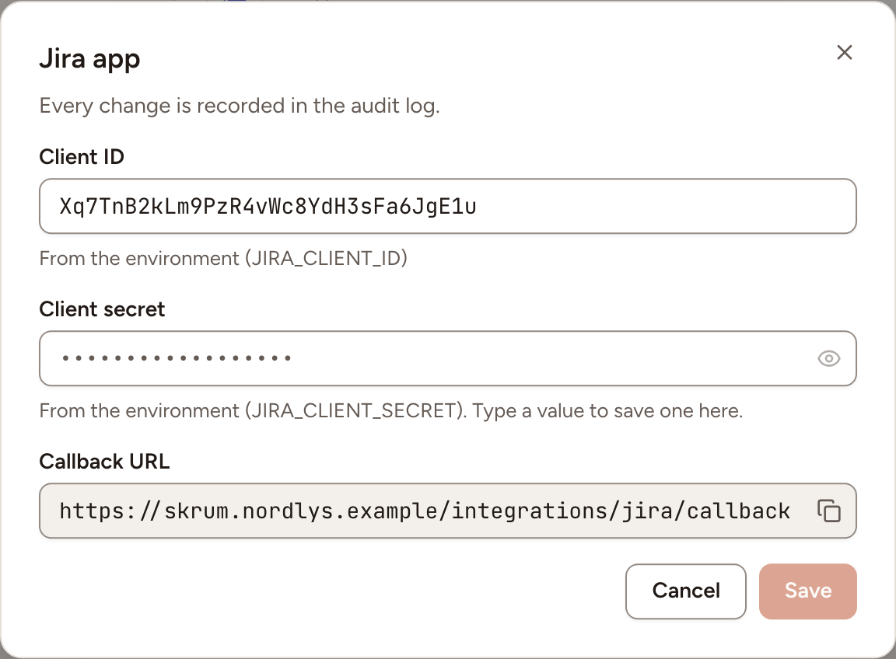
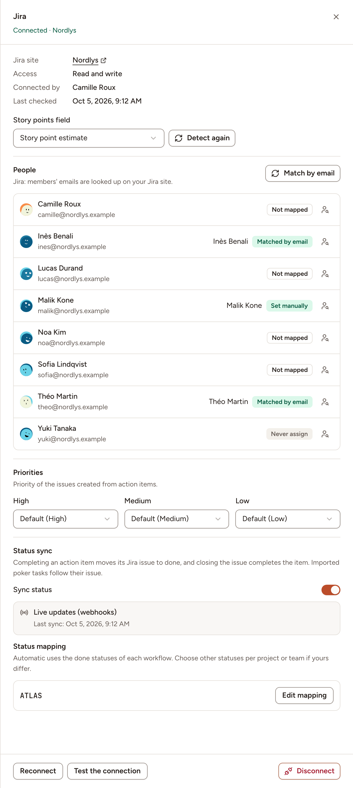

After this page, a team can import Jira issues into planning poker, write estimates back, export action items as issues and keep their status in step. An instance admin creates one Atlassian app; each team then connects its Jira site. For a Jira server you host yourself, see [Jira Data Center](../jira-data-center/).

## What it does

| Access | What the team can do |
|---|---|
| **Read only** | Import issues into planning poker |
| **Read and write** | Also write estimates to the story points field, export action items as issues with an assignee and a priority |

The team can also turn on the status sync: completing an action item moves its Jira issue to done, closing the issue completes the item, and imported poker tasks follow their issue.

## Who can set it up

- The Atlassian app and its credentials: an instance admin, in **Administration**, then **Integrations**.
- A team's connection: a workspace owner or admin, or the team's owner, on the team's **Integrations** page. Skrüm acts in Jira as the Atlassian account of that person.

## Before you start

- The callback address is opened by the browser of the person who connects. The server running Skrüm must reach `auth.atlassian.com` and `api.atlassian.com`.
- Live status updates need Jira to call your instance, so `APP_URL` must be a public HTTPS address. On a private network the status sync still works: Skrüm asks Jira every `INTEGRATIONS_POLL_MINUTES` minutes, 5 by default. See [Integrations overview](../overview/).

## On the vendor's side

1. In the [Atlassian developer console](https://developer.atlassian.com/console/myapps/), create an OAuth 2.0 integration.
2. Under **Authorization**, select **Configure** next to OAuth 2.0 (3LO) and enter this callback URL, with your own address in place of `{APP_URL}`:

   ```text
   {APP_URL}/integrations/jira/callback
   ```

   Skrüm shows the exact value as **Callback URL** in the dialog of the next section.
3. Under **Permissions**, add the scopes Skrüm asks for. A read-only connection asks for these five:

   ```text
   offline_access
   read:jira-work
   read:board-scope:jira-software
   read:sprint:jira-software
   manage:jira-webhook
   ```

   A read-and-write connection asks for two more:

   ```text
   write:jira-work
   read:jira-user
   ```

4. Under **Settings**, copy the **Client ID** and the **Secret**.
5. If people outside your own Atlassian account will connect, turn sharing on under **Distribution**.

Atlassian describes each step in [OAuth 2.0 (3LO) apps](https://developer.atlassian.com/cloud/jira/platform/oauth-2-3lo-apps/).

You add no webhook by hand. When a team turns the status sync on, Skrüm registers its own webhooks through Jira's API, for the events `jira:issue_updated` and `jira:issue_deleted` on the projects of the linked issues, at this address:

```text
{APP_URL}/integrations/webhooks/jira/{integration}/{token}
```

Jira lets such webhooks live 30 days; Skrüm extends them before they expire. Atlassian describes them in [Webhooks](https://developer.atlassian.com/cloud/jira/platform/webhooks/).

## In Skrüm, Administration

Open **Administration**, select **Integrations**, then **Configure** on the Jira row.

| Field | Environment variable |
|---|---|
| **Client ID** | `JIRA_CLIENT_ID` |
| **Client secret** | `JIRA_CLIENT_SECRET` |

Select **Save**. A value saved here wins over the environment variable.



## In the team's Integrations page

1. Open the team's settings and select **Integrations**.
2. Select **Connect** on the Jira row, then **Connect (read only)** or **Connect (read and write)**.
3. Allow the app on Atlassian's page.
4. If your Atlassian account reaches several Jira sites, the row reads **Setup required**: select **Finish setup** and choose the site under **Choose the Jira site this team uses:**.

The panel then offers these settings.

| Setting | What it does |
|---|---|
| **Story points field** | The Jira field estimates are read from and written to. Skrüm detects it; choose another number field if it picked the wrong one, or select **Detect again** after changing your Jira fields |
| **People** | Which Jira account each member is, for the assignee of exported issues. **Match by email** looks every member up on your Jira site. For one person, choose an account, **Never assign**, or **Reset** |
| **Priorities** | The Jira priority given to an exported issue for each of **High**, **Medium** and **Low**: the default, a priority of your site, or **Don't set** |
| **Sync status** | Turns the status sync on, after a confirmation: the first sync takes the state of every linked issue, then the most recent change wins |
| **Status mapping** | Per project, which statuses count as done and which status an issue moves to when its item is started, completed or reopened. **Automatic** uses the done statuses of each workflow. A project appears once an action item was exported to it or a task imported from it |

**People** and **Priorities** appear with read and write access only. **Upgrade to read and write** asks Atlassian for the two extra scopes.



## Test it

Open the panel and select **Test the connection**. Skrüm checks that the site is still reachable with the stored access and shows **The connection works.**

## Troubleshooting

| What you see | What to do |
|---|---|
| **Could not connect Jira. Try again.** | The consent was cancelled, or the client ID, secret or callback URL do not match the Atlassian app |
| **This Atlassian account has no Jira site.** | Connect with an account that has access to the Jira site |
| **Reconnect required** | The access was revoked or expired, or the site is no longer accessible. Select **Reconnect** |
| **Reconnect Jira to receive live updates.** | The connection was made without the `manage:jira-webhook` scope. Add it to the Atlassian app, then select **Reconnect** |
| **Checking every 5 minutes.** | The instance does not accept Jira's calls, so Skrüm polls. Nothing to do: the sync works, with that delay |
| **Webhooks aren't reaching skrum; checking every 5 minutes.** | Jira's calls do not arrive. Check that `APP_URL` is reachable from the internet |
| **No story points field found.** | Add a number field for story points in Jira, then select **Detect again** |

## Disconnecting

Turn the row's switch off, or select **Disconnect** in the panel, and confirm. Imported tasks and exported issues keep their links but are no longer synced, and the people and priority mappings are deleted. Skrüm asks Jira to remove the webhooks it registered.

Atlassian does not let Skrüm revoke its own access. The person who connected removes the app under **Connected apps** in their Atlassian account settings.

## Official documentation

- [OAuth 2.0 (3LO) apps](https://developer.atlassian.com/cloud/jira/platform/oauth-2-3lo-apps/)
- [Developer console](https://developer.atlassian.com/console/myapps/)
- [Webhooks](https://developer.atlassian.com/cloud/jira/platform/webhooks/)
