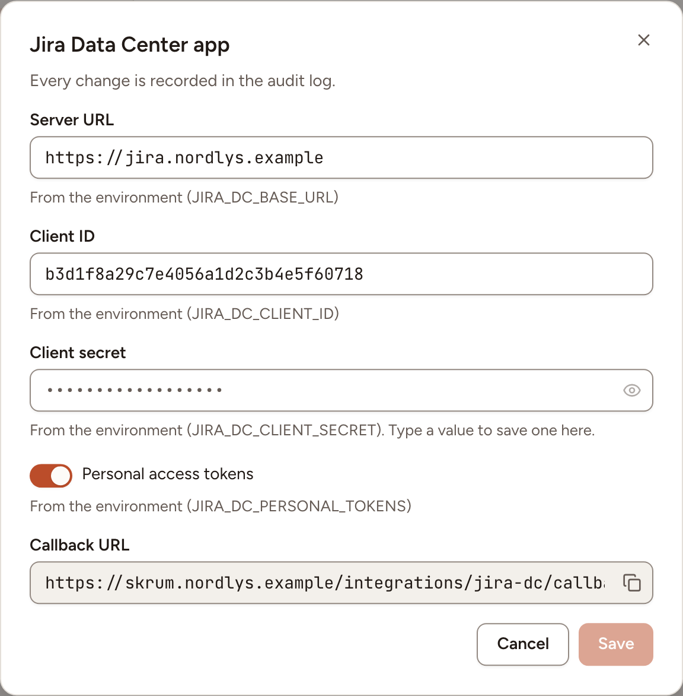
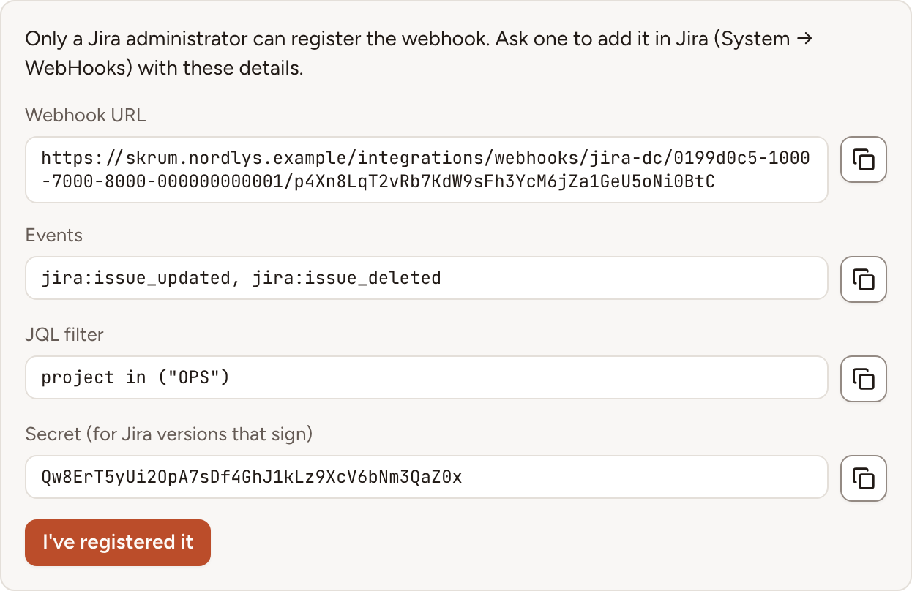

After this page, a team can use a Jira server you host yourself the way other teams use Jira Cloud: import issues into planning poker, write estimates back, export action items and keep their status in step. An instance works with one Jira server.

## What it does

| Access | What the team can do |
|---|---|
| **Read only** | Import issues into planning poker and receive status updates from Jira when sync is on |
| **Read and write** | Also write estimates to the story points field, export action items as issues with an assignee and a priority |

With read-and-write access, the team can turn on the two-way status sync: completing an action item moves its Jira issue to done, closing the issue completes the item, and imported poker tasks follow their issue.

There are two ways to sign in to Jira. The instance admin allows one or both.

| Way | Jira version | Skrüm acts in Jira as |
|---|---|---|
| OAuth 2.0, through an incoming application link | 8.22 or later | The person who connected, with the scope they allowed |
| A personal access token | 8.14 or later | The owner of the token, for everything |

Prefer OAuth when your Jira supports it.

With read-only access, imported tasks can still follow their Jira issue when status sync is on; Skrüm cannot write changes back to Jira.

## Who can set it up

- The server's address and the allowed ways to sign in: an instance admin, in **Administration**, then **Integrations**: see [Integration apps](../../administration/integration-apps/). The incoming link is created by a Jira administrator.
- A team's connection: a workspace owner or admin, or the team's owner, on the team's **Integrations** page.
- The webhook of the status sync: Skrüm registers it when the connecting account administers Jira. Otherwise a Jira administrator adds it by hand.

## Before you start

- The server running Skrüm must reach your Jira server. Both can be on the same private network.
- With OAuth, the callback address is opened by the browser of the person who connects.
- Live status updates need Jira to call your instance. By default Skrüm accepts those calls only when `APP_URL` is a public HTTPS address; otherwise it asks Jira every `INTEGRATIONS_POLL_MINUTES` minutes, 5 by default. If your Jira server reaches Skrüm on a private network, set `INTEGRATIONS_INBOUND_WEBHOOKS=on`. See [Integrations overview](../overview/).

## On the vendor's side

### OAuth 2.0: an incoming link

1. As a Jira administrator, open **Administration**, then **Applications**, then **Application links**.
2. Select **Create link**, choose **External application**, then **Incoming**.
3. Enter this redirect URL, with your own address in place of `{APP_URL}`:

   ```text
   {APP_URL}/integrations/jira-dc/callback
   ```

4. Choose the permission. Skrüm asks for the scope `READ` for a read-only connection and `WRITE` for a read-and-write one, so give the link the write permission if teams will write estimates or export action items.
5. Copy the **Client ID** and the **Client secret** Jira shows.

Atlassian describes these steps in [Configure an incoming link](https://confluence.atlassian.com/adminjiraserver/configure-an-incoming-link-1115659067.html).

### A personal access token

Nothing is created in advance. The person who connects the team creates a token in Jira, under **Profile**, then **Personal access tokens**, and pastes it into Skrüm. Atlassian describes it in [Using personal access tokens](https://confluence.atlassian.com/enterprise/using-personal-access-tokens-1026032365.html).

## In Skrüm, Administration

Open **Administration**, select **Integrations**, then **Configure** on the Jira Data Center row.

| Field | Environment variable | What it does |
|---|---|---|
| **Server URL** | `JIRA_DC_BASE_URL` | The address of your Jira server, with its context path if it has one. The dialog accepts an HTTPS address only |
| **Client ID** | `JIRA_DC_CLIENT_ID` | From the incoming link. Leave empty to allow tokens only |
| **Client secret** | `JIRA_DC_CLIENT_SECRET` | From the incoming link |
| **Personal access tokens** | `JIRA_DC_PERSONAL_TOKENS` | Lets teams paste a token. On by default |

The row reads **Available** once the **Server URL** is set and at least one way to sign in is allowed. A value saved here wins over the environment variable.



## In the team's Integrations page

Open the team's settings, select **Integrations**, then **Connect** on the Jira Data Center row.

- **With OAuth**: select **Connect (read only)** or **Connect (read and write)** and allow the application in Jira.
- **With a token**: select **Use a personal access token**, or **Older Jira server? Use a personal access token** when OAuth is offered too. Paste the token, choose **Read only** or **Read and write** under **Access**, tick **I understand** and select **Save token**. With read-only access, Skrüm itself refuses to write, whatever the token allows.

A connection made with a token shows **Acting as** followed by the owner's name: imports, estimates, exported issues and status changes appear in Jira as done by that person, and Skrüm sees only what they can see.

The panel then offers the same settings as Jira Cloud: **Story points field**, **People**, **Priorities**, **Sync status** and **Status mapping**. They are described in [Jira Cloud](../jira-cloud/).

### The webhook of the status sync

When **Sync status** is on and the instance accepts Jira's calls, Skrüm registers a webhook in Jira by itself if the account it acts as administers Jira. If not, the panel says **Only a Jira administrator can register the webhook.**

1. Select **Show webhook details**.
2. Send the four values to a Jira administrator, who adds a webhook in Jira under **System**, then **WebHooks**.
3. When it is added, select **I've registered it**. The panel reads **Setting up live updates…** until Jira's first call arrives, then **Live updates (webhooks)**.

| Value | What to enter in Jira |
|---|---|
| **Webhook URL** | The webhook's address, of the form `{APP_URL}/integrations/webhooks/jira-dc/{integration}/{token}`. It holds a token: treat it as a secret |
| **Events** | `jira:issue_updated` and `jira:issue_deleted` |
| **JQL filter** | The projects of the issues linked so far, such as `project in ("OPS")`. Shown once an issue is linked |
| **Secret (for Jira versions that sign)** | The webhook's secret, when your Jira version has that field. Skrüm then checks the `X-Hub-Signature` header of each call |



Atlassian describes the screen in [Managing webhooks](https://confluence.atlassian.com/adminjiraserver/managing-webhooks-938846912.html).

## Test it

Open the panel and select **Test the connection**. Skrüm asks Jira who it is signed in as and shows **The connection works.**

## Troubleshooting

| What you see | What to do |
|---|---|
| **Jira didn't accept this token.** | The token is wrong, expired or revoked. Create another in Jira |
| **Personal access tokens need Jira 8.14 or later.** | Upgrade Jira, or connect with OAuth on Jira 8.22 or later |
| **Personal access tokens are turned off on this skrum instance. Connect with OAuth.** | An instance admin turned **Personal access tokens** off. Connections made with a token then need **Reconnect** |
| **skrum is now configured for another Jira server. Reconnect.** | The **Server URL** changed since the team connected |
| **Could not connect Jira Data Center. Try again.** | The consent was cancelled, or the client ID, secret or redirect URL do not match the incoming link |
| **Checking every 5 minutes.** | No webhook is in use. See "Before you start" |

## Disconnecting

Turn the row's switch off, or select **Disconnect** in the panel (**Remove token** for a token), and confirm. Imported tasks and exported issues keep their links but are no longer synced, and the people and priority mappings are deleted. Skrüm asks Jira to remove the webhook it registered itself.

What stays on Jira's side:

- With OAuth, the authorisation. The person who connected revokes it under **Authorized applications** in their Jira profile.
- With a token, the token. Skrüm deletes its copy; its owner revokes it in Jira under **Profile**, then **Personal access tokens**.
- A webhook added by hand. A Jira administrator deletes it under **System**, then **WebHooks**.

## Official documentation

- [Configure an incoming link](https://confluence.atlassian.com/adminjiraserver/configure-an-incoming-link-1115659067.html)
- [Using personal access tokens](https://confluence.atlassian.com/enterprise/using-personal-access-tokens-1026032365.html)
- [Managing webhooks](https://confluence.atlassian.com/adminjiraserver/managing-webhooks-938846912.html)
