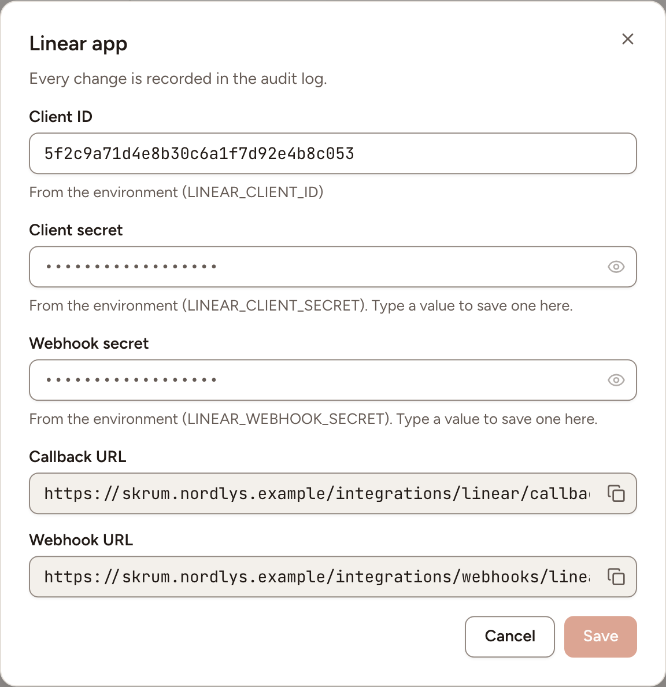
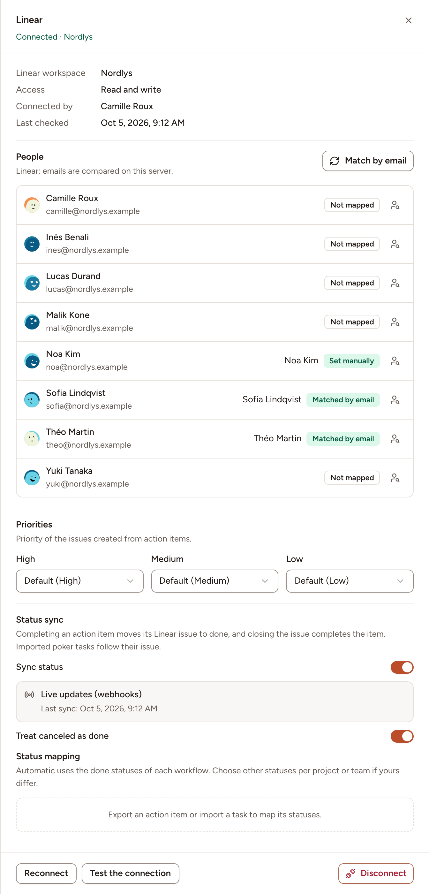

After this page, a team can import Linear issues into planning poker, write estimates back, export action items as issues and keep their status in step. An instance admin creates one OAuth application in Linear, and optionally a webhook for live updates; each team then connects its Linear workspace.

## What it does

| Access | What the team can do |
|---|---|
| **Read only** | Import issues into planning poker and receive status updates from Linear when sync is on |
| **Read and write** | Also write estimates back, export action items as issues with an assignee and a priority |

With read-and-write access, the team can turn on the two-way status sync: completing an action item moves its Linear issue to done, closing the issue completes the item, and imported poker tasks follow their issue.

Imports show all accessible issues when no team or cycle is selected. Select a team to narrow the list; leave its cycle empty to include issues with and without a cycle. The cycle selector offers active and upcoming cycles. Search, status filters and progressive loading work with or without a cycle: see [Tasks and imports](../../planning-poker/tasks-and-imports/).

With read-only access, imported tasks can still follow their Linear issue when status sync is on; Skrüm cannot write changes back to Linear.

## Who can set it up

- The OAuth application, the webhook and their values: an instance admin, in **Administration**, then **Integrations**: see [Integration apps](../../administration/integration-apps/). Creating a webhook in Linear takes a Linear workspace admin.
- A team's connection: a workspace owner or admin, or the team's owner, on the team's **Integrations** page. Skrüm acts in Linear as the person who connected.

## Before you start

- The callback address is opened by the browser of the person who connects. The server running Skrüm must reach `linear.app` and `api.linear.app`.
- The webhook is optional. It gives live status updates and needs Linear to call your instance, so `APP_URL` must be a public HTTPS address. Without it, or on a private network, the status sync still works: Skrüm asks Linear every `INTEGRATIONS_POLL_MINUTES` minutes, 5 by default. See [Integrations overview](../overview/).

## On the vendor's side

### The OAuth application

1. In Linear's settings, under **API**, create a new OAuth2 application.
2. Add this callback URL, with your own address in place of `{APP_URL}`:

   ```text
   {APP_URL}/integrations/linear/callback
   ```

3. Copy the application's client ID and client secret.

Skrüm asks for the scope `read` for a read-only connection, and `read` and `write` for a read-and-write one. Linear describes the application in [OAuth 2.0 authentication](https://linear.app/developers/oauth-2-0-authentication).

### The webhook

For an instance used by several Linear workspaces, configure **Issues** webhooks on the OAuth application, with the address below. Linear then creates a webhook when a workspace authorizes the application. Save that application webhook signing secret in Skrüm. Configure this before connecting the workspaces. See [Webhooks](https://linear.app/developers/webhooks).

For a single workspace, you can instead create a workspace webhook manually:

1. In Linear's settings, under **API**, select **New webhook**.
2. Enter this address:

   ```text
   {APP_URL}/integrations/webhooks/linear
   ```

3. Tick **Issues** and nothing else. Skrüm acts on issue events only and ignores the others.
4. Copy the webhook's signing secret.

Skrüm shows both addresses, as **Callback URL** and **Webhook URL**, in the dialog of the next section. It checks the `Linear-Signature` header of every call against the signing secret and refuses a call sent more than a minute earlier. Linear describes webhooks in [Webhooks](https://linear.app/developers/webhooks).

An instance has one signing secret. A manually created webhook reports only the Linear workspace and teams it covers; select all public teams or the team whose issues you want to sync. Separate workspace webhooks with different secrets cannot share this configuration. Other connected workspaces need the OAuth application webhook described above, or use polling without live updates.

## In Skrüm, Administration

Open **Administration**, select **Integrations**, then **Configure** on the Linear row.

| Field | Environment variable |
|---|---|
| **Client ID** | `LINEAR_CLIENT_ID` |
| **Client secret** | `LINEAR_CLIENT_SECRET` |
| **Webhook secret** | `LINEAR_WEBHOOK_SECRET` |

Select **Save**. The row reads **Available** once the client ID and the client secret are set; the webhook secret can stay empty. A value saved here wins over the environment variable.



## In the team's Integrations page

1. Open the team's settings and select **Integrations**.
2. Select **Connect** on the Linear row, then **Connect (read only)** or **Connect (read and write)**.
3. Allow the application on Linear's page. The row reads **Connected** with the Linear workspace.

The panel then offers these settings.

| Setting | What it does |
|---|---|
| **People** | Which Linear account each member is, for the assignee of exported issues. **Match by email** compares emails on your server. For one person, choose an account, **Never assign**, or **Reset** |
| **Priorities** | The Linear priority given to an exported issue for each of **High**, **Medium** and **Low** |
| **Sync status** | Turns the status sync on, after a confirmation: the first sync takes the state of every linked issue, then the most recent change wins |
| **Treat canceled as done** | Whether an issue canceled in Linear counts as done. On by default |
| **Status mapping** | Per Linear team, which statuses count as done and which status an issue moves to when its item is started, completed or reopened. A team appears once an action item was exported to it or a task imported from it |

**People** and **Priorities** appear with read and write access only. **Upgrade to read and write** asks Linear for the `write` scope.



## Test it

Open the panel and select **Test the connection**. Skrüm asks Linear who it is signed in as and shows **The connection works.**

## Troubleshooting

| What you see | What to do |
|---|---|
| **Could not connect Linear. Try again.** | The consent was cancelled, or the client ID, secret or callback URL do not match the Linear application |
| **Reconnect required** | The access was revoked. Select **Reconnect** |
| **Checking every 5 minutes.** | No webhook secret is saved, or the instance does not accept Linear's calls. The sync works, with that delay |
| **Setting up live updates…** | Skrüm waits for the webhook's first call. It arrives with the next change to an issue |
| **Webhooks aren't reaching skrum; checking every 5 minutes.** | Check the webhook's address and that the secret saved in Skrüm is the webhook's signing secret |

## Disconnecting

Turn the row's switch off, or select **Disconnect** in the panel, and confirm. Imported tasks and exported issues keep their links but are no longer synced, the people and priority mappings are deleted, and Skrüm revokes its Linear access.

The OAuth application and the webhook stay in Linear. They serve every team of the instance: delete them only when no team uses Linear any more.

## Official documentation

- [OAuth 2.0 authentication](https://linear.app/developers/oauth-2-0-authentication)
- [Webhooks](https://linear.app/developers/webhooks)
