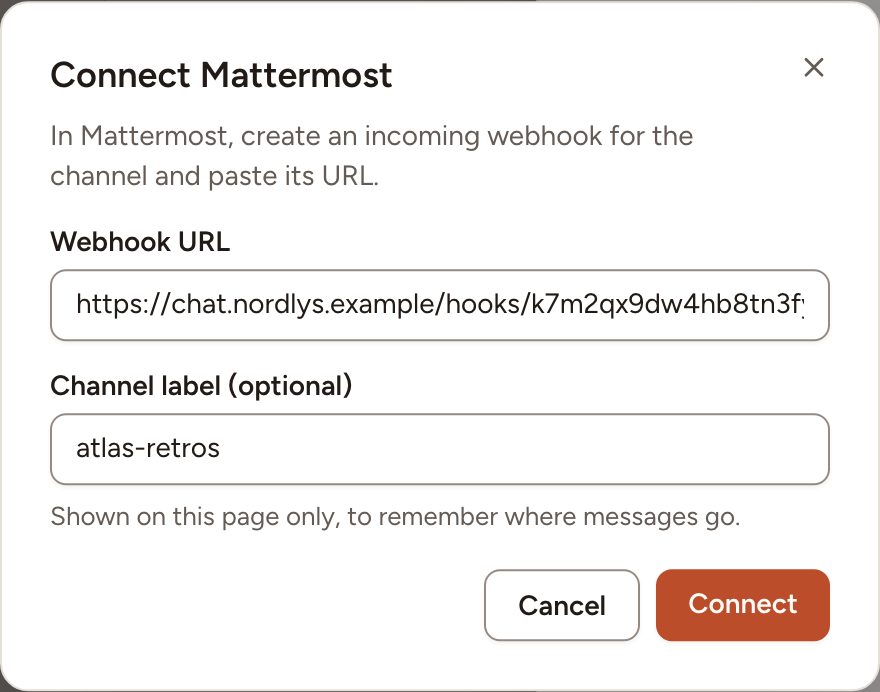

After this page, a team can post the link of a session and the results of a retrospective to a Mattermost channel. An instance admin names the one Mattermost server teams may post to; each team then pastes an incoming webhook of that server.

## What it does

- **Share links**: post the link of a retrospective, a planning poker game or a game room with **Share to Mattermost**.
- **Share results**: post the recap of a retrospective with **Share the results to Mattermost**.

## Who can set it up

- The server's address: an instance admin, in **Administration**, then **Integrations**.
- A team's channel: a workspace owner or admin, or the team's owner, on the team's **Integrations** page. That person also needs the right to create an incoming webhook in Mattermost.

## Before you start

- An instance posts to one Mattermost server. Teams cannot paste a webhook of another one.
- Skrüm calls Mattermost; Mattermost never calls Skrüm. Both can sit on the same private network, as long as the server running Skrüm reaches the Mattermost server.
- Incoming webhooks must be enabled on the Mattermost server.

## On the vendor's side

1. In Mattermost, open the product menu, then **Integrations**, then **Incoming Webhooks**.
2. Select **Add Incoming Webhook**, give it a name, choose the channel and save.
3. Copy the address Mattermost shows. Anyone who has it can post to the channel, so treat it as a secret.

Mattermost describes these steps, and the setting that enables them, in [Incoming webhooks](https://docs.mattermost.com/developers/integrate/webhooks/incoming).

## In Skrüm, Administration

Open **Administration**, select **Integrations**, then **Configure** on the Mattermost row.

| Field | Environment variable |
|---|---|
| **Server URL** | `MATTERMOST_URL` |

Enter the address of your Mattermost server, such as `https://chat.example.com`. The dialog accepts an HTTPS address only. A value saved here wins over the environment variable.

## In the team's Integrations page

1. Open the team's settings and select **Integrations**.
2. Select **Connect** on the Mattermost row, then **Connect** in the panel.
3. Paste the webhook's address into **Webhook URL**.
4. Optionally fill in **Channel label (optional)**, 80 characters at most. It is shown on this page only, to remember where messages go.
5. Select **Connect**.

The address must be the **Server URL**, then `/hooks/`, then the webhook's key of 26 letters and digits:

```text
https://chat.example.com/hooks/k7m2qx9dw4hb8tn3fy6cz5ajre
```



The panel then shows the **Host** and the **Channel** label. Skrüm never shows the address again: to change it, select **Replace URL** and paste the new one.

## Test it

Open the panel and select **Send a test message**. The channel receives "skrum is connected." and Skrüm shows **Test message sent.**

## Troubleshooting

| What you see | What to do |
|---|---|
| No Mattermost row on the team's page | The instance has no **Server URL**, or an instance admin turned Mattermost off |
| **Use an incoming webhook of** followed by the server's address | The address is on another server, or does not end with `/hooks/` and a 26-character key |
| **Reconnect required** and **The Mattermost webhook no longer works. Paste a new one.** | The webhook was deleted or disabled in Mattermost, or the **Server URL** changed. Select **Replace URL** |
| **Mattermost did not respond. Try again later.** | The server could not reach Mattermost |

## Disconnecting

Turn the row's switch off, or select **Disconnect** in the panel, and confirm. Nothing is posted to the channel any more. The webhook stays in Mattermost: delete it there if you no longer need it.

## Official documentation

- [Incoming webhooks](https://docs.mattermost.com/developers/integrate/webhooks/incoming)
