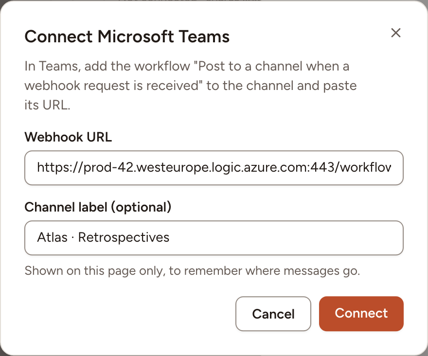

After this page, a team can post the link of a session and the results of a retrospective to a Microsoft Teams channel. There is no app to register: Teams gives you an address, and you paste it into Skrüm.

## What it does

- **Share links**: post the link of a retrospective, a planning poker game or a game room with **Share to Microsoft Teams**.
- **Share results**: post the recap of a retrospective with **Share the results to Microsoft Teams**.

## Who can set it up

- Turning the provider on, and the list of accepted hosts: an instance admin, in **Administration**, then **Integrations**.
- A team's channel: a workspace owner or admin, or the team's owner, on the team's **Integrations** page. That person also needs the right to add a workflow to the channel in Teams.

## Before you start

- Skrüm calls the workflow's address; Teams never calls Skrüm. An instance on a private network works as long as its server can reach Microsoft's hosts.
- The address must be HTTPS on port 443, at most 2048 characters, with no user name or password in it.

## On the vendor's side

1. In Teams, open **Workflows** and create a workflow from the webhook template for a channel. Skrüm's dialog names it "Post to a channel when a webhook request is received"; Microsoft's page lists the channel templates under names such as **Send webhook alerts to a channel**.
2. Choose the team and the channel the messages will go to, then save.
3. Copy the address the workflow shows. It is the only value Skrüm needs. Anyone who has it can post to the channel, so treat it as a secret.

Microsoft describes these steps in [Send messages in Teams using incoming webhooks](https://support.microsoft.com/en-us/workflows/send-messages-in-teams-using-incoming-webhooks).

## In Skrüm, Administration

Open **Administration**, select **Integrations**, then **Configure** on the Microsoft Teams row.

| Field | Environment variable | What it does |
|---|---|---|
| **Enabled** | `MSTEAMS_ENABLED` | Shows Microsoft Teams on the teams' Integrations pages |
| **Allowed hosts** | `MSTEAMS_ALLOWED_HOSTS` | Host names accepted besides the two built-in ones, separated by commas, 20 at most |

Skrüm always accepts an address whose host ends in `.logic.azure.com` or `.api.powerplatform.com`. If your workflow's address is on another host, add that exact host name to **Allowed hosts**.

A value saved here wins over the environment variable.

## In the team's Integrations page

1. Open the team's settings and select **Integrations**.
2. Select **Connect** on the Microsoft Teams row, then **Connect** in the panel.
3. Paste the address into **Webhook URL**.
4. Optionally fill in **Channel label (optional)**, 80 characters at most. It is shown on this page only, to remember where messages go.
5. Select **Connect**.

The panel then shows the **Host** and the **Channel** label. Skrüm never shows the address again: to change it, select **Replace URL** and paste the new one.

## Test it

Open the panel and select **Send a test message**. The channel receives "skrum is connected." and Skrüm shows **Test message sent.**

## Troubleshooting

| What you see | What to do |
|---|---|
| No Microsoft Teams row on the team's page | An instance admin has not turned **Enabled** on, or turned the provider off |
| **Use the workflow URL from Microsoft Teams.** | The address is not HTTPS on port 443, or its host is neither a built-in one nor in **Allowed hosts** |
| **Reconnect required** and **The Teams workflow URL no longer works. Paste a new one.** | The workflow was deleted or turned off, or its host is no longer accepted. Select **Replace URL** |
| **Microsoft Teams did not respond. Try again later.** | The server could not reach the workflow |

## Disconnecting

Turn the row's switch off, or select **Disconnect** in the panel, and confirm. Nothing is posted to the channel any more. The workflow stays in Teams: delete it there if you no longer need it.

## Official documentation

- [Send messages in Teams using incoming webhooks](https://support.microsoft.com/en-us/workflows/send-messages-in-teams-using-incoming-webhooks)
