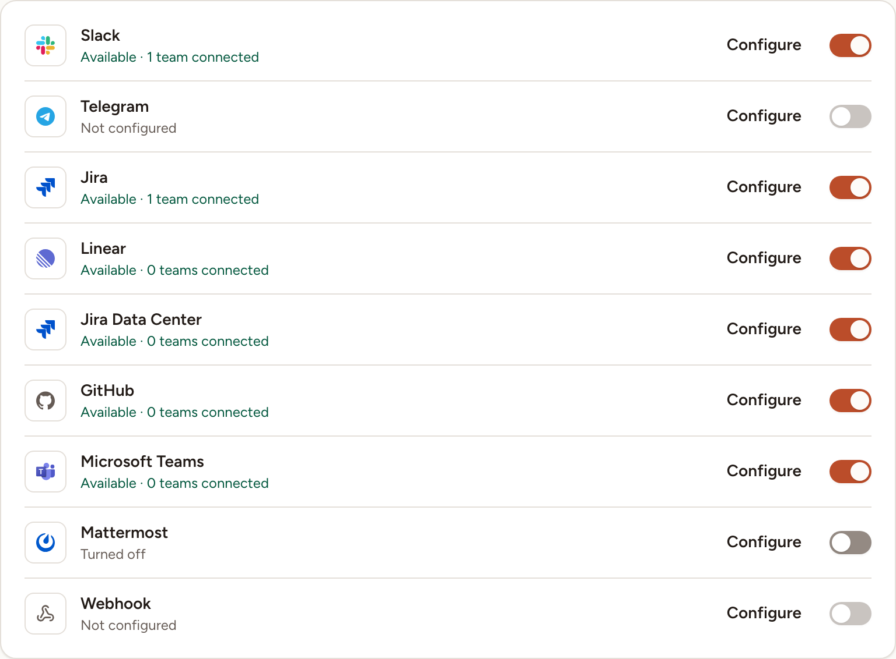
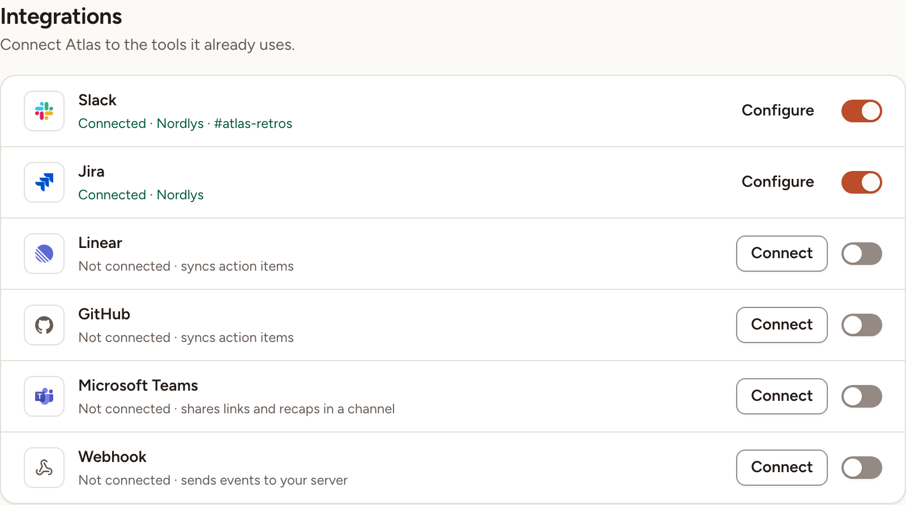

Skrüm connects a team to nine tools: four chat channels, four issue trackers and a webhook of your own. This page says who sets an integration up, what each one can do, and how Skrüm learns about changes made in a tracker.

## Two levels: the instance, then the team

An integration is set up twice, by two different people.

| Level | Who | Where | What they do |
|---|---|---|---|
| Instance | An instance admin | **Administration**, then **Integrations** | Enter the app's credentials (or turn the provider on), once for every team |
| Team | A workspace owner or admin, or the team's owner | The team's settings, then **Integrations** | Connect the team to its own channel, site or repository |

Facilitators, members and observers of a team cannot open its **Integrations** page.

### At the instance

1. Open **Administration** and select **Integrations**. Skrüm asks for your password first.
2. Select **Configure** on a provider's row, fill in the fields and select **Save**. Each provider's page lists its fields.
3. The row then reads **Available** with the number of teams connected. Its switch turns the provider off for every team; the teams' connections are kept and come back when you turn it on again.

Every field can also be set by an environment variable. A value saved in the dialog wins over the environment; **Use the environment value** under a saved field returns to it. Saving needs a password confirmation less than five minutes old: when it has passed, the dialog shows **Confirm your password to change these settings.** with a **Confirm** button. Every change is recorded in the [audit log](../../administration/audit-log/).

Tokens and secrets are stored encrypted with the application key. See [Configuration reference](../../self-hosting/configuration/) before you rotate it.

### In a team

The **Integrations** entry of a team's settings appears once at least one provider is configured and turned on. The page lists those providers only.

Each row has a status line, a button and a switch. The button opens the provider's panel: **Connect** when nothing is connected, **Configure** when it works, **Finish setup** when a step is missing, **Reconnect** when the connection stopped working. Turning the switch off asks to disconnect. A team has one connection per provider.

## What each integration can do

| Provider | Share links | Share results | Import into poker | Write estimates back | Export action items | Map people | Map priorities | Sync status | Send events |
|---|---|---|---|---|---|---|---|---|---|
| [Slack](../slack/) | Yes | Yes | – | – | – | – | – | – | – |
| [Telegram](../telegram/) | Yes | Yes | – | – | – | – | – | – | – |
| [Jira Cloud](../jira-cloud/) | – | – | Yes | Yes | Yes | Yes | Yes | Yes | – |
| [Linear](../linear/) | – | – | Yes | Yes | Yes | Yes | Yes | Yes | – |
| [Jira Data Center](../jira-data-center/) | – | – | Yes | Yes | Yes | Yes | Yes | Yes | – |
| [GitHub](../github/) | – | – | Yes | Yes | Yes | Yes | Yes | Yes | – |
| [Microsoft Teams](../microsoft-teams/) | Yes | Yes | – | – | – | – | – | – | – |
| [Mattermost](../mattermost/) | Yes | Yes | – | – | – | – | – | – | – |
| [Webhook](../webhooks/) | Yes | Yes | – | – | – | – | – | – | Yes |

- **Share links** posts the link of a retrospective, a planning poker game or a game room. **Share results** posts the recap of a retrospective. See [Summary and sharing](../../retrospectives/summary-and-sharing/).
- **Import into poker** and **Write estimates back** are described in [Tasks and imports](../../planning-poker/tasks-and-imports/).
- **Export action items**, the people and priority mappings, and the status sync are described in [Export and tracker sync](../../action-items/export-and-sync/).
- **Send events** is the webhook sending by itself when something happens. See [Webhook events](../../reference/webhook-events/).

A tracker connected **read only** can import issues and receive status updates for imported tasks when sync is on. Changes in Skrüm cannot be written back to the tracker: writing estimates, exporting action items and the two mappings need **read and write**.

## Live updates or polling

With the status sync turned on, Skrüm has to learn that an issue changed in the tracker. It does so in one of two ways.

- **Live updates (webhooks)**: the tracker calls Skrüm when an issue changes.
- **Polling**: Skrüm asks the tracker every few minutes. The connection's panel then reads **Checking every 5 minutes.**

Two environment variables decide.

| Variable | Values | Effect |
|---|---|---|
| `INTEGRATIONS_INBOUND_WEBHOOKS` | `auto` (default), `on`, `off` | With `auto`, Skrüm accepts trackers' webhooks only when `APP_URL` is a public HTTPS address: not `localhost`, not an IP address, not a name ending in `.local`, `.localhost`, `.test`, `.internal`, `.lan` or `.home.arpa`, and resolving to a public address. `on` always accepts them, `off` never does |
| `INTEGRATIONS_POLL_MINUTES` | `1` to `60`, default `5` | How often Skrüm polls a connection that gets no live updates |

On a private network, with `auto`, nothing is lost: every tracker falls back to polling. If your tracker can reach Skrüm on that network, as a Jira Data Center server often can, set `INTEGRATIONS_INBOUND_WEBHOOKS=on`.

A connection with live updates is still read once an hour. When changes keep being found that way and no webhook arrived for 24 hours, the panel reads **Webhooks aren't reaching skrum; checking every 5 minutes.** and Skrüm polls until one arrives.

The chat channels and the webhook only send; they need nothing from outside. Telegram is the exception: Skrüm asks Telegram for new messages every minute to read the connect command.

Polling, the Telegram check and a daily check that every connection still has access all run from the scheduler. See [Processes and status](../../self-hosting/processes/).
