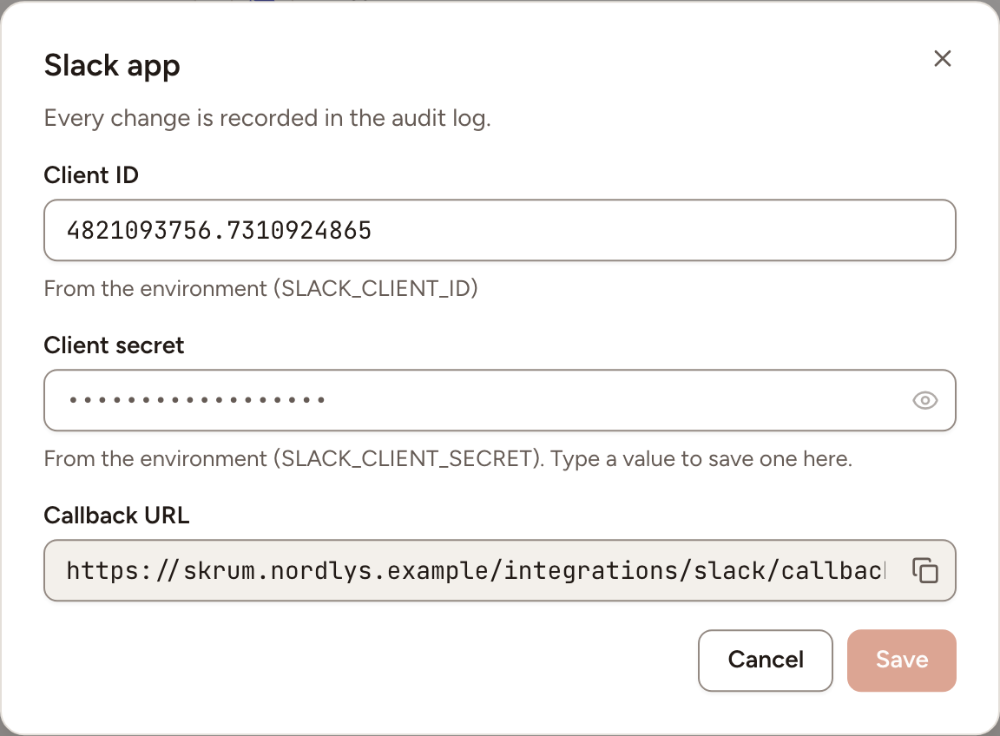
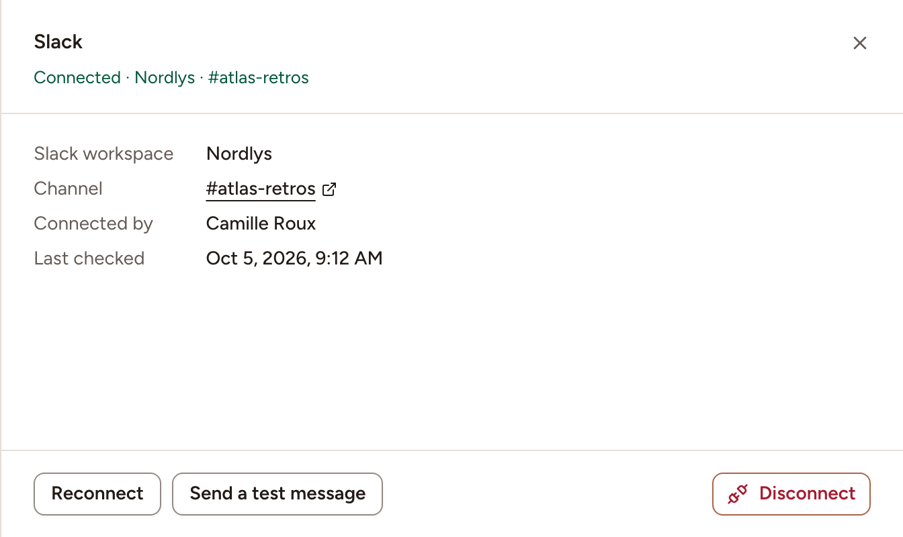

After this page, a team can post the link of a session and the results of a retrospective to one Slack channel. An instance admin creates a Slack app once; each team then connects its own channel.

## What it does

- **Share links**: post the link of a retrospective, a planning poker game or a game room with **Post link to Slack**, under **Post a link** in the session's share dialog.
- **Share results**: post the recap of a completed retrospective with **Share to Slack**, in its **Share** menu.

Skrüm only posts. It reads no message from Slack.

## Who can set it up

- The Slack app and its credentials: an instance admin, in **Administration**, then **Integrations**.
- A team's channel: a workspace owner or admin, or the team's owner, on the team's **Integrations** page.

## Before you start

- Slack only redirects to an HTTPS address. Your instance's `APP_URL` must start with `https://`.
- That address is opened by the browser of the person who connects, not by Slack's servers. An instance on a private network can use Slack as long as its address is HTTPS and your browsers reach it.
- The server running Skrüm must be able to call `slack.com` and `hooks.slack.com`.

## On the vendor's side

1. Create an app for your workspace from Slack's app settings. Slack's [quickstart](https://docs.slack.dev/app-management/quickstart-app-settings) walks through it.
2. Under **OAuth & Permissions**, add this redirect URL, with your own address in place of `{APP_URL}`:

   ```text
   {APP_URL}/integrations/slack/callback
   ```

   Skrüm shows the exact value as **Callback URL** in the dialog of the next section.
3. Under **Incoming Webhooks**, turn **Activate Incoming Webhooks** on. Under **OAuth & Permissions**, give the app this one **Bot Token Scope** and no other:

   ```text
   incoming-webhook
   ```

   Slack describes it in [Sending messages using incoming webhooks](https://docs.slack.dev/messaging/sending-messages-using-incoming-webhooks). No bot token and no signing secret are needed.
4. Copy the app's client ID and client secret.

## In Skrüm, Administration

Open **Administration**, select **Integrations**, then **Configure** on the Slack row.

| Field | Environment variable |
|---|---|
| **Client ID** | `SLACK_CLIENT_ID` |
| **Client secret** | `SLACK_CLIENT_SECRET` |

Select **Save**. A value saved here wins over the environment variable. The row reads **Available** once both values are set.



## In the team's Integrations page

1. Open the team's settings and select **Integrations**.
2. Select **Connect** on the Slack row, then **Connect** in the panel.
3. Slack asks you to allow the app and to pick the channel it will post to. Choose the channel and allow.
4. Back in Skrüm, the row reads **Connected** with the Slack workspace and the channel.

A team posts to one channel. To change it, open the panel and select **Reconnect**: Slack asks for the channel again.



## Test it

Open the Slack panel and select **Send a test message**. The channel receives "skrum is connected." and Skrüm shows **Test message sent.**

## Troubleshooting

| What you see | What to do |
|---|---|
| No Slack row on the team's page | The instance has no Slack credentials, or an instance admin turned Slack off |
| **Could not connect Slack. Try again.** | The consent was cancelled, or the client ID, client secret or redirect URL do not match the Slack app. Check them, then connect again |
| **Reconnect required**, with Slack's reason in the panel | The access was revoked, or the channel or its webhook no longer exists. Select **Reconnect** |
| **Too many requests to Slack, wait a moment.** | Slack is limiting the app. Share again a little later |
| **Slack did not respond. Try again later.** | The server could not reach Slack |

## Disconnecting

Turn the row's switch off, or select **Disconnect** in the panel, and confirm. Posting to the channel stops and Skrüm revokes its Slack access. The Slack app the instance admin created is not touched: other teams keep using it.

## Official documentation

- [Quickstart: app settings](https://docs.slack.dev/app-management/quickstart-app-settings)
- [Installing with OAuth](https://docs.slack.dev/authentication/installing-with-oauth)
- [Sending messages using incoming webhooks](https://docs.slack.dev/messaging/sending-messages-using-incoming-webhooks)
