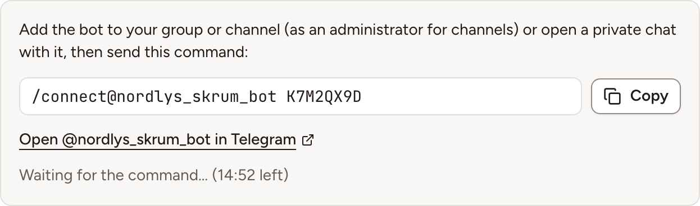

After this page, a team can post the link of a session and the results of a retrospective to a Telegram group, channel or private chat. An instance admin creates one bot; each team then links a chat to it with a code.

## What it does

- **Share links**: post the link of a retrospective, a planning poker game or a game room with **Post link to Telegram**, under **Post a link** in the session's share dialog.
- **Share results**: post the recap of a completed retrospective with **Share to Telegram**, in its **Share** menu.

The bot reads three commands, `/connect`, `/start` and `/help`. Other messages are neither stored nor logged.

## Who can set it up

- The bot and its token: an instance admin, in **Administration**, then **Integrations**: see [Integration apps](../../administration/integration-apps/).
- A team's chat: a workspace owner or admin, or the team's owner, on the team's **Integrations** page. That person must also be able to add the bot to the chat in Telegram.

## Before you start

- One bot serves the whole instance. Use it for this instance only.
- Never set a webhook on that bot. Skrüm asks Telegram for the bot's new messages every minute, and Telegram refuses that while a webhook is set.
- Skrüm calls `api.telegram.org`; Telegram never calls Skrüm. An instance on a private network works as long as its server reaches that host.
- The scheduler must be running, or the connect command is never read. See [Processes and status](../../self-hosting/processes/).

## On the vendor's side

1. In Telegram, open a chat with **@BotFather** and send `/newbot`.
2. Give the bot a name and a username when asked.
3. Copy the token BotFather answers with. It is the only value Skrüm needs.

Telegram describes BotFather in [Bot features](https://core.telegram.org/bots/features#botfather), and the rule about webhooks under [getUpdates](https://core.telegram.org/bots/api#getupdates).

## In Skrüm, Administration

Open **Administration**, select **Integrations**, then **Configure** on the Telegram row.

| Field | Environment variable |
|---|---|
| **Bot token** | `TELEGRAM_BOT_TOKEN` |

Select **Save**. A value saved here wins over the environment variable.

## In the team's Integrations page

1. Open the team's settings and select **Integrations**.
2. Select **Connect** on the Telegram row, then **Connect** in the panel. Skrüm shows a command with a code of 8 characters, valid for 15 minutes.
3. In Telegram, add the bot to your group or channel, or open a private chat with it. **Open @… in Telegram** leads to the bot. In a channel, the bot must be an administrator.
4. Send the command in that chat, exactly as shown:

   ```text
   /connect@your_bot K7M2QX9D
   ```

5. Skrüm reads the bot's messages once a minute, so allow about that long. The bot then answers that the chat is connected to the team, Skrüm shows **Telegram connected.** and the row reads **Connected** with the chat's name.



A code works once. Asking for a new code cancels the previous one. A team posts to one chat: **Connect another chat** gives a new code and replaces it.

## Test it

Open the panel and select **Send a test message**. The chat receives "skrum is connected." and Skrüm shows **Test message sent.**

## Troubleshooting

| What you see | What to do |
|---|---|
| **This code has expired. Create a new one.** | The 15 minutes passed. Select **Connect** again and send the new command |
| The bot answers **This code is invalid or has expired.** | Ask for a new code. After five wrong codes from the same chat, the bot ignores that chat's connect commands for an hour |
| The bot does not answer | The command went to another bot, or the scheduler is not running. Send the command with the bot's username, as shown |
| **The Telegram bot is used elsewhere. Remove its webhook or use a dedicated bot.** | Something else reads this bot's messages. Remove the webhook set on it, or create a bot for Skrüm alone |
| **Telegram did not answer. Check the bot token of this instance.** | The token is wrong or revoked, or the server cannot reach Telegram. **Connect** stays disabled until it works |
| **Reconnect required** and **The bot was removed from the Telegram chat.** | Add the bot back, then connect the chat again with a new code |

## Disconnecting

Turn the row's switch off, or select **Disconnect** in the panel, and confirm. Nothing is posted to the chat any more and the bot leaves it, unless another team of the instance posts to the same chat.

## Official documentation

- [Bot features: BotFather](https://core.telegram.org/bots/features#botfather)
- [Bot API: getUpdates](https://core.telegram.org/bots/api#getupdates)
