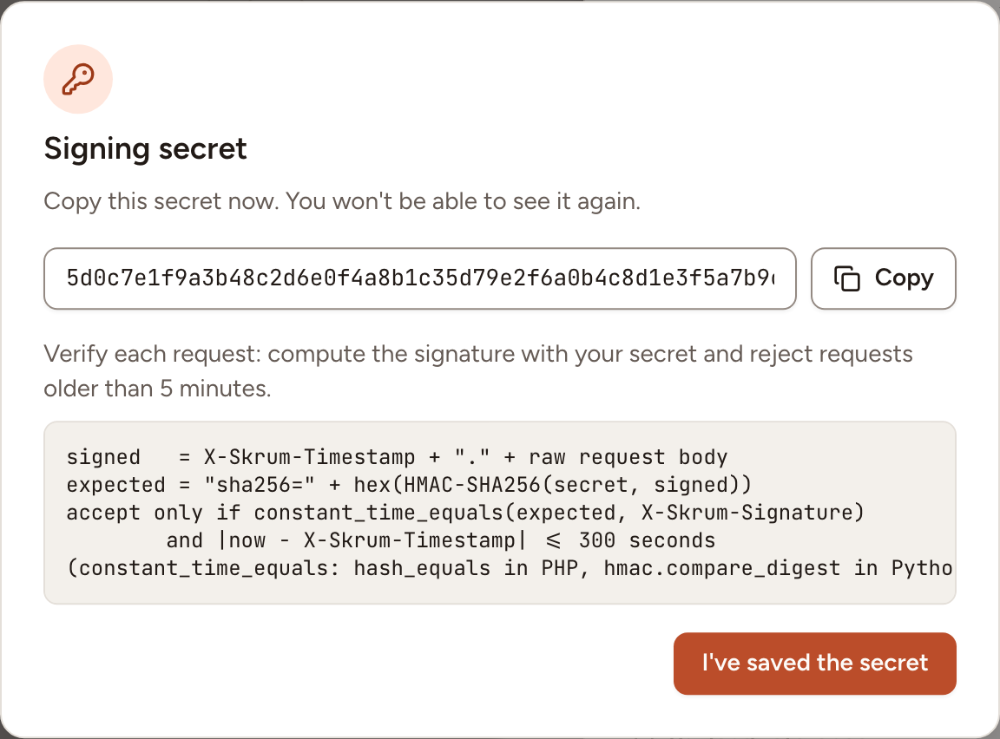
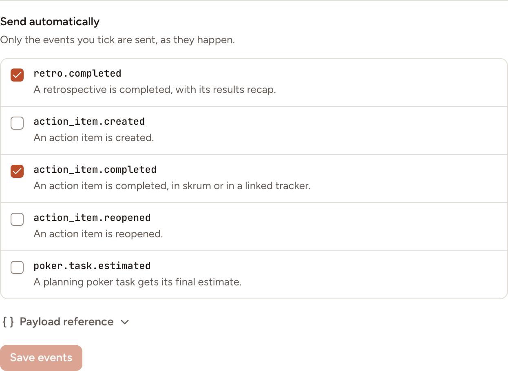
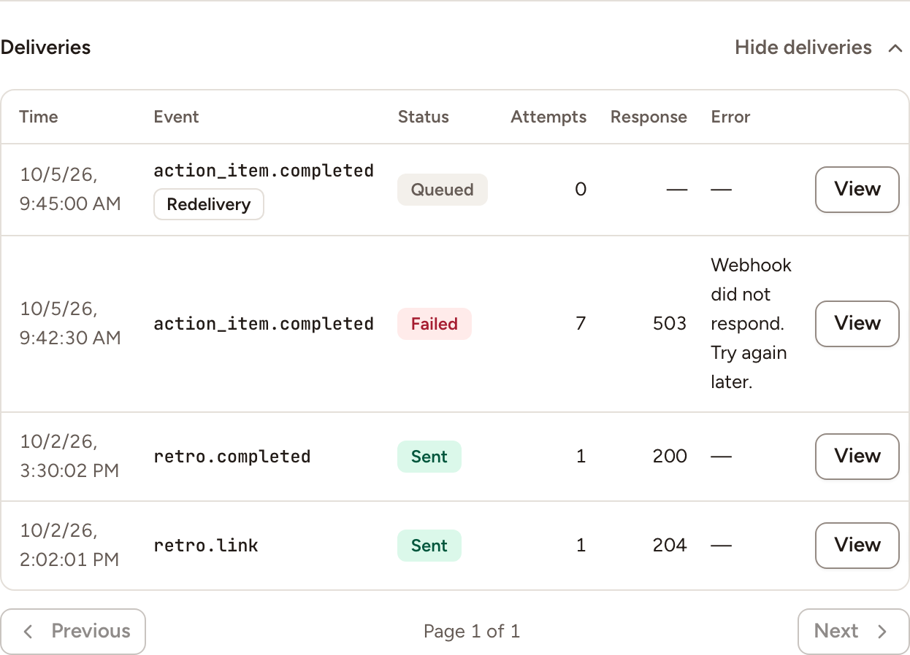

After this page, a team sends signed JSON requests to a receiver you run: when someone shares a link or the results of a retrospective, and by itself when the events you choose happen. There is no vendor here: the contract below is Skrüm's own.

## Who can set it up

- Turning webhooks on: an instance admin, in **Administration**, then **Integrations**, **Configure** on the Webhook row, **Enabled**. The environment variable is `OUTGOING_WEBHOOKS_ENABLED`; a value saved in the dialog wins over it.
- A team's webhook: a workspace owner or admin, or the team's owner, on the team's **Integrations** page. A team has one webhook.

## Before you start

Your receiver must accept `POST` requests with a JSON body and answer within 10 seconds. Its address must:

- start with `https://`;
- be at most 2048 characters, with no user name or password in it;
- use port 80, 443, or a port from 1024 to 65535;
- resolve to public addresses only.

Two environment variables, which have no field in the administration, relax this for a private network.

| Variable | Default | Effect when `true` |
|---|---|---|
| `OUTGOING_WEBHOOKS_ALLOW_PRIVATE_NETWORKS` | `false` | Addresses that resolve to a private network are accepted |
| `OUTGOING_WEBHOOKS_ALLOW_HTTP` | `false` | `http://` addresses are accepted |

Skrüm checks the address when you save it and again before every request. It does not follow redirects.

## Connect a webhook

1. Open the team's settings and select **Integrations**.
2. Select **Connect** on the Webhook row, then **Connect** in the panel.
3. Paste your receiver's address into **Endpoint URL**. **Label (optional)**, 80 characters at most, is shown on this page only.
4. Select **Connect**. Skrüm shows the **Signing secret**.
5. Copy the secret and store it in your receiver, then select **I've saved the secret**. Skrüm never shows it again.



The panel then shows the **Host**, the **Label**, when the secret was created and the last successful delivery. The address is never shown again: **Replace URL** takes a new one and keeps the secret.

## Choose the events

Under **Send automatically**, tick the events the webhook sends by itself, then select **Save events**. None is ticked at first.



| Event | Sent when |
|---|---|
| `retro.completed` | A retrospective is completed, with its results recap |
| `action_item.created` | An action item is created |
| `action_item.completed` | An action item is completed, in Skrüm or in a linked tracker |
| `action_item.reopened` | An action item is reopened |
| `poker.task.estimated` | A planning poker task gets its final estimate |

Four more events are sent when a person shares a link with **Send link to webhook** or the results of a retrospective with **Send to webhook**, whatever is ticked: `retro.link`, `poker.link`, `game_room.link` and `retro.results`. **Send a test message** sends `webhook.test`.

[Webhook events](../../reference/webhook-events/) gives the body of each one.

## The request

Every request is a `POST` with `Content-Type: application/json` and `User-Agent: skrum-webhooks/1`.

| Header | Value |
|---|---|
| `X-Skrum-Event` | The event's name, such as `action_item.completed` |
| `X-Skrum-Delivery` | The delivery's identifier, the same as `id` in the body |
| `X-Skrum-Timestamp` | When this attempt was sent, in seconds since 1970 |
| `X-Skrum-Signature` | `sha256=` followed by the signature, see below |
| `X-Skrum-Redelivery` | `true` on a delivery sent again from the log; absent otherwise |

The body always has these seven members.

```json
{
  "version": 1,
  "id": "4f1c2e9a-8d3b-4b8e-9f51-2a7c0d6e5b13",
  "event": "action_item.completed",
  "occurredAt": "2026-10-07T10:00:00Z",
  "sentAt": "2026-10-07T10:00:02Z",
  "team": { "id": "…", "name": "Atlas" },
  "data": {}
}
```

`id` stays the same on every retry and on a redelivery, so use it to ignore a message you already handled. `sentAt` changes with each attempt. `data` depends on the event.

## Verify the signature

The signature is the HMAC-SHA256, in hexadecimal, of the timestamp, a dot and the raw body, keyed with the signing secret:

```text
X-Skrum-Signature = "sha256=" + hex(HMAC-SHA256(secret, X-Skrum-Timestamp + "." + raw body))
```

Compute it over the bytes you received, before parsing the JSON, and compare in constant time. Refuse a request whose timestamp is more than 5 minutes away from your clock. In Python:

```python
import hashlib
import hmac
import time


def is_from_skrum(secret: str, headers: dict, raw_body: bytes) -> bool:
    timestamp = headers["X-Skrum-Timestamp"]
    signed = timestamp.encode() + b"." + raw_body
    expected = "sha256=" + hmac.new(secret.encode(), signed, hashlib.sha256).hexdigest()

    if abs(time.time() - int(timestamp)) > 300:
        return False

    return hmac.compare_digest(expected, headers["X-Skrum-Signature"])
```

**Rotate secret** replaces the secret after a confirmation and shows the new one once. The old secret stops working immediately, so update your receiver at once.

## Answers and retries

Answer with any `2xx` status to accept a delivery. Skrüm keeps the status and the first 2 KB of your answer, nothing more.

| Your answer | What Skrüm does |
|---|---|
| `2xx` | Marks the delivery **Sent** |
| `5xx`, no answer within 10 seconds, or an unreachable host | Tries again, see below |
| `429` | Waits for the time in your `Retry-After` header, 30 seconds without one and one hour at most, then tries again. The wait does not count as a failed attempt |
| `410` | Marks the delivery **Failed** and turns the webhook off at once |
| Any other status, a redirect included | Marks the delivery **Failed** without retrying |

| Delivery | Attempts | Waits between attempts | Gives up after |
|---|---|---|---|
| An event sent automatically | 7 | 30 seconds, 2 minutes, 10 minutes, 30 minutes, 1 hour, 2 hours | 4 hours |
| A shared link or results, a redelivery | 4 | 10 seconds, 1 minute, 5 minutes | 1 hour |

## When a webhook is turned off

Skrüm turns a webhook off by itself in two cases: your receiver answered `410`, or 10 deliveries in a row failed and none succeeded in the last 24 hours. The row then reads **Reconnect required** and the panel gives the reason, **The receiver asked skrum to stop.** or **Disabled after 10 failed deliveries in a row.** While it is off, nothing is sent and the events that happen are not kept for later.

To turn it back on, open the panel and select **Re-enable**, or paste an address with **Replace URL**.

## The delivery log

In the panel, select **Show deliveries**. The log lists 25 deliveries per page, the most recent first, with the time, the event, the status (**Queued**, **Sent** or **Failed**), the number of attempts, your answer's status and the error.



- **View** opens the request Skrüm sent, headers and body, and your answer. The signature is masked.
- **Redeliver** sends the same message again, with the same `id` and the header `X-Skrum-Redelivery: true`. It appears as a new line marked **Redelivery**. The table scrolls sideways when it is wider than the panel; the button is at the end of the line.

A delivery cannot be sent again while it is still being sent, while a redelivery of it is queued, or while the webhook is turned off.

Skrüm keeps the lines of the log for 90 days and the content of a delivery for 30 days. After that the line reads **Content no longer kept** and can be neither viewed nor sent again. **Content not kept** marks a message that was not stored, for example because it was too large, about 250 KB and more.

## Test it

Open the panel and select **Send a test message**. Your receiver gets a `webhook.test` event whose `data` is `{"message": "skrum is connected."}`, signed like any other, and Skrüm shows **Test message sent.** A test does not appear in the log.

## Troubleshooting

| What you see | What to do |
|---|---|
| No Webhook row on the team's page | An instance admin has not turned **Enabled** on, or turned the provider off |
| **This URL points to a private or invalid address.** | The address breaks one of the rules of "Before you start" |
| **Could not reach** followed by the host | The host does not resolve, or did not answer within 10 seconds |
| **The receiver answered** followed by a status | Your receiver refused the request. Look at **View** for what it answered |
| **This webhook URL is no longer allowed. Paste a new one.** | The instance's rules changed, for example plain HTTP is no longer allowed. Select **Replace URL** |
| **The signing secret is missing. Rotate it to continue.** | Select **Rotate secret** and store the new secret in your receiver |

## Disconnecting

Turn the row's switch off, or select **Disconnect** in the panel, and confirm. Nothing is sent to your receiver any more and Skrüm deletes the address and the secret. The receiver itself is yours to remove.
