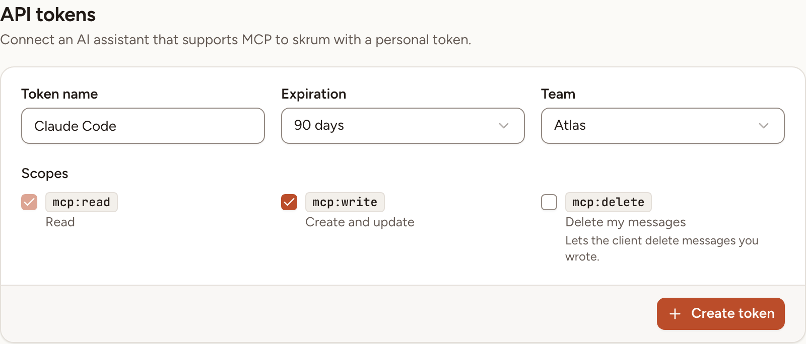

Skrüm serves a [Model Context Protocol](https://modelcontextprotocol.io/) (MCP) server. After this page, an assistant that speaks MCP can read your teams' retrospectives, action items and planning poker games, and change what you allow. Anyone with an account and a verified email address can connect one; a guest cannot.

## What a connected assistant can do

The assistant acts as you. It sees the teams you are a member of, and every team of a workspace where you are owner or admin. On a team where you are an observer, it changes nothing.

What it may do depends on the scopes of its token:

| Scope | Label | What it allows |
|---|---|---|
| `mcp:read` | **Read** | Read teams, retrospectives, cards, summaries, health checks, ROTI, action items and poker games. Always included. |
| `mcp:write` | **Create and update** | Change action items, edit cards you wrote, create and run poker games. |
| `mcp:delete` | **Delete my messages** | Delete cards you wrote. |

The server offers 29 tools and 2 prompts: see [Tools reference](../tools/) and [Prompts](../prompts/).

## Create a token

1. Open the user menu and select **Settings**, then **API tokens**.
2. If the list says **Confirm it's you to see your tokens.**, select **Show my tokens** and enter your password.
3. Enter a **Token name**, for example the name of the client. It holds up to 60 characters and must differ from your other tokens.
4. Choose an **Expiration**: **30 days**, **90 days** (the default), **1 year** or **Never**.
5. Under **Team**, keep **All my teams** or choose one team. A token bound to a team sees that team only.
6. Under **Scopes**, tick **Create and update** and **Delete my messages** if the assistant may change things. **Read** is always ticked.
7. Select **Create token**.



The token appears once, under **Copy your token now. You won't be able to see it again.** Skrüm keeps only a hash of it. You can hold at most 25 active tokens.

If **API tokens** is missing from your settings, your email address is not verified or the instance has turned the server off.

## Add the server to your client

The address of the server is your instance's address followed by `/mcp`. It is shown under **MCP server**, in the **Server URL** field.

Under the new token, two tabs hold the configuration with your address and your token already filled in. Select **Copy configuration**, then **Done**.

**Claude Code**, in a terminal:

```bash
claude mcp add --transport http skrum https://skrum.example.com/mcp --header "Authorization: Bearer <token>"
```

[Connect Claude Code to tools via MCP](https://code.claude.com/docs/en/mcp) documents this command.

**Other clients (JSON)**, in the place the client's documentation names:

```json
{
  "mcpServers": {
    "skrum": {
      "type": "http",
      "url": "https://skrum.example.com/mcp",
      "headers": {
        "Authorization": "Bearer <token>"
      }
    }
  }
}
```

To check the connection, ask the assistant to list your Skrüm teams. After its first request, the **Last used** column of the token shows today's date.

## There is no OAuth sign-in

The server accepts one thing: a token in the `Authorization` header. A client must be able to send that header. Connectors that require a sign-in through OAuth cannot connect.

## What stays hidden from an assistant

A tool returns what you would see on the screen, and nothing more:

- other people's cards while the board still hides them;
- the authors of cards on an anonymous board, except your own;
- who voted for which card, and vote totals while the board hides them;
- other people's health check answers and ROTI ratings;
- other players' poker cards before the reveal, and who played which card in an anonymous round;
- email addresses, guest links of retrospectives and credentials of integrations. `poker.game.get` returns the guest link of a poker game only while guest access is on.

No tool casts a vote or sets an estimate of your choosing.

> Data you read through this connection is sent to the AI application you use.

## Revoke a token, limits

To cut a client off, select **Revoke** on the token's row, then **Revoke** in the dialog: the client loses access on its next request. Changing your password does not revoke a token. An instance admin can revoke anyone's token under [MCP keys](../../administration/mcp-keys/).

A token makes at most 120 requests a minute, of which 30 changes and 20 searches. Whoever hosts the instance changes the first two with `SKRUM_MCP_RATE_LIMIT` and `SKRUM_MCP_WRITE_RATE_LIMIT`, and turns the server off with `SKRUM_MCP_ENABLED=false`: see [Configuration reference](../../self-hosting/configuration/).
