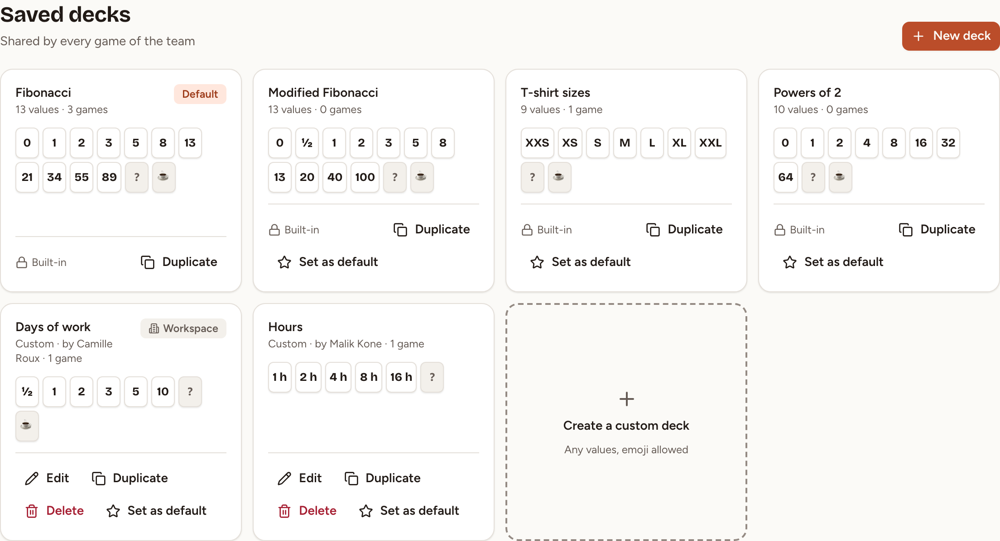
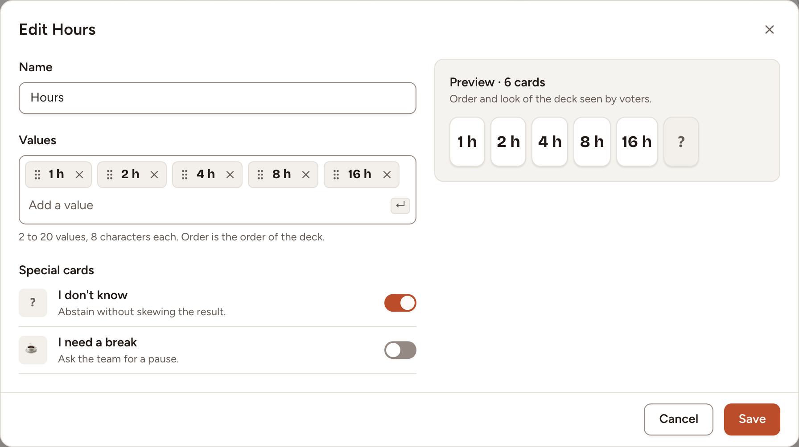

This page lists the cards of each deck and shows how to make your own. Anyone who may start a game may save a deck for the team; a deck for the whole workspace is made by an owner or an admin of the workspace.

## The five kinds of deck

A game uses one of five kinds of deck: four are built in, the fifth holds the values you choose.

| Deck | Cards |
|---|---|
| **Fibonacci** | 0, 1, 2, 3, 5, 8, 13, 21, 34, 55, 89, ?, ☕ |
| **Modified Fibonacci** | 0, ½, 1, 2, 3, 5, 8, 13, 20, 40, 100, ?, ☕ |
| **T-shirt sizes** | XXS, XS, S, M, L, XL, XXL, ?, ☕ |
| **Powers of 2** | 0, 1, 2, 4, 8, 16, 32, 64, ?, ☕ |
| **Custom** | 2 to 20 values of your own, 8 characters each at most, with or without ? and ☕ |

**?** is "I don't know" and **☕** is "I need a break". A player may play them, but they do not count in the average, the median or the agreement, and cannot be the final estimate.

When every value of a deck is a number, a round gives an average and the queue adds up the estimates. A deck with other values, such as T-shirt sizes, gives the most played card instead.

The deck of a game can change in **Game settings** until someone votes.

## Make a deck for one game

1. In the **New session** dialog, select **New deck**. In **Game settings**, before the first vote, select **Create a deck**.
2. Type each value under **Values** and press Enter. Their order is the order of the cards.
3. Under **Special cards**, keep or turn off **I don't know** and **I need a break**.
4. Select **Use this deck**.

In the **New session** dialog the deck has an optional name: with a name, it is also saved for the team.

## Save decks for the team

In a game, open **Game settings** and select **Manage decks**. The **Saved decks** page shows the built-in decks, the decks of the team and those of the workspace, each with its cards and the number of the team's games that used it.

- **New deck** opens the editor with a **Name**, 40 characters at most, that no other deck of the team has. A team keeps up to 30 saved decks.
- **Duplicate** copies any deck, built-in ones included, into a new deck of the team.
- **Edit** and **Delete** are offered, for a deck of the team, to the person who made it and to the owners and admins of the workspace; for a deck of the workspace, to those owners and admins only.
- **Set as default** chooses the deck a new game starts with. It is offered to the owner of the team and to the owners and admins of the workspace.

Editing or deleting a saved deck never changes a game: each game keeps the cards it started with.

## Share a deck with every team

As an owner or admin of the workspace, open **Templates** in the sidebar, select **New template**, then **Poker deck**. The deck appears in the deck list of every team of the workspace, marked **Workspace**. A workspace keeps up to 30 of them.
