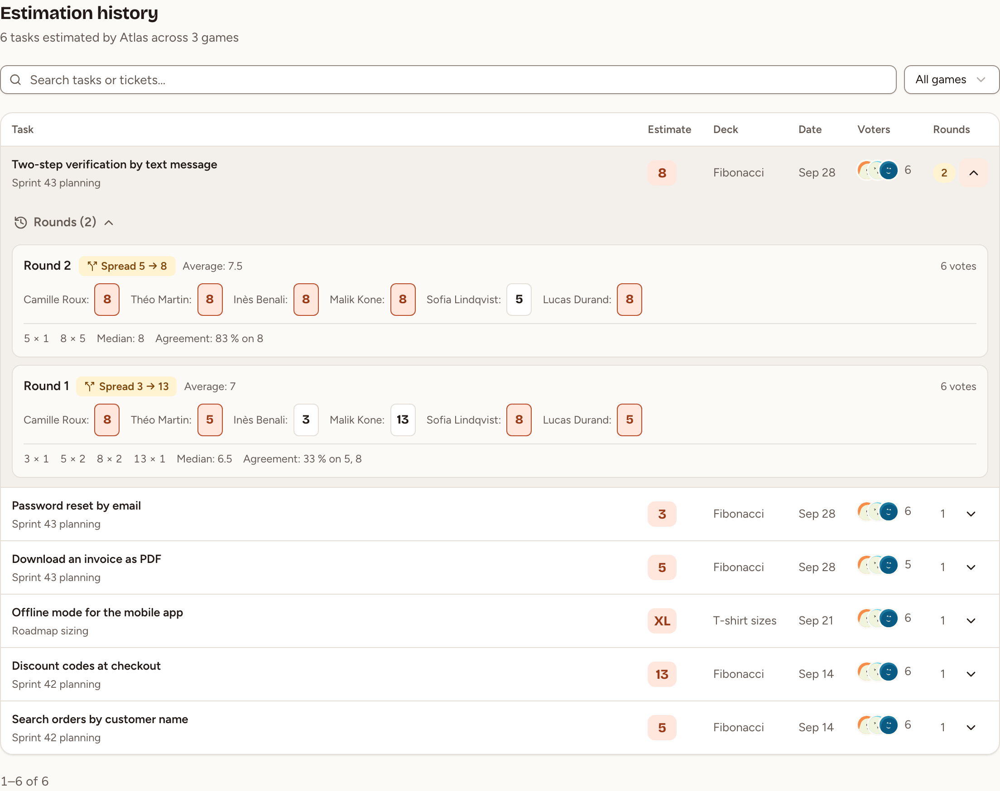

This page shows where to find every estimate a team saved in its planning poker games. Every member of the team can open it, observers included, and so can the owners and admins of the workspace.

## Open the history

1. Open the team, then **Insights** in the sidebar.
2. Select the **Estimates** tab.

**Estimation history** lists the tasks of the team's games that have a saved estimate, the most recent first, 50 to a page. A task appears as soon as the facilitator validates its estimate; a task that was voted but never given an estimate is not listed.

## Read a row

| Column | What it shows |
|---|---|
| **Task** | The title, the key of its issue when it was imported, and the game it was estimated in |
| **Estimate** | The saved estimate |
| **Deck** | The deck of the game |
| **Date** | The day the estimate was saved |
| **Voters** | Who voted in the last round, and how many. The faces are left out when that round was anonymous |
| **Rounds** | How many rounds the task took. The number is highlighted when the team voted more than once |

## Find a task

- Type in **Search tasks or tickets…** to search the titles and the issue keys.
- Choose a game in the list that reads **All games** to keep its tasks only.

**Clear filters** appears when nothing matches.

## See how a task was voted

Select the arrow at the end of a row (**Show rounds**). Each revealed round of the task is listed, the latest first, with:

- the card of each voter, or the cards without names for an anonymous round;
- how many times each card was played, the median and the agreement;
- the average, on a deck of numbers;
- **Consensus** when everyone played the same card, or the spread from the lowest to the highest card.

The same rounds are shown in the room while the task is being estimated: see [Voting and reveal](../voting-and-reveal/).
