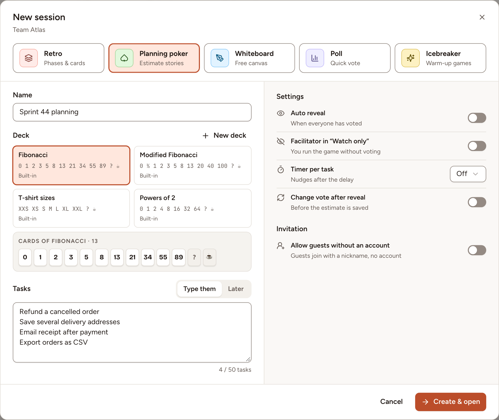
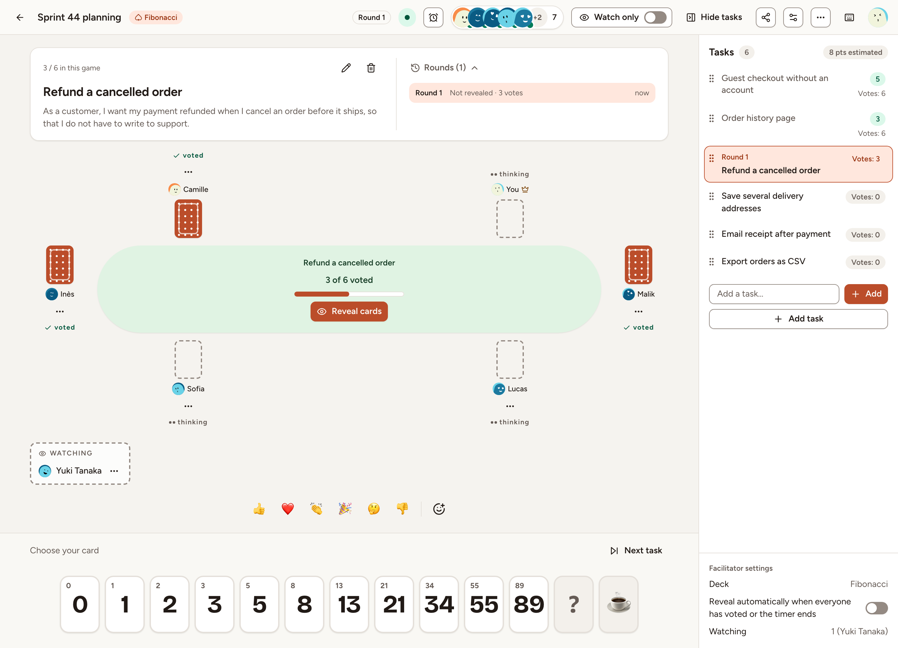

This page shows how to open a planning poker game for a team, bring people into it and hand it over. Every member of the team may start a game, except observers; the owners and admins of the workspace may too.

## Create the game

1. Open the team's page and select **New session**.
2. Select **Planning poker**.
3. Fill in the **Name**. Skrüm proposes "Poker" followed by today's date.
4. Choose a **Deck**. The team's default deck is already selected; [Decks](../decks/) lists them.
5. Under **Tasks**, select **Type them** and write one task per line, 50 at most, or select **Later** to add them in the room. A team that connected a tracker has a third tab: see [Tasks and imports](../tasks-and-imports/).
6. Set the options of the table below, then select **Create & open**.

| Option | What it does |
|---|---|
| **Auto reveal** | Reveals the cards as soon as everyone has voted. |
| **Facilitator in “Watch only”** | You run the game without voting. |
| **Timer per task** | Starts a countdown of 1, 3, 5 or 10 minutes with each round. |
| **Change vote after reveal** | Lets players change their card after the reveal, until the estimate is saved. |
| **Allow guests without an account** | Turns the guest link on. |

You arrive in the room as the facilitator of the game.

## Find your way in the room

The task being estimated is at the top, the players sit around the table, the **Tasks** queue is on the right and your cards are at the bottom. The header shows the round, the timer and who is present.

As the facilitator you change the options of the game at any time with **Game settings** in the header. The others can read them there. The deck can change only until the first vote.

## Bring people in

Team members open the game from the team's **Sessions** page and join as players. Observers of the team join too, and watch.

To invite people without an account, select **Share** in the header. The dialog shows the guest link, its QR code and a session code. If guest access is off, turn on **Allow guests without an account** first. A guest chooses a nickname and may turn on **Join as spectator**. Guests vote like everyone else, but cannot add or edit tasks: see [Join as a guest](../../getting-started/join-as-guest/).

**Regenerate link** replaces the link and signs out every guest who joined with the old one. When the team has connected a chat channel, the same dialog posts the link there.

## Play or watch

Turn on **Watch only** in the header to stay in the room without a card; a card you had played in the open round is withdrawn. **Join the vote**, in the banner that appears, gives you your cards back.

The facilitator can do the same for someone else: open **Player options** next to a name and select **Make spectator** or **Make player**.

## Hand over, end or delete the game

A crown marks the facilitator. The facilitator menu, the **…** button of the header, holds three actions:

- **Hand over facilitation…** gives the role to a member of the team who is not an observer, or to an owner or admin of the workspace.
- **End game** makes the game read-only until **Reopen game** is selected.
- **Delete game…** deletes its tasks, rounds and votes for everyone. The owners and admins of the workspace can delete a game too.

When the facilitator is away, any team member in the game who is not an observer can select **Take control** and becomes the facilitator at once.
