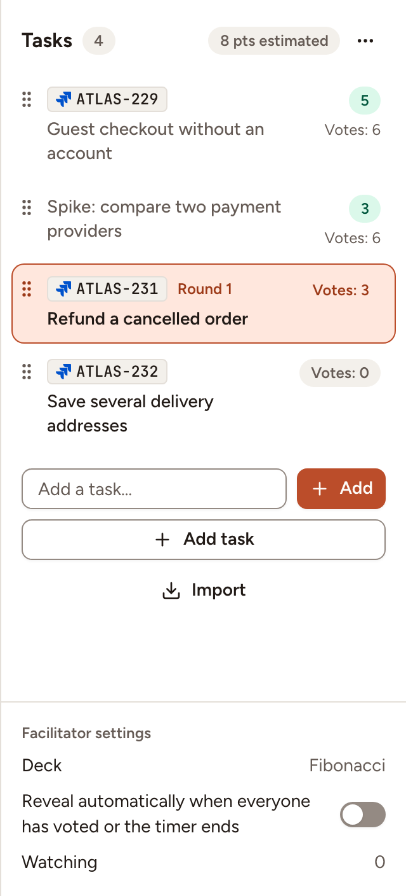
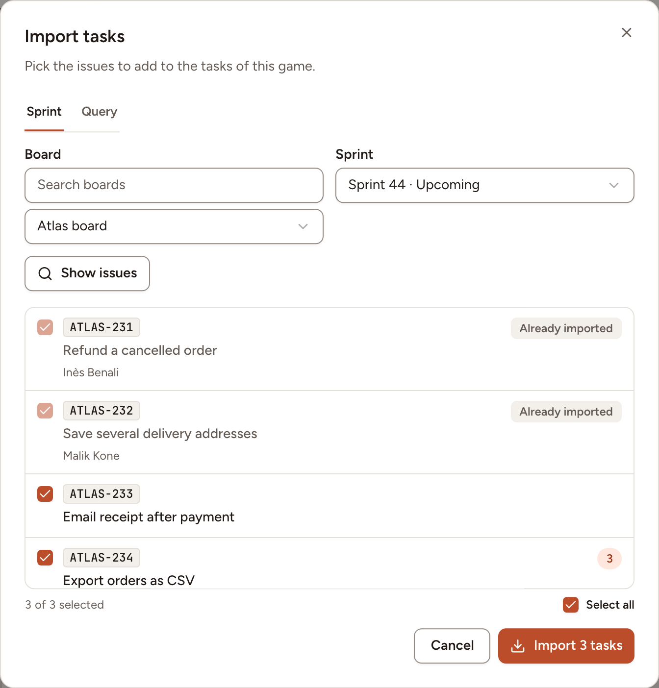

This page shows how to fill the queue of a game with tasks typed by hand or imported from your tracker. Everyone in the game except guests may add tasks; importing is also closed to observers of the team. Only the facilitator orders the tasks, picks the one to estimate and deletes them.

## Add tasks by hand

The **Tasks** panel is on the right of the room; **Hide tasks** in the header closes it.

- For a title alone, type it in **Add a task…** and select **Add**.
- For a title and a description, select **Add task**. The description accepts Markdown. A section under an "Acceptance criteria" heading is shown apart, beside the description.

A title has 200 characters at most, and a game holds 200 tasks at most. To change a task typed by hand, select **Edit task**, the pencil on the task at the top of the room.

## Order the queue and pick a task

As the facilitator:

1. Drag a task by its handle to move it. With the keyboard, focus the handle, press Space, move with the arrow keys and press Space again.
2. Select a task to estimate it. Its first round opens for everyone.
3. Select **Delete task**, the bin on the task at the top of the room, to remove it with its rounds and votes.

Picking another task discards nothing: a round left open keeps its hidden votes and resumes when you come back to its task.

Each row shows the number of votes of the task's last round, and its estimate once saved. On a deck of numbers the panel adds up the estimates, as in "8 pts estimated".

## Import from a tracker

The team needs a connection to [Jira Cloud](../../integrations/jira-cloud/), [Jira Data Center](../../integrations/jira-data-center/), [Linear](../../integrations/linear/) or [GitHub](../../integrations/github/).

1. Select **Import** under the queue.
2. If the team has several trackers, choose the **Source**.
3. Choose where to look, on the first tab or on **Query**:

   | Tracker | First tab | **Query** |
   |---|---|---|
   | Jira | A **Board**, then an active or upcoming **Sprint** | A JQL query |
   | Linear | A **Team**, then an active or upcoming **Cycle** | A search |
   | GitHub | A **Repository**, then an open **Milestone** | A **Repository** and a search |

4. Select **Show issues**. Every issue that is not in the game yet is ticked; untick the ones you leave out. The list holds the first 100 issues.
5. Select the button that counts the issues you ticked, for example **Import 3 tasks**.

The same picker is in the **New session** dialog, under **Tasks**, on a tab named after your tracker, for example **Import from Jira**: a game can start with its issues.

## What an imported task keeps

An imported task shows the key of its issue, which opens the issue in the tracker, and its type, labels, assignee, status and the estimate it has there. Guests see the key, the type and the labels only.

Its title and description are managed in the tracker and cannot be edited in Skrüm. To fetch them again, open **More task actions**, the **…** button at the top of the queue, and select the refresh action, for example **Refresh from Jira**. An issue the tracker no longer returns is marked as not found and keeps what it had. A refresh never changes an estimate saved in the game.
