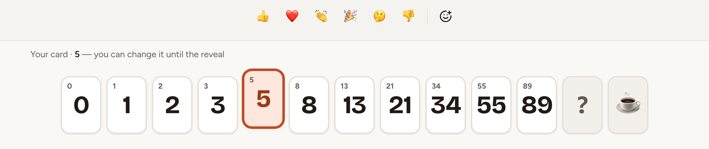
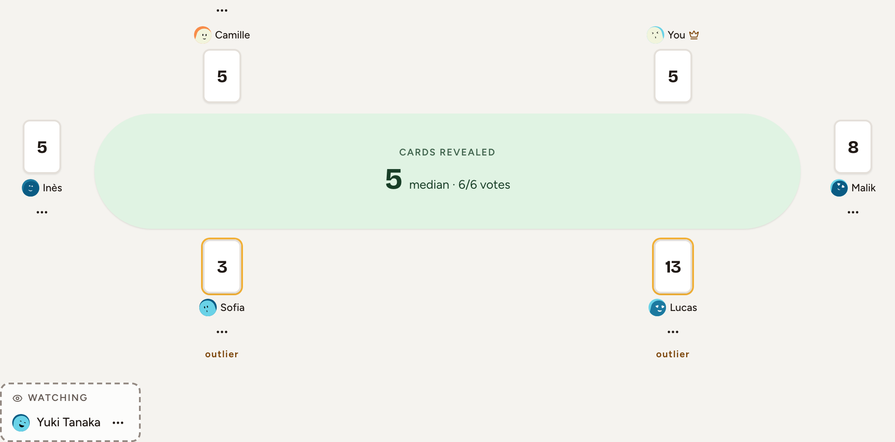
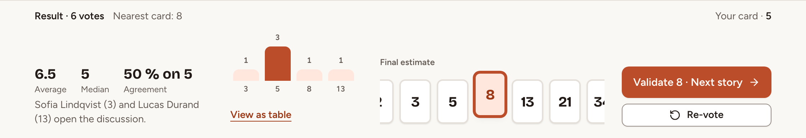
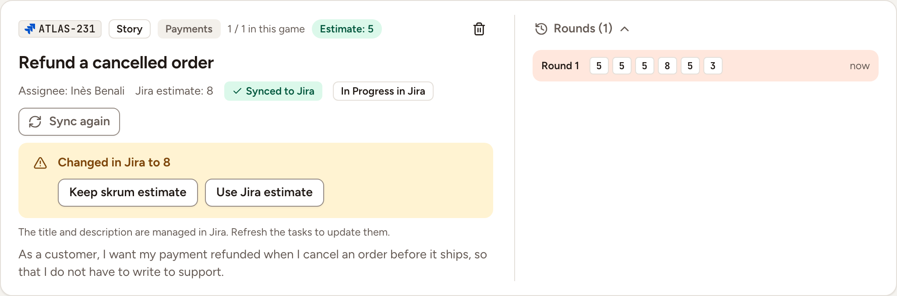

This page follows one task from the first card to its estimate. Everyone who plays votes; revealing, voting again and saving the estimate belong to the facilitator.

## Vote

Select a card of the deck at the bottom of the room. You can change it until the reveal, and selecting it again takes it back. **?** means "I don't know" and **☕** asks for a break; neither counts in the result.

The others see that you have voted, never what: your seat shows a card face down, and the table counts the votes, as in "3 of 6 voted". While a round is open, live cursors are hidden.

## Reveal

As the facilitator, select **Reveal cards** in the middle of the table once at least one person has voted.

Two options reveal without you:

- With **Reveal automatically when everyone has voted or the timer ends**, a switch of **Game settings** and of the queue, the cards turn over when every player who is present has voted.
- The **Timer** of the header starts a countdown of 1, 3, 5 or 10 minutes, or of 1 to 60 minutes with **Custom…**. **+2 min** extends it and **Stop timer** ends it. When it runs out, the cards are revealed if the switch above is on and someone has voted. **Timer per task**, in **Game settings**, starts it with every round.

## Read the result

Every card is face up next to its player. The lowest and the highest are marked "outlier" when they are not the most played card. Under the table, the result gives the **Average**, the **Median**, the **Agreement** (the share of the most played card), the card nearest to the average and the distribution of the votes. When the votes are apart, it names who opens the discussion. On a deck without numbers, the result keeps the agreement and the most played card only.

With **Anonymous votes**, the cards are counted but not attached to their players.

## Settle on the estimate

As the facilitator:

1. Choose a card under **Final estimate**. Skrüm proposes the card nearest to the average.
2. Select **Validate**. The button names the estimate, saves it and opens the next task that has none, as in "Validate 8 · Next story".

To vote again instead, select **Re-vote**: a new round opens, and the task keeps its earlier rounds under **Rounds**. Before a reveal, **Next task** moves on without an estimate. With **Change vote after reveal**, players may still change their card until the estimate is saved.

## Send the estimate to the tracker

When the task was imported and the team's connection may write, the saved estimate is written to its issue. The task then shows **Sync pending**, then **Synced to Jira** (or your tracker), or **Sync failed** with a **Retry** button. When nothing is written, the task says why, for example because the connection is read-only or because **Write estimates to Jira** is set to **Don't write** in **Game settings**. Jira and Linear take numbers only: an estimate from a deck such as T-shirt sizes is not written to them.

If the estimate then changes in the tracker, Skrüm does not overwrite either side. Once it has read the new value, for example after a refresh of the tasks, the task shows a warning and the facilitator decides:

- **Keep skrum estimate** writes the game's estimate to the issue again.
- **Use Jira estimate**, named after your tracker, takes the tracker's value. It is unavailable when that value is not a card of the deck.

