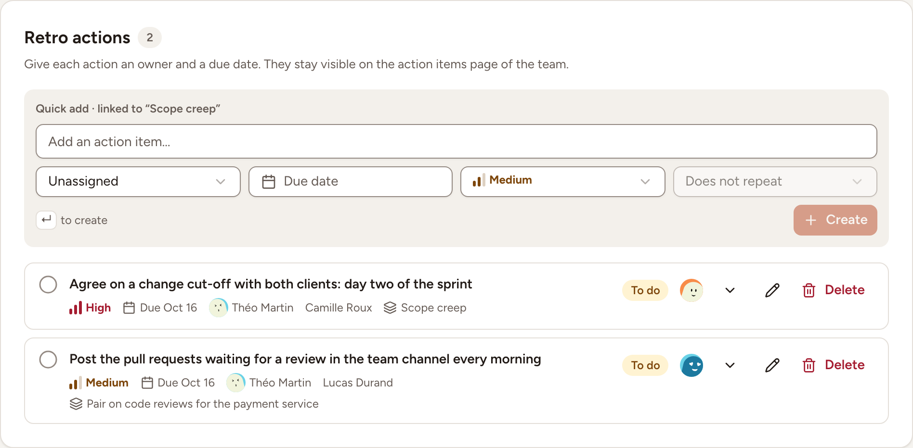

An action item is what the team commits to after a topic: one sentence, one owner, one date. This page shows how to create action items from the board, and what a language model adds when the instance has one.

## When action items can be created

Anyone taking part can create an action item from the board during the Discussing, Actions and ROTI phases, as long as the board is not locked.

- In **Discussing**, the form sits under **Topic actions**, beside the topic on screen.
- In **Actions**, the whole phase is about them: the topics are listed on the left under **Most voted topics**, and the action items of the retrospective on the right under **Retro actions**.

## Create an action item

1. Type the action item under **Add an action item…**, 500 characters at most.
2. Choose its owner in the first list, which starts on **Unassigned**.
3. Select **Due date** and pick a day.
4. Keep the priority on **Medium**, or choose **High** or **Low**.
5. Optionally make it repeat, in the last list. It stays on **Does not repeat** until the action item has a due date.
6. Press <kbd>Enter</kbd> or select **Create**.

The new action item is linked to the topic in focus: the form says so (**Quick add · linked to …** in Actions, **Linked to #1 · …** in Discussing), and the item shows the name of its topic. In Actions, the facilitator moves the focus with **Next topic** in the bar at the bottom, and everyone's board follows.

Only the text is required. The page reminds you to give each action item an owner and a due date, because they stay visible on the action items page of the team after the retro.

## Action items from earlier retros

When the team has open action items from before, a **Previous action items** button stands at the top of the board with their number. It opens the list of the open follow-ups from the team's earlier retros. Guests do not see it.

## Suggested actions

Suggested actions come from the AI summary request, either automatically when **Automatic AI summary** is on at completion, or when the facilitator selects **Generate summary** on the completed retro. They use the same configured model and the same board input as the summary; reviewing, promoting or rejecting an existing suggestion does not call the provider again. See [Summary and sharing](../summary-and-sharing/) for generation, privacy and retry behavior.

For each suggestion:

- **Promote** turns it into an action item of the retro. It is then marked **Added to action items**. The new item has no owner and no due date yet. Review its wording, then assign an owner and date so the team can follow it up.
- **Reject** dismisses it. Dismissed suggestions stay listed under **Dismissed**.

On a completed retro, only its facilitator and the workspace's owners and admins can promote or reject a suggestion. If the facilitator reopens the retro, the suggestions show in a **Suggestions** panel during Discussing and Actions, where anyone taking part can handle them.

## After the retro

The action items of the retro are listed in the results of the completed retro and on the team's action items page, where they are followed until they are done. See [Track action items](../../action-items/track/).
