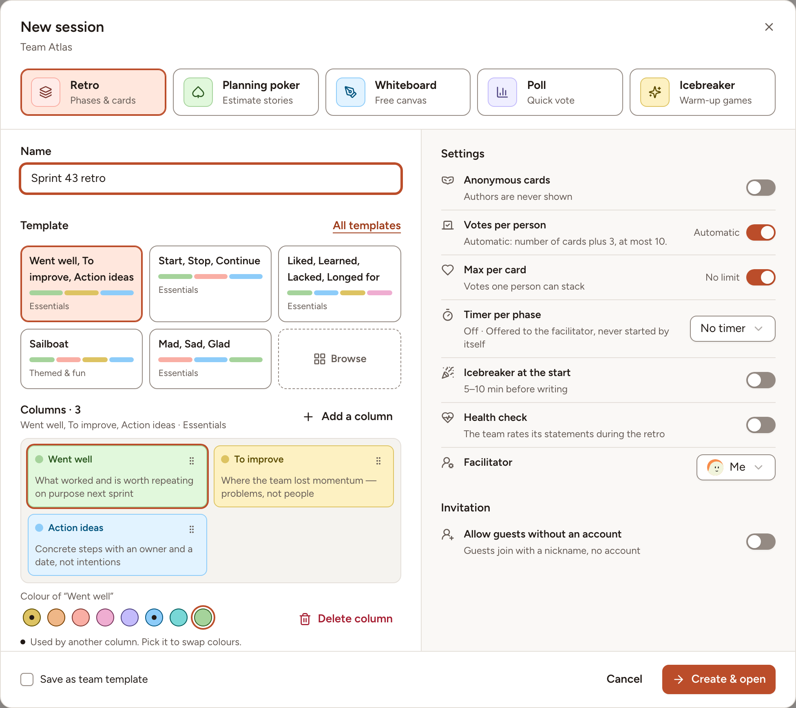
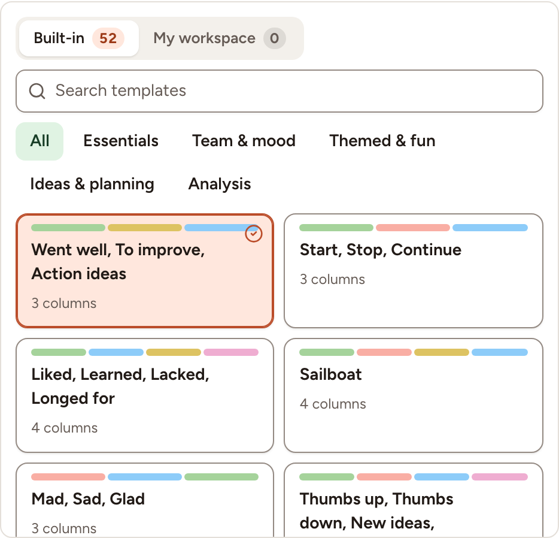

This page takes you from the team page to an open board. Every member of the team may create a retro, except observers; workspace owners and admins may create one for any team.

## Open the new session dialog

1. Open your team, or stay on any page of the workspace.
2. Select **New session**, on the team page or in the sidebar.
3. Keep **Retro** selected at the top of the dialog.

## Name it and pick a template

1. Change the **Name** if you want. It starts as "Sprint 43 retro" when the team's current sprint is number 43, and as "Retro" followed by today's date when the team has no sprint in progress.
2. Pick a template among the shortcuts, or select **All templates** (or **Browse**) to see the 52 built-in templates and the ones of your workspace, with a search and a filter by category.

3. Under **Columns**, adjust the board for this retro only: rename a column, change its colour, drag it to another place, **Delete column**, or **Add a column**. A board holds at most 10 columns.

The [Templates](../templates/) page explains how to keep a set of columns for later.

## Choose the settings

| Setting | What it does |
|---|---|
| **Anonymous cards** | Authors are never shown. It can be turned off later only while the board has no card. |
| **Votes per person** | **Automatic** gives everyone the number of cards plus 3, at most 10. Turn it off to set a number from 1 to 20. |
| **Max per card** | **No limit**, or the most votes one person can put on the same card. |
| **Timer per phase** | **No timer**, **Standard** (Writing 7, Grouping 5, Voting 3, Discussing 15, Actions 5 minutes) or **Custom (5 phases)**. The durations are offered to the facilitator; no timer starts by itself. |
| **Icebreaker at the start** | Adds a game phase before writing, with the game you choose. |
| **Health check** | The team rates its health statements during the retro. |
| **Facilitator** | **Me**, or another member of the team who will run the session. |
| **Allow guests without an account** | People without an account can join with a nickname through a link. |

Workspace owners and admins also see **Save as team template**: tick it to save the columns as a workspace template under the retro's name.

All of these can still be changed from the board, see [Facilitating](../facilitating/).

## Create and invite

1. Select **Create & open**. The board opens on its first phase.
2. Tell the team. Members find the retro on the team page, where a banner offers to **Join** a session in progress, and in **Sessions**. Opening the board is enough to take part.
3. For people outside the team, select **Share** in the board's header and turn on **Allow guests without an account**: the dialog then shows the guest link, its QR code and a session code. [Join as a guest](../../getting-started/join-as-guest/) describes what they see.
