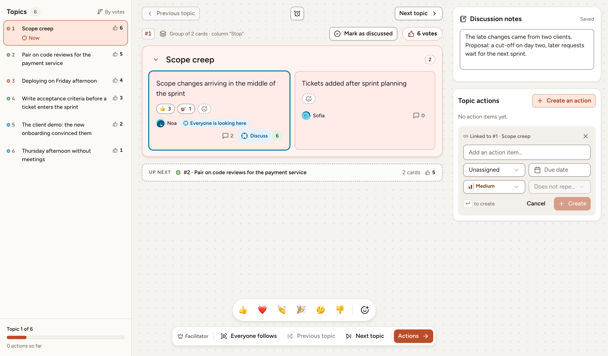
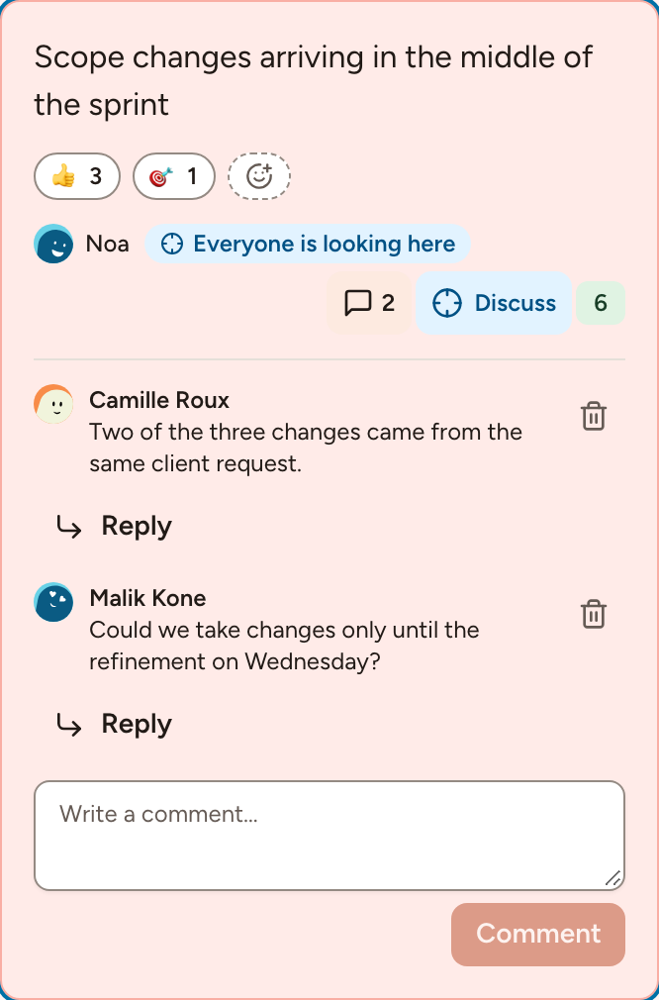

In the Discussing phase the columns give way to a list of topics, the most voted first. A topic is a group, or a card that stands alone. This page covers the order of the topics, the topic everyone follows, and the comments, reactions and notes that keep track of what is said.

## The order of the topics

The **Topics** list is sorted by votes. Two topics with the same number of votes follow the order of the board: the column, then the place of the card. Each line shows the rank, the name of the group or the text of the card, and its votes.

Everyone can browse the topics for themselves, with **Previous topic** and **Next topic** or by selecting a line of the list. The middle of the screen shows the cards of the topic you are on, and **Up next** names the following one.

## The topic everyone follows

The facilitator decides what the room looks at:

- **Discuss** on a card, or <kbd>F</kbd> with the focus on it, puts its topic in focus for everyone. The card is marked **Everyone is looking here** and every board moves to it. Selecting it again removes the focus.
- **Everyone follows**, in the facilitator's bar, makes every move of the facilitator between topics take the whole room along. It is the **Presentation mode** of the session settings.
- **Mark as discussed**, or <kbd>D</kbd>, ticks a topic off. The list then shows it as **Discussed**.

A participant who browses away from the topic in focus is told that everyone is looking at another topic, and **Back to the topic** returns to it.

The timer of this phase stands above the topic, see [Facilitating](../facilitating/).

## Comments

1. Select the speech bubble of a card. It shows the number of comments.
2. Type under **Write a comment…** and select **Comment**, or select **Reply** under a comment to answer it.

A comment holds 500 characters at most. You can edit and delete your own comments; the facilitator can delete any comment. A dot on the bubble marks comments you have not read.

## Reactions

Select the smiley with a plus sign on a card (**Add a reaction**) and pick an emoji. Select a reaction that is already there to add yours to it, and again to take it back.

The bar of emoji at the bottom of the board is something else: it sends a reaction that flies across the board of everyone present, and is not kept. Both exist only while **Show reactions** is on in the session settings.

Comments and card reactions are open from Grouping until the end of Actions, and closed while the board is locked.

## Discussion notes

**Discussion notes** is one shared text per topic, for what the room decides and the questions left open. Anyone taking part can type in it during the Discussing phase; it saves by itself and shows **Saved**. A note holds 5,000 characters at most.

## Action items

**Create an action** under **Topic actions** adds an action item linked to the topic on screen. The [Actions](../actions/) page describes the fields.
