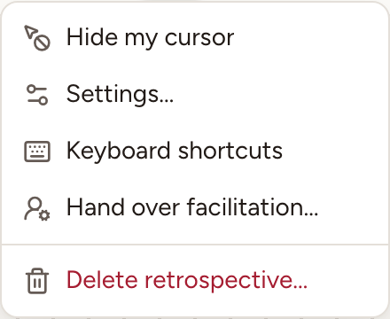
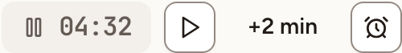
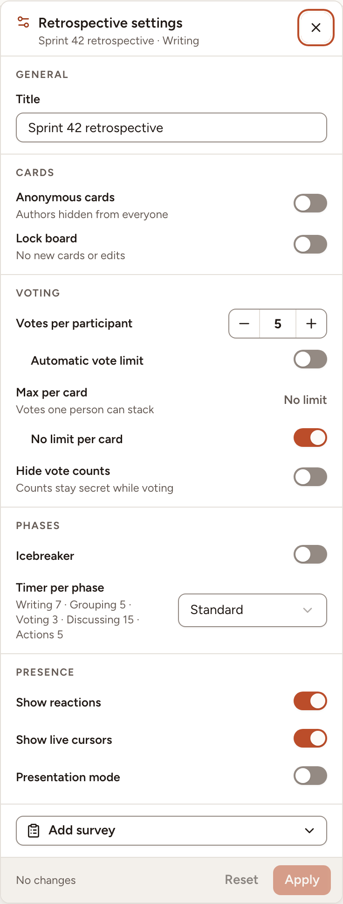
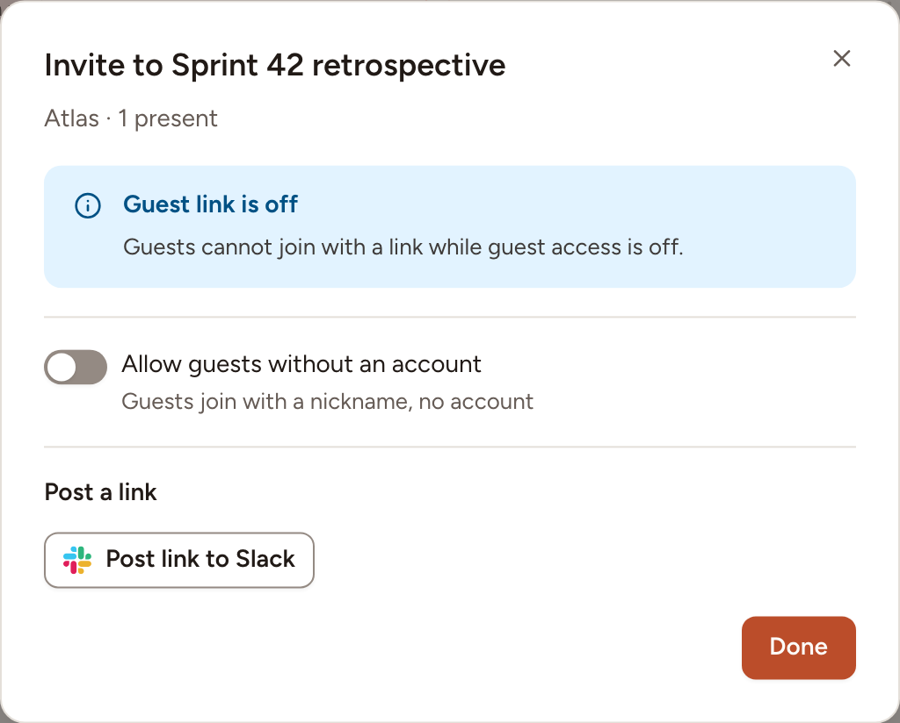

A retrospective has one facilitator at a time, chosen when it is created. The facilitator moves the phases, runs the timer and holds the settings. This page covers those tools; moving between phases is on [Phases overview](../phases/).

## Where the tools are

- The **Facilitator** bar at the bottom of the board holds the actions of the current phase and the button to the next one.
- The header holds the timer, **Share**, and a menu (**Facilitator menu**, the three dots).

On a wide window, **Settings** has its own button in the header and **Hide my cursor** its own toggle; on a narrower one they are in the menu, as in the picture.

## The timer

1. Select the alarm clock (**Timer**) and pick **1 min**, **3 min**, **5 min** or **10 min**. Everyone sees the countdown.
2. Select the pause button, or **Pause** in the facilitator's bar, to stop the clock; the same button resumes it.
3. Select **+2 min** to add two minutes.
4. Select **Stop timer** in the timer's menu to remove it.

When time is up, every board says so in a message and plays a short sound where the browser allows it. Nothing else happens: the phase does not change by itself.

When the retro has a **Timer per phase**, the duration of the current phase is offered first: one button to start it beside the alarm clock, and the first line of the menu, for example **Writing · 7 min**. In Discussing the duration is per topic and the timer stands above the topic. During the icebreaker the timer belongs to the game and cannot be paused.

## The session settings

Open the menu and select **Settings…**. Change what you need, then select **Apply**; **Reset** drops what you have not applied.

| Group | Settings |
|---|---|
| **General** | **Title** |
| **Cards** | **Anonymous cards**, **Lock board** |
| **Voting** | **Votes per participant** or **Automatic vote limit**, **Max per card** or **No limit per card**, **Hide vote counts** |
| **Phases** | **Icebreaker** and its game, **Timer per phase** |
| **Presence** | **Show reactions**, **Show live cursors**, **Presentation mode**, and **Allow GIFs** when the instance has a GIF provider |
| **AI** | **Automatic AI summary**, when the instance has a language model configured |

**Add survey** attaches the team's health check or a quick poll, see [ROTI and close](../roti-and-close/). The vote settings can change only before the Voting phase starts.

### AI settings for this retro

When the instance has a provider configured, **Session settings › AI › Automatic AI summary** controls whether completing this retro automatically sends its board content for a summary. It also enables participants to ask for group-name suggestions. Turn it off before completion to stop those features for this retro. The facilitator can still request a summary manually after completion, and poll drafts run only when the facilitator selects **Generate**.

See [AI poll drafts](../roti-and-close/#draft-a-quick-poll-with-ai), [group-name suggestions](../grouping/#let-a-language-model-suggest-names), [summary generation](../summary-and-sharing/#the-summary-with-a-language-model) and [suggested actions](../actions/#suggested-actions) for each workflow and the data it sends. An instance admin chooses the provider and credentials in [AI configuration](../../administration/ai/).

Everyone else can open the same panel, read-only: it names the facilitator as the only person who can change it.

## Hand over or take the role

To hand over: open the menu, select **Hand over facilitation…**, choose the **New facilitator** and select **Hand over**. The list holds the members of the team who take part in its sessions, and the workspace's owners and admins. Observers are not in it.

To take over a retro whose facilitator is away: the team's owner, its facilitators and the workspace's owners and admins have **Take control** in the menu of any open retro of the team.

## Invite people and guests

Members of the team need no invitation: they open the retro from the team page or from **Sessions**.

1. Select **Share** in the header.
2. Turn on **Allow guests without an account** to let people without an account in.
3. Give them the guest link (**Copy link**), the QR code, or the **Session code**, which they type on the join page whose address the dialog shows.
4. If the link went to the wrong place, select **Regenerate link**. The old link and its QR code stop working, and the guests who came in with it are signed out.

Turning guest access off removes the guests from the board.

When the team has a chat integration connected, **Post a link** sends the retro's link to that channel, for example **Post link to Slack**, with the guest link too if you tick **Include the guest link**. The facilitator and the workspace's owners and admins can post it. See [Integrations](../../integrations/overview/).

## Lock or delete the retro

- **Lock board**, in the bar, stops new cards, edits, votes, comments and reactions until you unlock it.
- **Delete retrospective…**, in the menu, removes the retro for everyone, with its action items that are still open.
