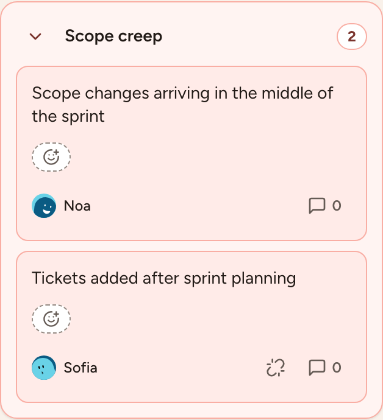
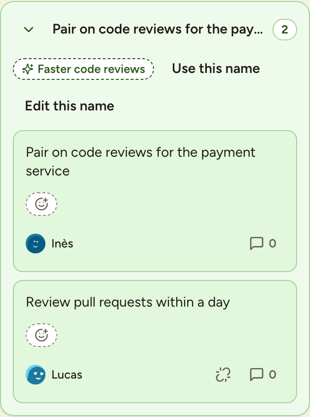

When the facilitator moves the board to Grouping, every card is revealed with its author, unless the cards are anonymous. Anyone taking part can then put the cards that say the same thing together, so that the team votes for a topic once. This page covers grouping, naming a group and taking a card out again.

## Group two cards

With the mouse:

1. Drag a card.
2. Drop it onto the card it goes with. The two cards form a group; drop more cards on the group to add them.

With the keyboard:

1. Move the focus to a card and press <kbd>G</kbd>.
2. Use the arrow keys to move the card over another card or a group.
3. Press <kbd>Space</kbd> or <kbd>Enter</kbd> to drop it, or <kbd>Esc</kbd> to cancel.

On a phone, open the menu of the card and select **Add to group…**.

The line above the columns counts the groups and the cards.

The arrow beside the name folds and unfolds the group. A group counts as one topic in the next phases: it gets the votes, and it is discussed as a whole.

## Name a group

1. Select the title of the group. A group without a name shows the text of its first card followed by **Name this group**.
2. Type a name, 60 characters at most.
3. Press <kbd>Enter</kbd> to save, <kbd>Esc</kbd> to cancel.

A group can be named or renamed from Grouping until the end of Actions.

## Let a language model suggest names

When the instance has a language model configured and **Automatic AI summary** is on for the retrospective, a **Suggest group names** button is shown above the columns.

1. Select **Suggest group names**. The text of the cards of the groups that have no name yet is sent to the provider named next to the button.
2. A suggested name appears on each of those groups. Only you see it.
3. Select **Use this name** to give the group that name for everyone, or **Edit this name** to change it first.

Participants, including guests, can ask for suggestions during Grouping, Voting, Discussing and Actions while the board is unlocked. The request sends the retro title, column names and the text of the selected groups’ cards. It does not send author names or account details. Suggestions are written in the requester’s interface language.

Generating suggestions does not rename groups automatically. Review a name before using it; accepting or editing it saves the name for everyone. If the request fails, retry or name the group yourself. Turning **Automatic AI summary** off also hides group-name suggestions for that retro.

An instance admin chooses the provider in [AI configuration](../../administration/ai/). The name shown beside the control identifies the provider or custom endpoint receiving the request.

## Take a card out of a group

Select the broken-link icon (**Ungroup**) on the card. The card goes back to its column on its own. Cards can be grouped and ungrouped during Grouping only.

## What else opens in this phase

From Grouping on, cards take reactions and comments, see [Discussion](../discussion/). You can still edit or delete your own cards until the facilitator moves to Voting.
