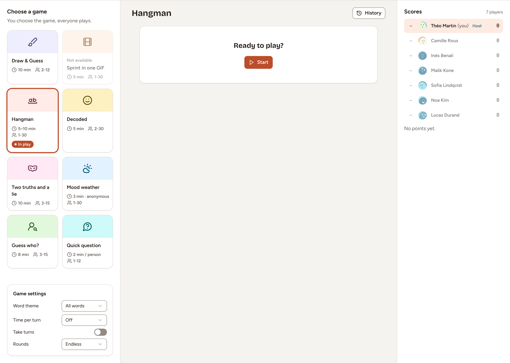

The icebreaker is an optional first phase: the team plays a short game on the board before it starts writing. This page shows how to turn it on, run a round and move on.

## Turn the icebreaker on

Do one of these:

- when you [create the retrospective](../create-a-retro/), turn on **Icebreaker at the start** and pick the game;
- on a board that is already open, as the facilitator, open the session settings and turn on **Icebreaker** under **Phases**, see [Facilitating](../facilitating/).

A retro created with the icebreaker opens on that phase. The switch cannot be turned off while the board is in the Icebreaker phase: move to Writing first.

## Play

During the phase the columns are replaced by a game room. The facilitator is its host.

1. As the facilitator, pick a game under **Choose a game**. You choose the game, everyone plays. The eight games are Draw & Guess, Sprint in one GIF, Hangman, Decoded, Two truths and a lie, Mood weather, Guess who? and Quick question; each card shows how long it takes and for how many players.
2. Adjust the **Game settings** under the list if the game has some.
3. Select **Start**.
4. Play as many rounds as you want. **Scores** keeps the points of each player, and **History** opens the last rounds.

The participants of the retro are the players. The rules of each game are in the [Games](../../games/overview/) section.

> **Sprint in one GIF** is marked **Not available** unless the instance has a GIF provider configured.

During the icebreaker the timer in the header is the game's own clock for the round. It cannot be paused.

## Move on, or skip it

As the facilitator, select **Go to the retro** in the bar at the bottom of the board. The board moves to Writing and a round still in progress is abandoned.

To skip the icebreaker, select **Go to the retro** without starting a round.
