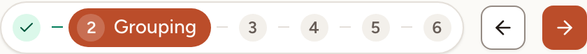

A retro moves through its phases in a fixed order, and each phase opens some actions and closes others. This page lists the phases, shows how the facilitator moves between them and says what a completed retro no longer allows.

## The phases, in order

| Phase | What happens |
|---|---|
| [Icebreaker](../icebreaker/) | A short game before the work. Present only when the icebreaker is turned on for the retro. |
| [Writing](../writing/) | Everyone writes cards in the columns. The cards of the others stay hidden. |
| [Grouping](../grouping/) | The cards are revealed. Cards that say the same thing are put together and the group is named. |
| [Voting](../voting/) | Everyone spreads their votes over the cards and groups. |
| [Discussing](../discussion/) | The team goes through the topics, most voted first, with notes, comments and the first action items. |
| [Actions](../actions/) | The team turns what was said into action items with an owner and a due date. |
| [ROTI](../roti-and-close/) | Everyone rates whether the time was well spent. |
| Completed | The retro is over. It shows its results and can no longer be changed. |

The header of the board shows the phases as a row of steps, with the current one named.

## Move to the next phase

Only the facilitator of the retro moves the board. Everyone else follows: their board changes at the same moment.

As the facilitator, do one of these:

- select the main button of the bar at the bottom of the board, which is named after the phase it leads to (**Grouping**, **Voting**, and so on; **Go to the retro** from the icebreaker, **Next phase** from Actions);
- select the right arrow beside the steps in the header, or the next step itself;
- press <kbd>Ctrl</kbd>+<kbd>→</kbd> (<kbd>⌘</kbd>+<kbd>→</kbd> on a Mac) while the cursor is not in a text field.

A retro moves one phase at a time: you cannot jump from Writing to Discussing.

## Go back

Select the left arrow beside the steps, or the previous step. Going back to Voting starts a new round of "I have finished voting": nobody is marked as finished any more.

## Complete the retro

On the last phase, the main button of the facilitator's bar becomes **End session**. It ends the retro at once, without a confirmation. A facilitator can also end a retro that has started from any phase: select the back arrow at the top left of the board, then **End the session** in the dialog; the remaining phases are skipped. **Leave, the session continues** in the same dialog leaves the board open for the others.

Once a retro is completed:

- cards can no longer be written, edited, grouped, voted on, commented or reacted to;
- no action item can be added from the board, except by promoting a suggested action, see [Summary and sharing](../summary-and-sharing/);
- the ROTI vote, the surveys and the health check of the retro are closed;
- the timer is stopped, and the lock, the vote settings, the icebreaker, the reactions, the cursors and the presentation mode can no longer be changed.

The facilitator can still select **Reopen** in the header. The retro goes back to its last phase, ROTI.
