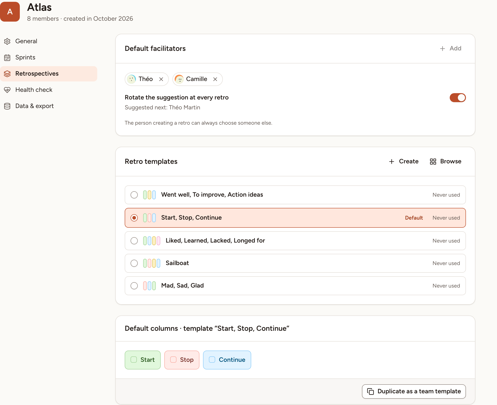

The team's retrospective settings decide what the New session dialog proposes: who facilitates, which template comes first, and with which columns. This page goes through them. The team's owner, its facilitators and the workspace's owners and admins may open and change them.

## Open the settings

1. Open the team and select **Settings** in the sidebar.
2. Select **Retrospectives**.

## Default facilitators

The list holds the people the team proposes as facilitator of a new retro.

1. Select **Add** and pick a person. Only the team's owners and facilitators can be added, 10 at most.
2. Remove someone with the cross on their name.
3. Turn on **Rotate the suggestion at every retro** to propose each person of the list in turn. With it off, the first person of the list is always the one proposed.

Under the switch, **Suggested next** names the person the next retro will propose, with the date of that retro when the team has a retro day.

The suggestion is only a starting value: the person creating a retro can always choose someone else in the **Facilitator** field. The rotation moves on only when a retro is created with the person it suggested.

## Retro templates

The card lists the templates the team uses most, with how many times each was used. A team that has not run a retro yet sees five common built-in templates.

- Select the circle of a template to make it the **Default**: the New session dialog then opens with that template selected.
- **Browse** opens all the templates, built-in and custom, to make one that is not in the list the default.
- **Create** opens the editor on a new template for the team, see [Templates](../templates/).

If the default template is deleted or stops being shared with the team, the card says that it is no longer available and asks you to choose another.

## Default columns

The last card shows the columns of the default template.

- For a custom template you may edit, change the columns here and select **Save**. The change applies to the template, so to every retro created from it afterwards.
- For a built-in template, which cannot be changed, select **Duplicate as a team template**: you get a copy whose columns you can edit.

## The retro day and the sprint length

The day and time of the team's retro and the default length of its sprints are not on this page: they are with the sprints, under **Settings**, then **Sprints**. See [Sprints](../../teams/sprints/).

## What is set per retro

Everything else is chosen for each retro when it is created, and can be changed on its board: anonymous cards, the number of votes, the timers, the icebreaker, the health check and guest access. See [Create a retro](../create-a-retro/) and [Facilitating](../facilitating/).
